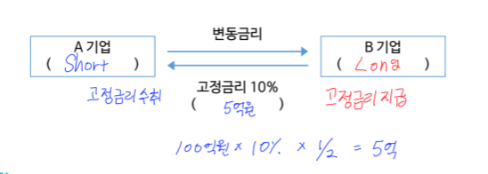
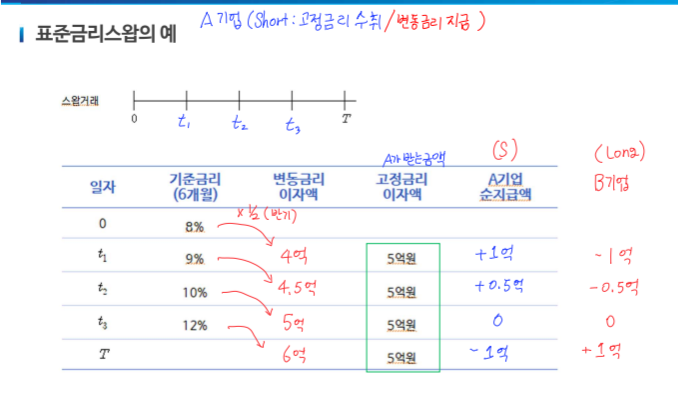
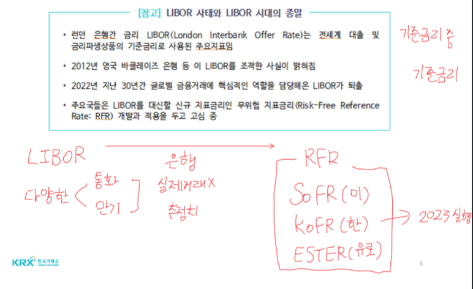
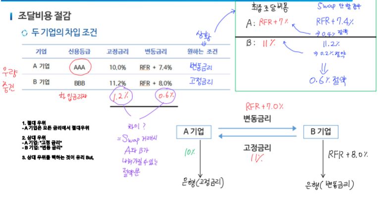
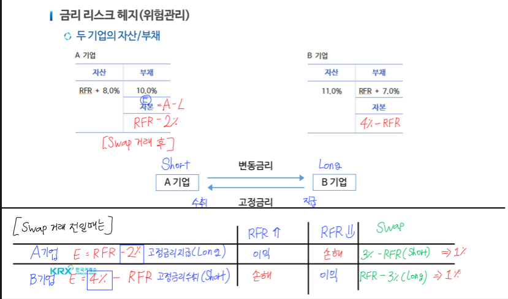
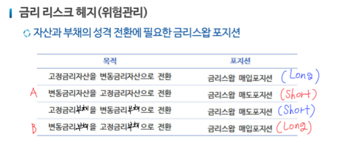

# 12강

## 예시

- 채권
    + 액면가: 1억
    + 이표율: 5%(고정금리)
    + 만기: 6년
    + 이자지급: 1년 → 6번
    + 발행 → 지급

- **변동금리부채권(FRN)**
    + 액면가: 1억
    + 이표율: **LIBOR**
    + 만기: 6년
    + 이자지급: 1년 → 6번
    + 투자 → 수취

## 금리 스왑
- 일정 기간동안 정해진 원금에 대해 한 당사자는 **고정금리 이자를 지급**
- 다른 당사자는 **변동금리이자를 지급**
- 정기적인 현금흐름을 맞교환하는 계약(**동일한 통화**)
- 명목원금: 이자 계산을 위함(실제 교환 X)
- 교환주기: 1년, 6개월, 3개월(**거래 상대방에 따라 다르다**)
- **Swap Rate**: 변동 금리에 대한 고정금리 비율
- **변동 금리 기준**

| Payer Swap(Long) | Receiver Swap(Short) |
|:----------------:|:--------------------:|
| 고정 금리 지급     | 고정 금리 수취         |
| 변동 금리 수취     | 변동 금리 지급         |

- Long: 고정금리 → 변동금리
- Short: 변동금리 → 고정금리

### 예시
- 명목원금: 100억원
- 교환주기: 6개월
- 만기: 2년
- 고정금리: 10%
- 변동금리: **6개월 LIBOR**

## 기준금리

## 금리 스왑 활용

