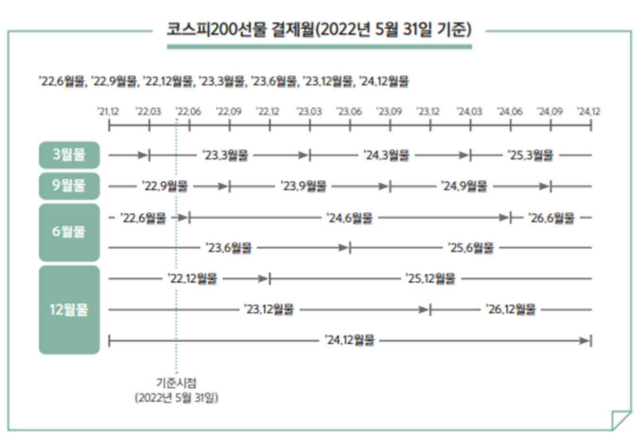

# **1강**

## **파생상품이란?**
- **<span style="color:red">기초자산</span>에 의해 그 가치가 결정되는 <span style="color:red">계약</span>**
- 다음 각 호의 어느 하나에 해당하는 <span style="color:#fff5b1">**계약상의 권리**</span>
    + **기초 자산**에 의해 산출된 금전등을 <span style="color:#fff5b1">**장래의 특정 시점에 인도**</span>할 것을 약정하는 **계약** → <span style="color:#fff5b1">**선도/선물**</span>
    + 기초자산에 의해 산출된 금전등을 수수하는 <span style="color:#fff5b1">**거래를 성립시킬 수 있는 권리**</span>를 부여하는 것을 약정하는 계약 → <span style="color:#fff5b1">**옵션**</span>
    + 장래의 일정기간 동안 <span style="color:#fff5b1">**미리 정한 가격**</span>으로 **기초자산**에 의해 산출된 금전 등을 **교환**할 것을 약정하는 **계약** → <span style="color:#fff5b1">**스왑**</span>

### **파생상품 종류**
- **계약형태**에 따라 선도, 선물, 옵션, 스왑, 합성으로 나누어짐

## **기초 자산 종류**
- **주가지수**: KOSPI200 선물/옵션, S&P500 선물
- **개별주식**
- **금리**
- **외환**
- **농산물**, **에너지**, **금속**

## **거래 장소**
1. **장외파생상품(Over-The-Counter; OTC)**
    - **비표준화** → 선택의 자유 ↑ But 거래 상대방이 필요
    - **상대탐색비용(= 신용 리스크)**
    - **선도**
2. **장내파생상품**
    - **표준화된**계약
    - **거래소에 의한 채무이행**
    - **결제 안정화 제도**
    - **선물**

## **파생상품의 경제적 기능**
1. **리스크 헤지 수단** → 리스크의 전가
2. **가격 발견 기능** → 미래 기초자산 가격에 대한 시장 참여자들의 예측치
3. **자원배분의 효율성** → 다수의 시장참가자가 경쟁 
4. **시장 효율성** → 저렴한 거래비용

## **계약형태**에 따른 구분 → 미래 발생할 일에 대한 계약
1. **선도(Forwards)/선물(Futures)**
    - 기초자산을 **장래 특정 시점에 인도**할 것을 약정하는 계약
2. **옵션(Options)**
    - 당사자 어느 한쪽의 의사에 따라 기초자산 **거래를 성립시킬 수 있는 <span style="color:#fff5b1">권리**</span>를 부여하는 것을 약정하는 계약
3. **스왑(Swaps)**
    - **일정 기간**동안 정한 가격으로 기초자산을 **교환**할것을 약정하는 계약

# **2강**
- Long 포지션 = Buy, <span style="color:#fff5b1">우상향</span>
- Short 포지션 = Sell, <span style="color:#fff5b1">우하향</span>
- 외상, 선결제는 선도 X
- 선도: 약속을 지금 But **<span style="color:#fff5b1">이행은 정해진 미래의 날**</span>

## **선도(Forwards)**
- 미래 시점(t = T)에 **사전에 약정한 가격과 수량으로** 기초자산을 인수도 하기로 하는 조약
- 선도 거래 $t_0$ 시점에서 물건 필요 X, $F_0$을 $t_0$ 시점에 약속만 하고 교환 X


## **선도 거래 단점**
- 거래 상대방을 구하기 어려움
- 결제 불이행(Default Risk) → 거래의무는 있으나 강제할 수단 X
- 선도 거래는 **OTC**상품 So, 장외파생상품의 단점을 보유 → 선물 상품의 등장

## **현물 거래의 손익 구조**
- <span style="color:#fff5b1">**Payoff**</span>: **만기일(T)에** 계약을 이행함에 실현되는 **현금흐름(가치)**
- <span style="color:#fff5b1">**Profit**</span>: **만기일(T)에** Payoff - 만기일 이전(t < T)실현된 현금흐름(가치)
- 현물의 경우 만기 X, 
$$
S_0 = S_t = S_T\\ 
t_0 = t = T
$$
|               현물 Long 손익구조          |               현물 Short 손익구조          |
|:---------------------------------------:|:----------------------------------------:|
|  |  |

## **선도 거래의 손익 구조**
- 선도 거래는 T시점(만기일)에서만 거래가 발생 → <span style="color:red">**Payoff = Profit**</span>


## **선도 가격과 현물가격의 관계**
- **무소득 투자자산의 이론(증식되지 X)** 
    + t = 0 시점에서 가격이 S_0인 기초자산에 대해 만기가 T인 선도 가격은 
    + **시장 균형**하에서 다음과 같다. 
    + 단, r = **<span style="color:#fff5b1">연속 복리</span> 기준 무위험이자율(연이자율)**<br>

```math
F_{0} = S_{0}*e^{rT}
```

- **무소득 투자자산** = 배당금 없는 주식
- [가정]
    1. **시장 균형**
    2. **기초 자산**
    3. **이자**

- **T시점 현물 Profit = 선도 Profit**


## **문제**
- <span style="color:#fff5b1">만기가 6개월 후</span>인 무배당 주식 <span style="color:#fff5b1">선도 계약</span> 체결
- <span style="color:#fff5b1">현재 주가는 $100, 무위험 이자율이 연속 복리 기준으로 연 12%</span>
- 선도 가격은?
- T = 6개월 = 1/2
- $S_0$ = $100
- r = 0.12

```math
F_0 = S_0 * e^{rT} = 100 * e^{0.12*0.5} = 100 * e^{0.06} = 106
```
- 선도 매수자의 만기 <span style="color:#fff5b1">Payoff</span> 그래프는? (선도는 Payoff = Profit, 매수 = Long = 우상향)
- 만기일 주가가 $120 일때, 수익은? 120 - 106 = 14
- 만기일 주가가 $100 일때, 수익은? 100 - 106 = -6(= Loss)


## **Summary**
- **선도거래**: 미래 시점에 사전에 약정한 가격과 수량으로 기초자산을 인수도 하기로 하는 계약
- **선도거래 손익 구조**
    + Long 포지션일 때, 만기 수익 = $S_T - F_0$
    + Short 포지션일 때, 만기 수익 = $F_0 - S_T$

# **보충: 화폐의 시간 가치(이자율)**
## **선물(Futures)와 선도(Forwards) 이자율 설정**
### **화폐의 시간적 가치**
- 연간 이자율 = r
- $S_0$만큼의 금액을 $T$년 동안 투자 가정
    1. (복리계산): 이자 계산을 **연간 한번**할 경우, 만기 시 **원리금의 액수**
    $$S_{0}(1+r)^{T}$$
    2. (연간 n회 복리 계산): 만약 이자 계산을 <span style="color:#fff5b1">**연간 n번**</span>할 경우, 만기시 원리금 액수
    $$S_{0}(1+\frac{r}{n})^{nT}$$
    3. <span style="color:red">(연속 복리)</span>: 복리횟수가 무수히 많을 때, 만기 시 원리금 액수
        + 본 강의에서 언급이 없을 경우 연속 복리 이자율로 사용
    $$S_{0}e^{rT}$$
    
- 추가 공식
    $$e^{a+b} = e^{a}*e^{b}$$
    $$e^{a-b} = \frac{e^a}{e^b}$$
    $$e^0 = 1$$
    $$e^1 = e$$

# **3강**
## **선물 거래**
1. 표준화된 계약
    - 기초자산의 표준화
        + ex: 금선물 = 순도 99.99% 이상 1Kg 벽돌 모양 직육면체 금(골드 바)
    - 최종 거래일(만기일 = T) 표준화
        + 코스피 200지수 선물 & 옵션: 3, 6, 9, 12월 <span style="color:#fff5b1">2번째 목요일 → 4마녀의 날
        + 개별 주식 선물 * 옵션: 매월 2번째 목요일
    - 최종 결제 방법 표준화
        + 인수도 결제: 선물계약의 기초자산(실물)을 주거나 받음
        + 현금 결제: 계약의 최종 손익을 계산해서 미정산 차액을 현금으로 결제
    - 거래 단위
        + 주식 시장: 1주
        + **개별 주식 선물**: <span style="color:#fff5b1">**1계약 = 주식 10주**</span>
        + So, **선물 가격 $F_t$의 1계약 금액 = $F_t$ * 10**
2. 거래소에 의한 채무이행
3. 결제안정화 제도

## **선물 거래 작동 원리(결제 안정화 장치)**
1. **증거금(Margin)**: 선물 거래시 계약 이행을 보증하기 위해 거래소에 납부하는 <span style="color:#fff5b1">보증금</span>
    - 선물에 투자하고자 하는 거래자는 증거금 계좌를 개설해야 함
2. **마진콜(Margin Call)**: 일일정산 후 증거금 잔액이 부족해지면 **증거금 충당을 요구받는 것**
3. **일일정산(Daily Settlement)**: 선물 가격 변동에 따라 발생하는 손익을 매일 재계산하는 것
4. **반대거래(Offsetting Transaction)**: 최종거래일 이전 기존 매수(매도)한 계약에 대한 동일 종목 및 수량 매도(매수)하여 선물 거래에 의한 결제 의무에서 벗어나는 결제 방법


### **예시**
- Long(매수) "포지션 개시 가격 < 미래 가격" 일 때 이득
- t = 1 시점에서 유지 증거금 윗 부분은 출금 가능
- 즉, 개시 이후에는 유지 증거금 이상만 존재하면 됨
- t = 2 시점에서 유지 증거금보다 모자라게 됨 → 마진 콜
    + 추가 증거금 납입(보라색)
    + 포지션 청산(반대 거래)


## **반대 거래(반대매매)**
- 최종거래일에 결제를 할 수도 있으며, 만기일 이전에 포지션 청산도 가능
- **현금결제**의 경우: 만기 결제와 중도 청산이 모두 **가격의 차이**로 이루어짐
- **실물인수도**의 경우: **만기 결제 시에만 발생**
- 투자자의 포지션을 상쇄시키는 거래
- **미결제 약정(= 시장에 남아있는 선물 계약의 총 수)** 의 감소를 가져옴
- 일반적으로 만기일(T)에 가까워질수록 미결제 약정은 감소

## **문제**
- 삼성전자 <span style="color:#fff5b1">주식선물</span> 최근 월물을 8월 10일에 <span style="color:#fff5b1">2계약 매수</span>
- 단, <span style="color:#fff5b1">주식선물의 개시증거금률이 10%</span>이고 <span style="color:#fff5b1">유지증거금은 개시 증거금의 70%</span>라고 가정
- **계약금액(Long 2계약)** = 2 * 10(승수) * 선물가격(60,000원: 8/10일 가격) = 1,200,000원
- **개시증거금** = 계약금액 * 10% = 1,200,000 * 0.1 = 120,000원
- **유지증거금** = 개시증거금 * 70% = 120,000 * 0.7 = 84,000원
- **손익** = 금액 변화 * 20(계약 수 * 승수 = 2 * 10)

|  일자 |      사건     |  선물 가격 |  일일 손익 |입금,마진콜/인출| 증거금 계좌잔액|
|:----:|:-------------:|:--------:|:---------:|:------------:|:------------:|
| 8/10 | 선물 2계약 매수 | 60,000원 |   -       | 120,000원    | 120,000원     |
| 8/11 |+ 500원         | 60,500원 | 10,000원  |              | 130,000원    |
| 8/12 |- 2,500원      | 58,000원  | -50,000원 |              | 80,000원     |
|      |  마진콜        |          |           | 40,000원     | 120,000원    |
| 8/16 |+ 2,000원      | 60,000원  | 40,000원  |              | 160,000원    |
|      |  인출          |          |           | -40,000원    | 120,000원    |
| 8/17 |-2,000원       | 58,000원  | -40,000원 |              | 80,000원     |
|      |  마진 콜       |          |           |              |              |
| 8/18 |  반대 거래     |          |           | -80,000원     | 0원          |

- 8/12일: 유지증거금 > 증거금 계좌 잔액 So, 마진콜
- **총 수익** = **입금,마진콜/인출의 합에 -를 곱함** = (80,000 + 40,000) - (120,000 + 40,000) = **-40,000원**
- **총 수익** = **($ F_t - F_0 $) * 계약 수 * 거래 승수** = (58,000원 - 60,000원) * 2 * 10 = **-40,000원**

## **문제(왜 현물 거래가 아닌 선물 거래를 하는가?)**
- 만기일 1주당 1만원 하는 주식 20주(= 선물 2계약 * 거래 승수 10)를 살 때(Long), 현물 거래와 선물 거래의 투자 성과를 비교
- 단, 주식 선물의 증거금률 10%라고 가정
- 초기 투자 금액 ↓ But 수익률 ↑(위혐률 ↑) <span style="color:#fff5b1">**"레버리지 효과"**</span>

|        구분          |     주식 현물 거래    |             주식 선물 거래            |
|:--------------------|:-------------------:|:-----------------------------------:|
| 투자 금액            | 200만원(20주 * 10만원)| 20만원(2계약 * 10승수 * 10만원 * 증거금률(10%))|
| 주가 5만원 상승 시 이익| +100만원(5만 * 20주) | 100만원                              |
| 상승 시 수익률        | 100/200 = 50%       | 100/20 = 500%                       |
| 주가 5만원 하락 시 손해| -100만원(5만 * 20주) | -100만원                             | 
| 하락 시 수익률        | -100/ 200 = -50%    | -100/20 = -500%                     |

## **Summary**

|    구분    |           선도 거래         |            선물 거래           |
|:----------:|:-------------------------:|:-----------------------------:|
| 거래 당사자 | 제한적                     |   다양                         |
|  거래 장소  | 장외(OTC)                 |  <span style="color:#fff5b1">거래소(장내)</span>                   |
|  계약 조건  | 당사자간 합의(비표준화)      | 거래소 규정으로 정함(표준화)      |
|  거래 가격  | 계약 체결 시 단 1회 생성     | 같은 종목에 대해 실시간 가격 형성 |
| 포지션 청산 | 반대 매매가 어려움           | 반대매매가 쉬움                 |
|   증거금   | 상호합의에 의해 예탁 여부 선택 | 예탁 의무화                    |
| 결제 안전성 |  결제 불이행 위험에 크게 노출 | 청산소(거래소)가 지급            |

# **4강**
## **기타 거래소의 시장 안정화 제도**
1. **시장조성자 제도**
    - **유동성(거래량)이 부족한 선물종목에 대해** 최소한의 유동성을 공급하는 것
    - 거래소와 시장조성계약을 체결한 **시장 조성자**가 정해진 파생상품에 대해 매수 및 매도 호가 제시
    - **거래비용 감소, 헤지거래의 활성화 기반 마련**
2. **가격제한폭 & 실시간 가격 제한 제도**
    - 일시적 수급 불균형에 따른 가격 급변으로 투자자들의 손실이 커지는 것을 방지
3. **서킷브레이커(Circuit Breakers)**
    - 시스템 이상 및 가격의 급변에 따라 선물거래가 중단
4. **미결제약정수량 제한** → 시장 충격 방지

## **파생상품시장의 거래자 유형**
### 1. **방향성 거래자 혹은 투기자(Speculator)**
- 특정 자산(기초 자산)을 소유하지 않은 채 이익 추구를 위해 파생상품을 매도(수)함


### 2. **헷저(Hedger)**
- **현물을 보유**하고 있거나 **공매도**한 투자자는 현물가격이 급변할 경우를 대비해 헤지거래
- <span style="color:#fff5b1">**선물 거래 기준**</span>으로 이름을 붙임
    - **매수 헤지(Long Hedge)** = **현물 Short(공매도)** + **선물 Long**
    - **매도 헤지(Short Hedge)** = **현물 Long** + **선물 Short**

|   매수 Hedge Profit    |    매도 Hedge Profit     |  
|:---------------------:|:------------------------:|
| |  |

### 3. **차익 거래**
- **일물일가의 법칙(Law of One Price)** = 시장 균형 → 완전 경쟁 시장에서 동일 상품은 동일 가격
- 저평가된 물건은 **매수(Long)** 하고 고평가된 물건은 **매도(Short)**
- 단, <span style="color:red">**시점이 동시**</span>에 이루어짐
- <span style="color:#fff5b1">**현물 거래 기준**</span>으로 이름이 달라짐
- **매수 차익 거래(Cash and Carry Arbitrage)**
    + 선물 가격 고평가(Short), 현물 가격 저평가(Long)**($F_t > S_t$+ 이자)**
- **매도 차익 거래(Reverse cash and Carry Arbitrage)**
    + 선물 가격 저평가(Long), 현물 가격 고평가(Short)**($F_t < S_t$+ 이자)**

- **예시(매수 차익 거래)**


### **헷저와 차익거래자 차이**


### 참고(스프레드 거래)
- 스프레드 = 근원물가격 - 원 월물가격
- 저평가된 매수, 고평가된 매도



## Summary
- 헷저
    + <span style="color:#fff5b1">**선물 거래 기준**</span>
- 차익 거래자
    + <span style="color:#fff5b1">**현물 거래 기준**</span>

# **6강**
## **선물가격과 현물 가격의 관계**
- (무소득 투자자산의 이론 가격) t시점에서 가격이 $S_t$인 기초자산에 대해 
- 만기가 $T(t = T)$인 선물 가격은 **시장균형** 하에서 다음과 같다.
- 단, $r$ = 무위험이자율(연이자율)

$$F_t = S_t + 이자 \\ F_t = S_{t}e^{r(T-t)}$$

- **(T시점 현물 Profit = 선물 Profit)**

|Profit|       현물        |    선물    |
|:----:|:----------------:|:----------:|
|Long  | $S_T - (S_t+이자)$| $S_T - F_t$| 
|Short | $(S_t+이자) - S_T$| $F_t - S_T$|

## **선물 이론 가격**
- 조건
    1. 시장 균형
    2. 기초자산: 무소득 투자자산
    3. 이자: 연속 복리

|      Profit      |        현물 거래       |  선물 거래  |     헷지 거래      |        차익 거래        |
|:----------------:|:---------------------:|:---------:|:-----------------:|:----------------------:|
|t시점 결과를 아는가?|           X          |  X         | O                 |  O                    |
|Long              |$S_T - S_{t}e^{r(T-t)}$|$S_T - F_t$|$S_{0}e^{rT} - F_t$|$S_{0}e^{r(T-t)} - F_t$|
|Short             |$S_{t}e^{r(T-t)} - S_T$|$F_t - S_T$|$F_t - S_{0}e^{rT}$|$F_t - S_{0}e^{r(T-t)}$|

- 헷저: <span style="color:#fff5b1">**선물 기준**</span>
- 차익: <span style="color:#fff5b1">**현물 기준**</span>

## **베이시스, 콘탱고, 백워데이션**
- <span style="color:#fff5b1">**베이시스(Basis)**</span>: 선물가격과 현물 가격 차이 = $F_t - S_t$
    + **콘탱고(Contango): 베이시스 > 0**
    + **백워데이션(Backwardation): 베이시스 < 0**

- $F_t = S_t + 이자 \\ F_t - S_t > 0$

