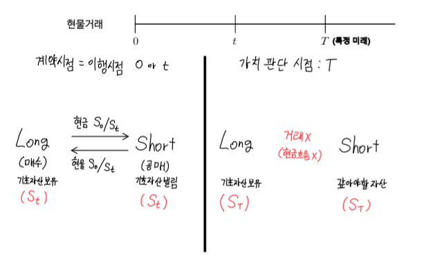
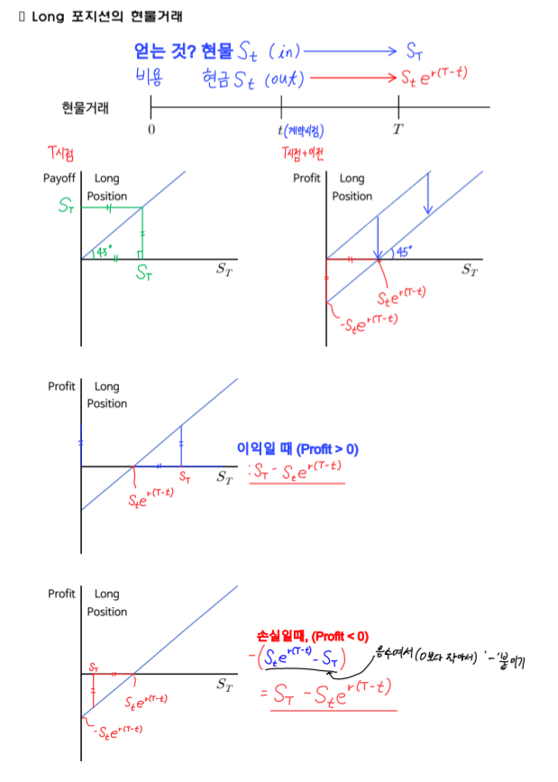
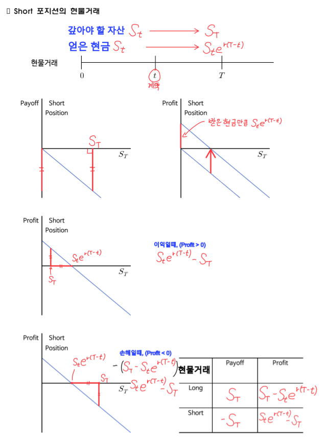
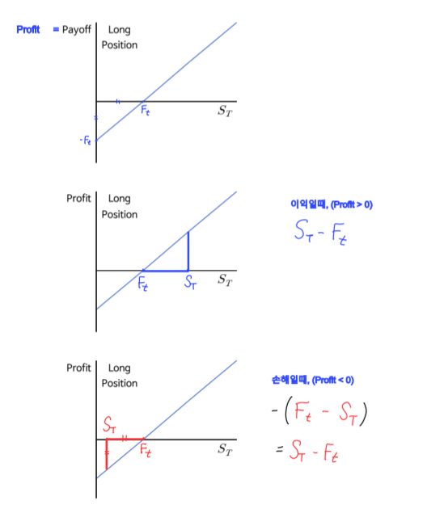
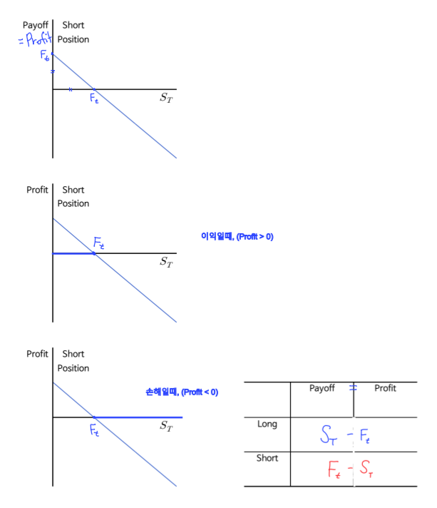
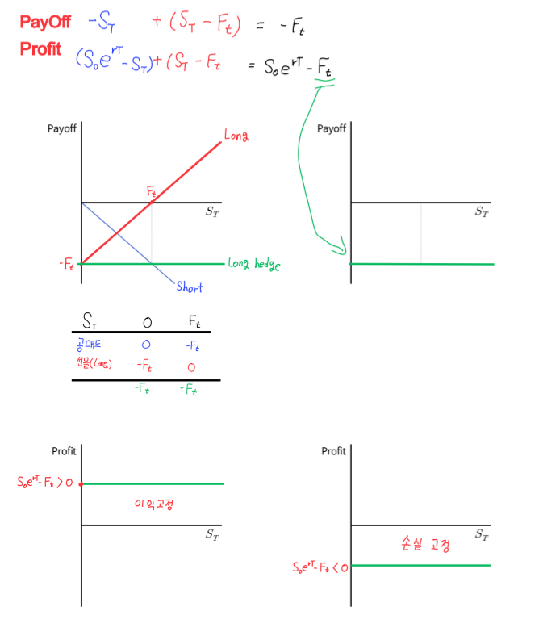
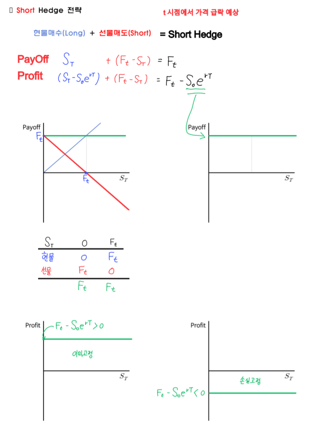
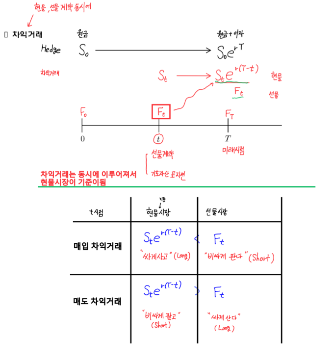
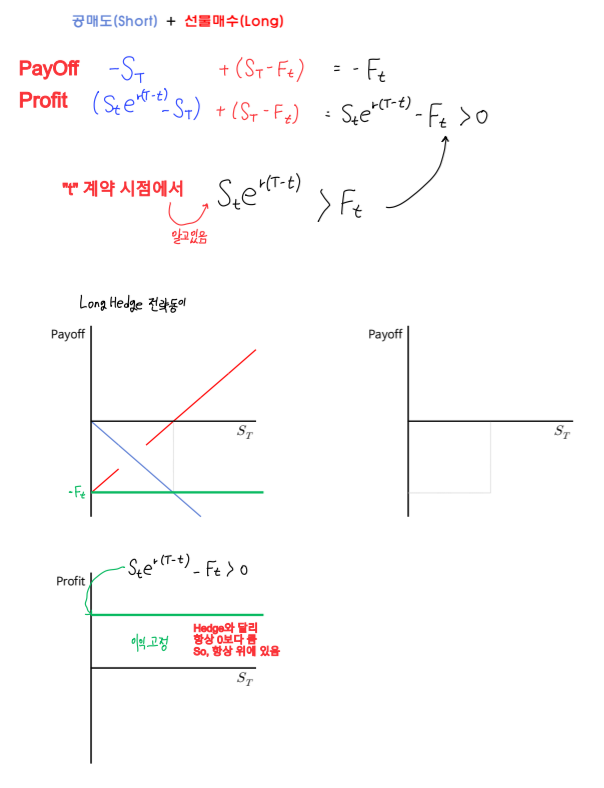
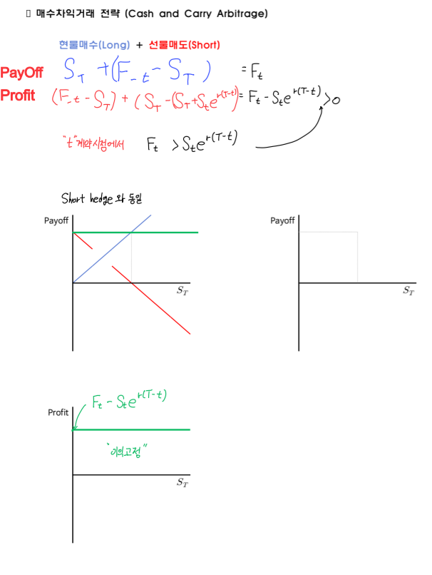

# **손익구조 복습**

- **Payoff**: 만기일(T)에 계약을 이행함에 실현되는 현금흐름
- **Profit**: 만기일(T)의 payoff - 만기일 이전(t < T)실현된 현금 흐름

## **현물 거래**

### **Long 포지션 현물 거래**

### **Short 포지션 현물 거래**

## **현물 거래 Payoff, Profit**

|현물거래| Payoff |        Profit         |
|:-----:|:------:|:---------------------:|
|  Long |$S_T$   |$S_T - S_{t}e^{r(T-t)}$|
| Short |-$S_T$  |$S_{t}e^{r(T-t)} - S_T$|

## **선물 거래**

### **Long 포지션 선물 거래**

### **Short 포지션 선물 거래**

## **선물 거래 Payoff(= Profit)**

|선물거래| Payoff = Profit |
|:-----:|:---------------:|
| Long  |$S_T - F_t$      |
| Short |$F_t - S_T$      |

## **헷지 거래(선물 거래 기준)**

### **Long 헷지 전략(공매도 + 선물Long)**

### **Short 헷지 전략(매수 + 선물Short)**

## **헷지 거래 Payoff, Profit**

|헷지 거래|          Payoff             |                         Profit                        |
|:------:|:---------------------------:|:-----------------------------------------------------:|
|Long    |-$S_T + (S_T - F_t) = - F_t$ | $(S_{0}e^{rT} - S_T) + (S_T - F_t) = S_0e^{rT} - F_t$ |
|Short   |$S_T + (F_t - S_T) = F_t$  | $(S_T - S_0e^{rT}) + (F_t - S_T) = F_t - S_0e^{rT} $   |

## **차익 거래(현물 거래 기준)**

### **(현물) 매도 차익 거래**

### **(현물) 매수 차익 거래**

## **차익 거래 Payoff, Profit**

|차익거래|          Payoff             |                             Profit                                 |
|:-----:|:---------------------------:|:------------------------------------------------------------------:|
|Long   |$S_T + (F_t - S_T) = F_t$ | $ (S_T - S_Te^{r(T-t)}) + (F_t - S_T) =  F_t - S_Te^{r(T-t)}$             |
|Short  |-$(S_T) + (S_T - F_t) = - F_t$  | $(S_T - F_t) + (- S_T + S_te^{r(T-t)}) = S_te^{r(T-t)} - F_t$|