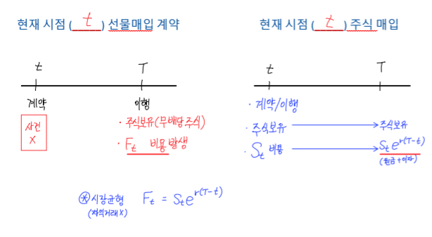
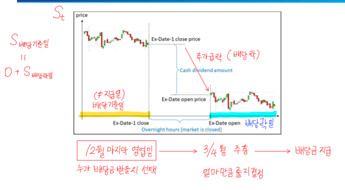
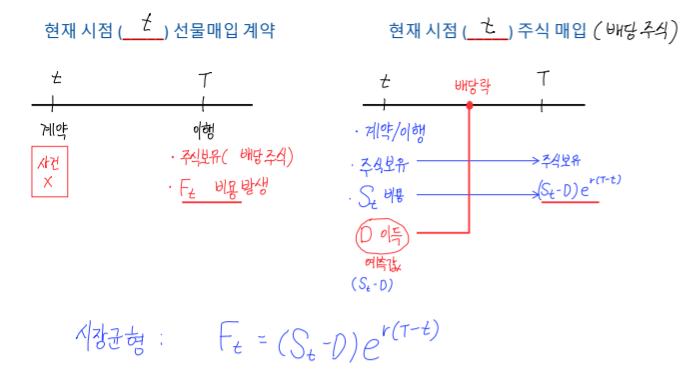
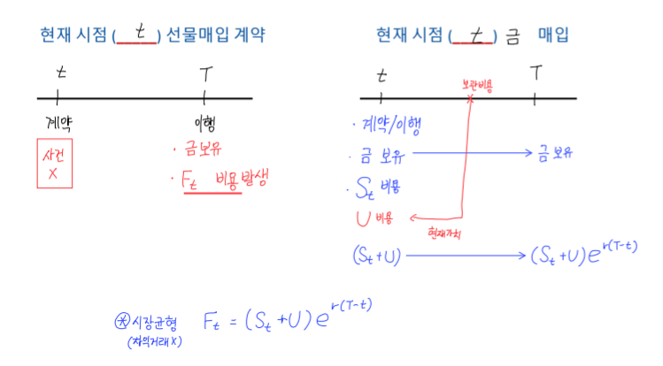
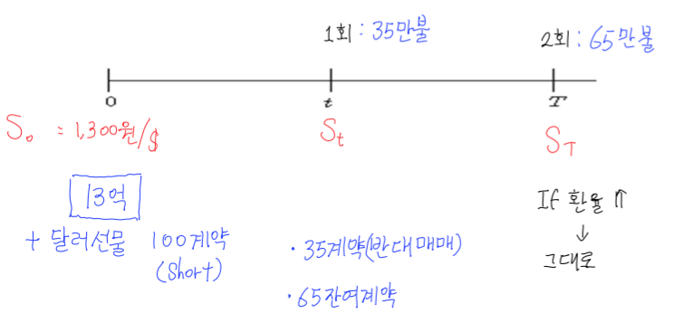
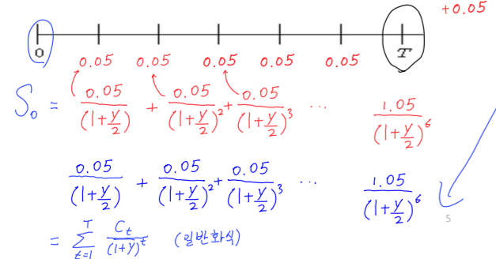
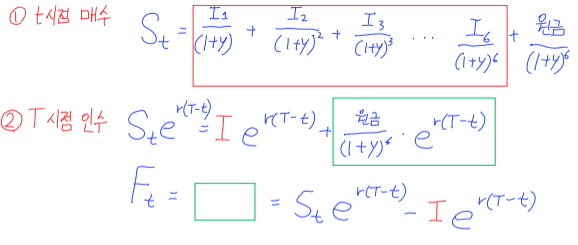

# 선물의 가격

## **선물 가격 결정 모형**
- 단순 가정하의 비현실성
    + 기초자산의 보관비용: **$C = r + u$ → $F_t = S_te^{c(T-t)}$**
    + 현물/선물 포지션에 대한 금융 비용
    + 기초자산으로부터 현금 흐름
- 보유비용: **현물을 보유함**으로 발생하는 비용

## 6강 복습 **무소득 투자자산의 선물 가격**
$$F_t = S_te^{r(T-t)}$$

- 미래 특정시점(T)에 무배당 주식을 보유하는 2가지 방법
- 조건
    + 시장 균형
    + 기초자산: **무소득 투자자산(무배당 주식)**
    + 이자율: 무위험 연속 복리

1. 현재 시점(t)에 선물 매입 계약(Long)
    + T 시점 소요 비용 = $F_t$

2. 현재 시점(t)에 주식 매입(Long)
    + T 시점 소요 비용 = $S_te^{r(T-t)}$

## 예정 소득 투자자산의 선물 가격
$$ F_t = (S_t - D)e^{r(T-t)} $$
- D = 예정된 소득의 현재 가치
- 조건
    + 시장 균형
    + 기초 자산: **예정 소득 투자 자산(배당 주식)**
    + 이자율: 무위험 연속 복리

|        예정 소득 투자 자산의 선물 가격      |               동일 보유 비용 모형              |
|:---------------------------------------:|:-------------------------------------------:|
|| |

## 예정 소득 투자자산의 선물 가격(**주가 지수 선물**)
$$ F_t = S_te^{(r-q)(T-t)}$$

- **q: 주가 지수 배당률**
- 조건
    + 시장 균형
    + 기초 자산: **예정 소득 투자 자산(주가 주식)**
    + 이자율: 무위험 연속 복리

### 문제(주가 지수 선물 가격)
- 만기가 3개월 남은 S&P 선물 계약(T-t) = 3 = 0.25
- 연 1% 배당 수익률(q) = 0.01
- 현재 지수 1,300(S_t) = 1,300
- 이자율: 5% (연속복리 기준)(r) = 0.05
- 선물 가격은?

$$ S_t*e^{(r-q)(T-t)} = 1300 * e^{0.04 * 0.25} = 1300 * e^{0.01}$$

## **보관 비용이 발생하는 선물 가격**
$$ F_t = (S_t + U)e^{r(T-t)} $$
- U: 보관 비용

## **보관 비용이 발생하는 선물 가격(비용 = 가격 비례)**
$$ F_t = S_te^{(r+u)(T-t)} $$
- u: 보관 비용

## **보유 편익률**
- 현물 계약을 한 투자자가 선물 계약을 한 투자자보다 실물 자산을 보유함으로 얻는 편익
- 기간 동안(t → T)상품을 보유하면
    + 보유 비용을 부담
    + But 일시적인 상품의 품귀에 대비 가능
    + 생산에 바로 투입 가능
- 보유 편익률: y
$$ F_t = S_te^{(r+u-y)(T-t)} $$

## 요약
- 투자자산: $F_t = S_te^{c(T-t)}$
    + 무배당 주식: $ c = r $
    + 주가 지수: $ c = r - q $
    + 일반 상품: $ c = r + u $
- 소비자산(농산물, 원유 등): $F_t = S_te^{(c-y)(T-t)}$

# 10강(통화 선물)
- **거래 단위: 1만 달러**
- **이자율 등과 관계식**: $F_t = S_te^{(r-r_j)(T-t)}$
    + $F_t$: 미국 $1을 원화로 표시한 **선물 가격**
    + $S_t$: 미국 $1을 원화로 표시한 **현물 가격**
    + $r$: 국내 무위험 이자율
    + $r_j$: 미국 무위험 이자율

## 통화 선물을 활용한 환리스크 관리
- 환율 변동에 노출된 외화표시 자산, 부채 또는 손익 흐름을 보유하고 있는 기업의 수익성, 순현금 흐름 및 시장 가치 등 **기업의 경제적 가치가 변동 할 수 있는 가능성**
- **환리스크 관리**: 환율 변동으로부터 기업 수익이 변동되는 정도를 **일정 수준 이하로 제어하는 활동**

### **환위험 종류**
- 거래 환위험: 계약시점과 결제시점의 환율차이에 의해 발생하는 위험
- 환산 환위험: 장부상 외화부채나 외화자산의 가치가 환율에 따라 변동하는 위험
- 경제적 환위험: 환율 ↓ → 가격 경쟁력 ↓

## 환리스크 관리 Payoff
- 수출 기업(상품 수출 달러 보유) - 현물 $Long
- 수입 기업(상품 수입 달러 지급) - 현물 $Short

|      구분      | 환율 상승($S_T$↑)| 환율 하락($S_T$↓)| 통화 선물 헷지   |
|:-------------:|:---------------:|:---------------:|:---------------:|
|수출 기업($S_T$)| 이익             |손실             |+ Short:$F_t - S_T$|
|수입 기업(-$S_T$)| 손실             |이익             |+ Long:$S_T - F_t$|

## **시점/금액의 불확실성에 따른 환리스크 회피**
- 상황
    + 시점(0)에서 100만불 **수출 계약**
    + 수출 대금: 통상 2회 분할, 선적 후 2달 내 입금
    + 환율 ↑ → 그대로
    + 환율 ↓ → 반대 매매

# 11강(금리와 채권)

## 금리(이자율)와 채권
### 금리
- 국채금리: 정부가 자금을 차입하기 위해 투자자들에게 지급하는 금리
    + 긴축적 통화정책(긴축) → 국채 매도 → 금리 올리기(인플레이션 막기)
    + 확장적 통화정책(완화) → 국채 매수 → 경제 성장

- 금리 ↓ → 현금 빌리려는 투자자 ↑ → 투자 ↑ → 경제 성장
    + 화폐가치 ↓ → 물가 ↑
- 금리 ↑ → 현금 빌리려는 투자자 ↓ → 경기침체, 물가 ↓

|      구분        |     긴축적 통화정책 (Tightening)      |       확장적 통화정책 (Easing)      |
|:---------------:|:-----------------------------------:|:---------------------------------:|
|금리             | 상승 ↑ (기준금리 인상)                 | 하락 ↓ (기준금리 인하)               |
|인플레이션        |  하락 ↓ (수요 억제)                   | 상승 ↑ (수요 자극)                   |
|경제성장 (GDP)    | 둔화 ↓ (투자·소비 위축)               | 확대 ↑ (투자·소비 활성화)             |
|실업률           | 상승 ↑ (기업 활동 축소)                | 하락 ↓ (고용 증가)                   |
|환율             | 상승 ↑ (자국 통화 강세, 외국 자금 유입)  | 하락 ↓ (자국 통화 약세, 외국 자금 유출)|
|수출입 효과       | 수출 감소, 수입 증가 (강한 통화로 인해)  | 수출 증가, 수입 감소 (약한 통화로 인해)|
|총수요/총공급 영향 | 총수요 감소 → 물가 안정 but 성장 둔화   | 총수요 증가 → 성장 촉진 but 인플레 우려|

### 채권(이표채)
- 액면가, 표면금리(이표율), 만기, 이자 지급 방식
- 채권 수익률과 가격
    + 채권에서 발생하는 **미래 현금 흐름의 현재가치**와 **현재가격(S_0)** 를 일치시키는 **할인율(y)**

- 예시
    + 미래에 지급되는 금액(T): 1억
    + 이자: 10% = 1천만원
    + 3년, 반기(6개월) → 6번 이자 지급

### 채권의 수익률과 채권가격 관계
$$ S_t = \sum_{t=1}^{T}\frac{C_t}{(1+y)^t} $$

- 채권 가격($S_t$)와 수익률(y)는 역의 관계
- 시장 금리 변동 → y에 영향
- 우하향하는 곡선
- 예시
    + 5% 만기 3년 보유 → 시장 금리 6% ↑ → 채권 수요 ↓ → 가격 ↓

## 금리선물
$$ F_t = (S_t - I)e^{r(T-t)} $$
- **I**: 선물 계약 존속기간 동안의 이자지급액의 **현재 가치**

### 금리(기초자산)선물
- **금리를 산다(Long)**
    + 금리 상승을 기대 → $S_t$ ↓ 예상 → 채권 매도
    + 금리 선물을 판다(T시점 채권 Short)

- **금리를 판다(Short)**
    + 금리 하락을 기대 → $S_t$ ↑ 예상 → 채권 매수
    + 금리 선물을 산다(T시점 채권 Long)

- 종류
    + 장기 금리 선물(3/5/10/30년 국채 선물)
    + 단기 금리 선물(3개월 무위험 지표 금리 선물)

## 금리 선물 활용: 헷지전략

- **Long Hedge**: 금리 하락에 따른 채권 가격 상승 예상
- **Short Hedge**: 금리 상승에 따른 채권 가격 하락 예상
- **Cross Hedge**: 기초자산과 유사한 가격 변동 패턴을 가지는 선물 계약

|    Payoff     | 금리 상승(채권$S$ ↓)| 금리 하락(채권$S$ ↑)| Hedge 금리 선물  |
|:-------------:|:-----------------:|:-----------------:|:---------------:|
|채권보유($S_T$) |손실                |이익               |Short($F_t -S_T$)|
|채권공매(-$S_T$)|이익                |손실               |Long($S_T - F_t$)|
