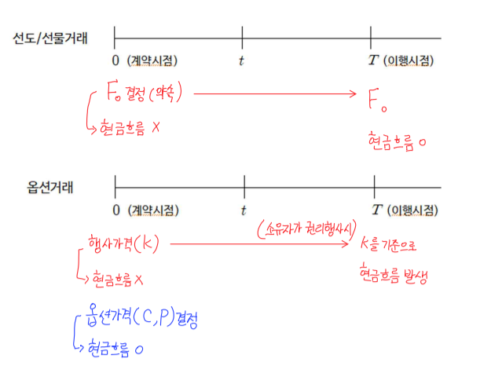

# 옵션(의무 + 권리)
- **미래 시점**에 사전에 약정한 가격, 수량으로 기초자산을 **매수 혹은 매도**할 권리가 부여된 계약
- 선도/선물(Only 의무): 미래 시점에 사전에 약정한 가격, 수량으로 기초자산을 **인수도**하기로 하는 계약
- 미래시점: 만기일 T
- 사전약정가격: 행사가격 K
- 옵션소유자(Holder): Long, 옵션 행사에 대한 권리 보유
- 옵션발행자(Issuer): Short, 옵션 소유자가 권리 이행 의사에 따라 의무
- t계약 시점: 소유자(Long) → 발행자(Short) 프리미엄(옵션 가격) 선지급

