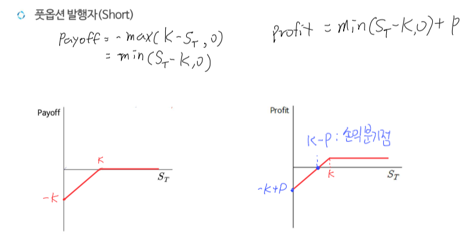

# 옵션(의무 + 권리)
- **미래 시점**에 사전에 약정한 가격, 수량으로 기초자산을 **매수 혹은 매도**할 권리가 부여된 계약
- 선도/선물(Only 의무): 미래 시점에 사전에 약정한 가격, 수량으로 기초자산을 **인수도**하기로 하는 계약
- 미래시점: 만기일 T
- 사전약정가격: 행사가격 K
- 옵션소유자(Holder): Long, 옵션 행사에 대한 권리 보유
- 옵션발행자(Issuer): Short, 옵션 소유자가 권리 이행 의사에 따라 의무
- t계약 시점: 소유자(Long) → 발행자(Short) 프리미엄(옵션 가격) 선지급

## Call Option
- 콜옵션 소유자(Long): 미래에 살지 말지 **권리**를 가지는 것
    + Payoff: $max(S_T - K, 0)$
        - $S_T - K(S_T > K), 0(S_T \leq K)$
    + Profit: Payoff - C = $max(S_T - K, 0) - C$
    + 손실 구간과 손익 분기점의 위치가 다름

- 콜옵션 발행자(Short): **의무**를 가짐 + 증거금이 있어야함
    + Payoff: $-max(S_T - K, 0)$ = $min(K - S_T, 0)$
        - $ 0(S_T \neq K), S_T - K(S_T < K)$
    + Profit: $min(K - S_T, 0) + C$

## Put Option
- 풋옵션 소유자(Long)
    + Payoff: $max(K - S_T, 0)$ 
        - $ 0(S_T \geq K), K - S_T(S_T < K)$
    + Profit: $max(K - S_T, 0) - P$

- 풋옵션 발행자(Short)
    + Payoff: $-max(K - S_T, 0)$ = $min(S_T - K, 0)$
        - $0(S_T \geq K), S_T - K(S_T < K)$
    + Profit: $min(S_T - K, 0) + P$

## 변동성 배팅
- 옵션 포지션 선택

|     구분      | 현물 가격 상승 예측 | 현물 가격 하락 예측 |
|:------------:|:-----------------:|:----------------:|
|변동성 증가 예측|콜옵션 Long         |풋옵션 Long        |
|변동성 감소 예측|풋옵션 Short        |콜옵션 Short       |

## 문제
- 행사가격(K): 100
- KOSPI 콜옵션을 1.5 포인트에 1계약 매수
    + 1.5포인트 = 프리미엄(C)
- **만기시 최대손실**은? 콜옵션 Long's Profit = -C로 고정 So **C**
- **손익분기점**은? K + C = **101.5**
- 만기시점에 KOSPI200이 105이면 콜옵션 행사한다? Yes
    + 손익분기점에 도달하지 않아도 K 이상이면 옵션 행사
- $S_T$ 증가 예상, 변동성 증가 예상

## 정리
### 권리와 의무
- 선물거래에서는 매입자, 매도자 모두 의무 보유
- 옵션거래에서는 매입자가 권리 소유, 매도자는 의무 So, 매입자는 매도자에게 **옵션 프리미엄 지급**

### 위험부담
- 선물계약은 **가격 상승과 가격하락에 따른 위험을 모두 부담**
- 옵션
    + 유리한 위험(이익기회) 취함
    + 불리한 위험(손실위험) 제거

### 가격에 따른 옵션 구분(Long 기준)

