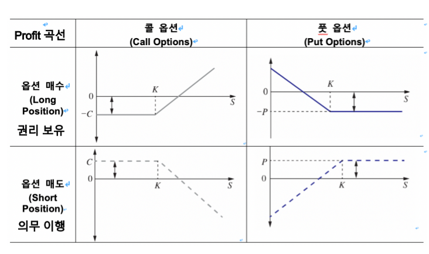

# 17장(옵션) 정리
- 미래 시점(T)에 사전에 약정한 가격(행사가격: K)과 수량으로 기초자산을 매수 혹은 매도할 권리가 부여된 계약
    + 매수할 권리 계약: Call Options
        - 소유자: K를 지불, 기초자산 **매수** 
    + 매도할 권리 계약: Put Options
        - 소유자: K를 수취, 기초자산 **매도** 
    + 옵션 소유자(holder: Long): 옵션 행사에 대한 권리 보유
    + 옵션 발행자(Issuer: Short): holder의 권리이행의사에 따른 의무
    + 옵션 소유자는 발행자에게 옵션 프리미엄(옵션 가격:P, C)를 계약시점에 지급

# 헷지 거래

## 시점

1. 현물(Long)인 상태(0)에서
    - 콜옵션 Short 계약(t): $S - C = -P$
    - 풋옵션 Long 계약(t): $S + P = C$

2. 현물(Short)인 상태(0)에서
    - 콜옵션 Long 계약(t): $-S + C = P$
    - 풋옵션 Short 계약(t) $-S - P = -C$

## 프로텍티브 풋(Protective Put: 콜옵션 Long) S+P = C
- Payoff: $S_T + max(K - S_T, 0) = max(S_T - K, 0) + K$
- Profit: $S_T - S_0e^{rT} + max(K - S_T, 0) - P_te^{r(T-t)} = max(S_T - K, 0) + K - S_0e^{rT} - P_te^r(T-t)$

## 커버드 콜(Covered Call: 풋옵션 Short) S - C = -P
- Payoff: $S_T + min(K - S_T, 0) = min(S_T - K, 0) + K$
- Profit: $S_T - S_0e^{rT} + min(K - S_T, 0) + C_te^{r(T-t)} = min(S_T - K, 0) + K - S_0e^{rT} + C_te^{r(T-t)}$

## 커버드 풋(Covered Put: 콜옵션 Short)-S -P = -C
- Payoff:
- Profit:

## 프로텍티브 콜(Protective Call: 풋옵션 Long) -S + C = P
- Payoff:
- Profit:

## 옵션 포지션 선택
- 헷지 투자자 = 옵션 계약(t)전에 현물 포지션을 보유

|      구분     |             현물 가격 상승 예측             |                현물 가격 하락 예측               |
|:------------:|:-----------------------------------------:|:---------------------------------------------:|
|변동성 증가 예측| 현물 Long + Put매수(S + P = C: 프로텍티브 풋)| 현물 Short + Call 매수(- S + C = P: 프로텍티브 콜)|
|변동성 감소 예측| 현물 Long + Call매도(S - C = -P: 커버드 콜)  | 현물 Short + Put 매도(-S -P = -C: 커버드 풋)     |
