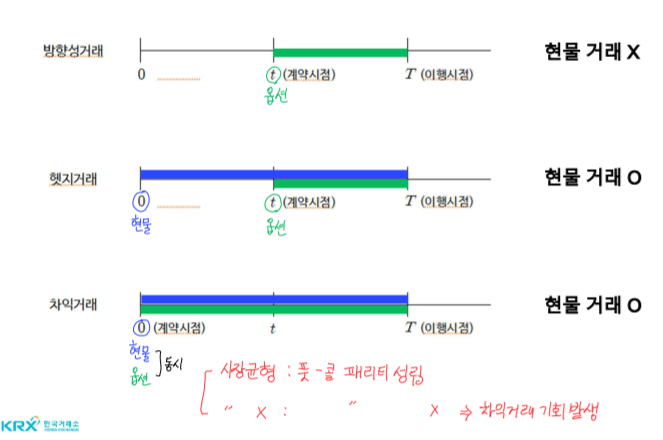
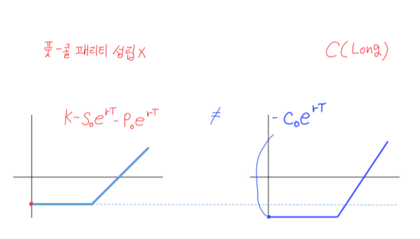
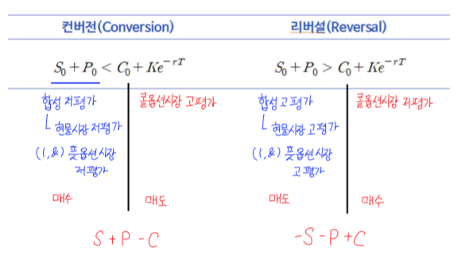
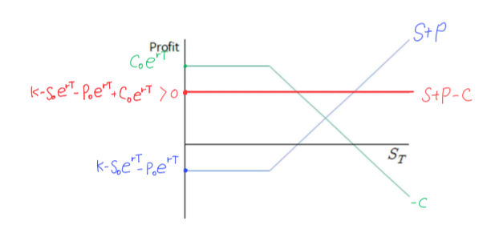

# 풋-콜 패리티, 옵션 차익 거래
- **만기(T), 행사가격(K)가 동일**
- $ S + P = C$: 프로텍티브 풋
- $ S - C = -P$: 커버드 콜
- $ -S - P = -C$: 커버드 풋
- $ - S + C = P$: 프로텍티브 콜
- 매수 → 옵션을 매수해서 보호한다
- 매도 → 옵션을 매도해서 커버한다

## 풋-콜 패리티
- 동일한 기초자산에 대해 만기(T)와 행사가격(K)가 같은 콜옵션과 풋옵션의 관계식
- S + P = C: 프로텍티브 풋
- S + P Profit
    - $max(S_T - K, 0) + K - S_0e^{rT} - P_0e^{rT}$
- C Profit(0 시점에 동시 체결)
    - $max(S_T - K, 0) - C_0e^{rT}$
- 시장 균형이라면 S + P = C
    - 만기시점(T): 
        + $K - S_0e^{rT} - P_0e^{rT} = -C_0e^{rT}$
        + $K + C_0e^{rT} = S_0e^{rT} + P_0e^{rT}$
    - 계약시점(0): $Ke^{-rT} + C_0 = S_0 + P_0$

## 풋-콜 패리티 변형
- $S_0 + P_0 = C_0 + K_e^{-rT}$
### 풋옵션 복제
- $P_0 = C_0 - S_0 + K_e^{-rT}$
- 풋Long = 콜Long + 현물Short + 채권 Long
### 콜옵션 복제
- $C_0 = S_0 + P_0 - K_e^{-rT}$
- 콜Long = 현물Long + 풋Long + 채권 Short
### 무위험 포트폴리오
- $S_0 + P_0 - C_0 = K_e^{-rT}$
### 풋-콜-선물 패리티
- 선물가격식: $F_0 = S_0e^{rT}$ → $S_0 = F_0e^{-rT}$
- $C_0 - P_0 = S_0 - K_e^{-rT}$
- $C_0 - P_0 = F_0e^{-rT} - K_e^{-rT} = (F_0 - K)e^{-rT}$

## 옵션의 차익 거래

- IF 풋-콜 패리티 성립 X?
- $K - S_0e^{rT} - P_0e^{rT} \neq -C_0e^{rT}$

## 컨버전과 리버설(Conversion & Reversal)

### 컨버전(Conversion)
- 합성 저평가: 현물시장 저평가 또는(그리고) 풋옵션 저평가 → 매수
- 콜옵션 고평가: 매도
- $S + P - C$

### 리버설(Reversal)
- 합성 고평가: 현물시장 고평가 또는(그리고) 풋옵션 고평가 → 매도
- 콜옵션 저평가: 매수
- $-S - P + C$