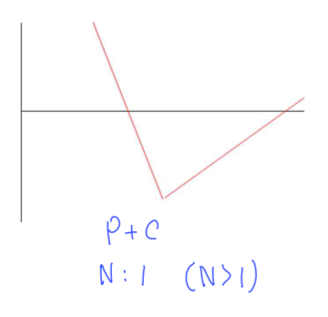

# 스프레드 전략, 변동성 매매 전략
- 수평 스프레드: 시간(T)가 다름
- 수직 스프레드: 행사가격(K)가 다름

## 스프레드 전략
- 행사가격($K_1$)이 250인 콜옵션을 5포인트($C_1$)로 1계약 매수
- 행사가격($K_2$)이 255인 콜옵션을 2포인트($C_2$)로 1계약 매도
- $C_1 - C_2$: Bull Spread
- $C_1$ Profit: $max(S_T - 250, 0) - 5$
- $C_2$ Profit: $min(255 - S_T, 0) + 2$

1) $S_T < 250 (K_1)$ Profit: $C_1 - C_2 = -3$

2) $250(K_1) \leq S_T < 255(K_2) $ Profit: $S_T - 250 -5 + 2 = S_T - 253$

3) $255(K_2) \leq S_T$ Profit: $S_T -250 - 5 + 255 - S_T + 2 = 2$

## 방향성 매매 - 수직 강세 스프레드(Vertical Bull Spread)
- 목적: **상승장**을 예상 Or 확신이 높지 않을 때 이용하는 보수적인 전략
- 행사가격($K_1$)이 낮은 옵션 **매수** + 행사가격($K_2$)이 높은 옵션 **매도**

## 방향성 매매 - 수직 약세 스프레드(Vertical Bear Spread)
- 목적: **하락장**을 예상 Or 확신이 높지 않을 때 이용하는 보수적인 전략
- 행사가격($K_1$)이 낮은 옵션 **매도** + 행사가격($K_2$)이 높은 옵션 **매수**

## 변동성 매수 - 스트레들(Straddle) 매수
- 목적: **가격변동성이 커질 것으로 예상**하는 경우에 이용, 상승/하락 예측 X
- 동일 만기(T), 동일 행사가격(K)를 만족하는 콜옵션, 풋옵션 동시 매수(C + P)

## 변동성 매수 - 스트랭글(Strangle) 매수
- 동일 만기(T), 낮은 $K_1$에서 $P_1$ 매수, 높은 $K_2$에서 $C_2$ 매수 $P_1 + C_1$

## 변동성 매수 - 버터플라이(Butterfly) 매도
- 스프레드 전략처럼 **같은 옵션**이지만, 다른 계약수 구조($C_1:C_2:C_3 = 1:2:1$)

## 방향성 + 변동성 매매 결합
- 가격변동성 확대로 스트레들 매수 → 현물 가격의 변동

1) 현물 가격 상승(**Strap 매수**)

2) 현물 가격 하락(**Strip 매수**)

