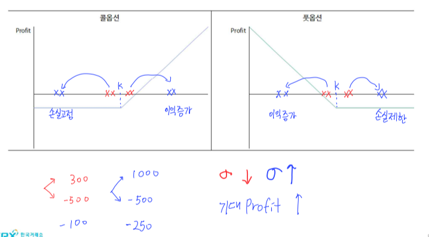
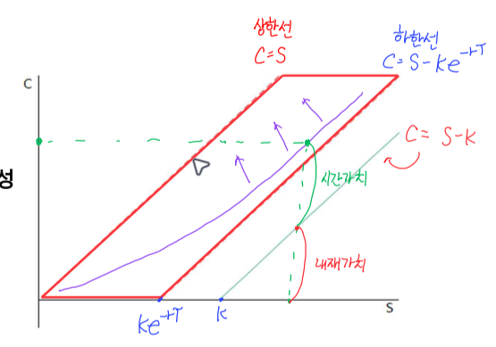
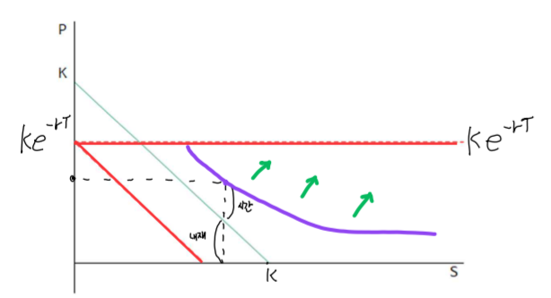

# 복습(풋-콜 패리티)
- 시장 균형 상태에서 $ S_0 + P_0 = C_0 + Ke^{-rT} $
- 콜옵션 복제: $ C_0 = S_0 + P_0 - Ke^{-rT} $
- 풋옵션 복제: $ P_0 = C_0 - S_0 + Ke^{-rT} $
- 풋콜선물 패리티: $ C_0 - P_0 = S_0 - Ke^{-rT} $

## 풋-콜-선물 패리티
$ C_0 - P_0 = (F_0 - K)e^{-rT} $

### 주식 옵션(배당)
$ F_0 = (S_0 - D)e^{rT} $
- $F_0$을 대입
$ C_0 - P_0 = ((S_0 - D)e^{rT} - K)e^{-rT}$
$ = S_0 - D - Ke^{-rT} $

### 주식옵션(무배당)
$ F_0 = S_0e^{rT} $
$ C_0 - P_0 = S_0 - Ke^{-rT} $

### 지수 옵션(배당 수익률)
$ F_0 = S_0e^{(r-q)T}$
- q: 배당선물 수익률
$ C_0 - P_0 = (F_0 - K)e^{-rT} = S_0e^{-qT} - Ke^{-rT} $

### 통화 옵션
$ F_0 = S_0e^{(r - r_f)T} $
$ C_0 - P_0 = (F_0 - K)e^{-rT} = S_0e^{-r_fT} - Ke^{-rT} $

## 복습 문제(풋-콜 패리티를 통한 옵션 프리미엄 가치평가)
- Q: 무배당 주식의 현재가격 8000원, 무위험 이자율 5%, 만기 1년, 행사가격 7500원인 무배당 주식에 대한 유러피언 콜 옵션의 현재가격 1500원일 때, 동일 조건의 풋옵션 가격은?
- $S_0 = 8000, r = 0.05, T = 1, K = 7500, C_0 = 1500 $
- $ P_0 = C_0 - S_0 + Ke^{-rT} = 1500 - 8000 + 7500e^{-0.05} = 634$

# 옵션 프리미엄 결정 요인(옵션 권리행사의 가치; Long 포지션 입장)
- 무위험이자율과 돈의 가치는 반대
- 내재가치: S, K
- 시간가치 프리미엄(= 기초자산 Long 포지션이 유리해질 가능성): T, r, 변동성
- 만기시점에서의 Payoff
    + Call: $max(S_t - K, 0)$
    + Put: $max(K - S_t, 0)$

|       구분      | 콜 옵션 | 풋 옵션 |
|:--------------:|:------:|:------:|
|기초자산 가격(S ↑)| ↑      |  ↓     |
|행사 가격(K ↑)   | ↓      | ↑      |
|만기(T ↑)        | ↑      | ↑      |
|무위험이자율(r ↑) | ↑      | ↓      |
|기초자산 변동성(↑)| ↑      | ↓      |

## 옵션 프리미엄 결정요인(기초자산의 변동성이 옵션 프리미엄에 미치는 영향)

## 옵션 프리미엄 분해
- 옵션 프리미엄: 내재가치 + 시간 프리미엄
- 내재가치(행사가치)
    + 기초자산 가격과 행사가격 간의 차이
    + 내재가치 옵션이 내가격(ITM)상태일 때 존재
    + 콜옵션 내재가치: $ max(S - K, 0) $, ITM: $ S_0 > K $
    + 풋옵션 내재가치: $ max(K - S, 0) $, ITM: $ S_0 < K $
- 시간 프리미엄
    + 기초자산 가격이 만기시점까지 유리한 방향으로 움직일 가능성에 대한 가치

### 문제
- Q: 현재 가격 90000원인 주식을 기초자산으로 하고 행사가격이 95000원인 3개월 만기 풋 옵션의 프리미엄 7000원일 때 옵션의 시간가치는?
- $ S = 90000, K = 95000, T = 0.25, P = 7000 $
- P = 내재가치 + 시간가치
- 시간가치 = P - 내재가치 = 7000 - $max(K - S, 0)$ = 7000 - 5000 = 2000

# 옵션 가격 범위
## 콜 옵션의 가격범위
- 상한가: $C < S$
- 하한가: $ C = S + P - Ke^{-rT}, C > S - Ke^{-rT}$
- 이자율, 변동성, 만기 ↑ → 콜옵션 프리미엄 ↑(보라색 화살표로 이동: 내재가치 고정 & 시간 가치 ↑)
- 가격 형성은 빨간색 사각형 내에서 형성

## 풋 옵션 가격범위
- 상한가: $P + (S - C)= Ke^{-rT}$, (S - C > 0) $P > Ke^{-rT} $
- 하한가: $P > -S + Ke^{-rT}$
- 이자율 ↓, 변동성/만기 ↑ → Put옵션 프리미엄 ↑(초록 화살표로 이동)

