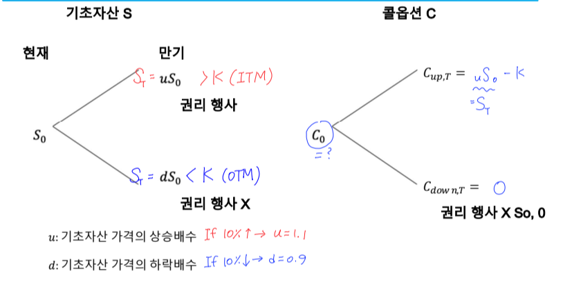
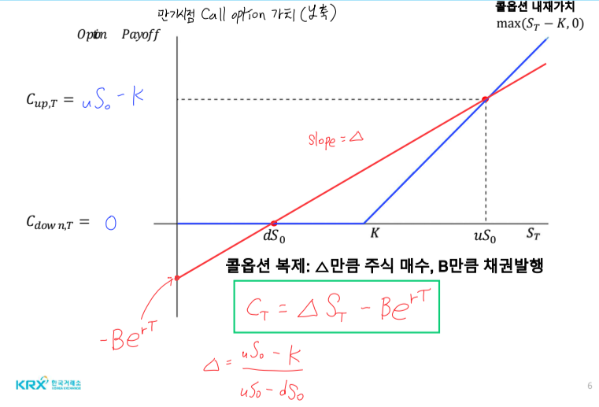
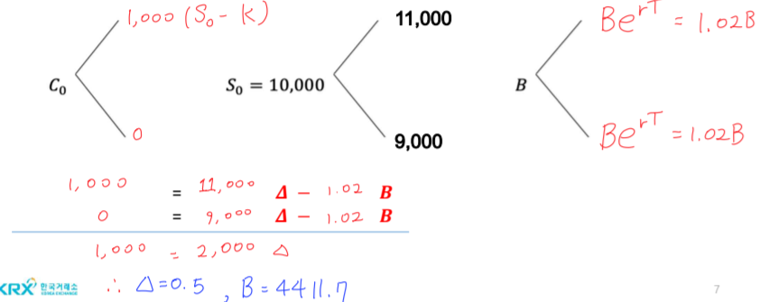
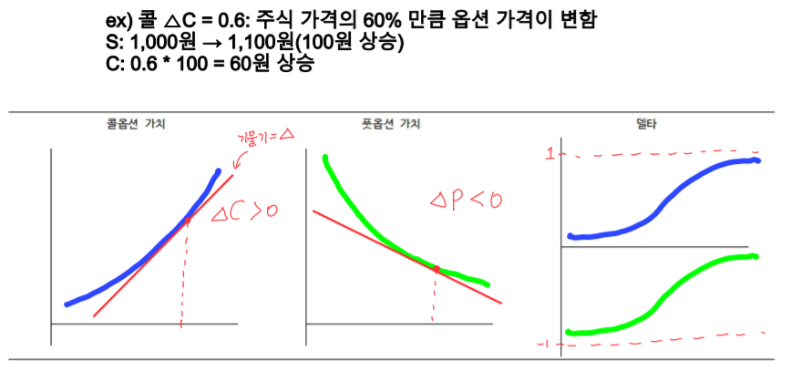
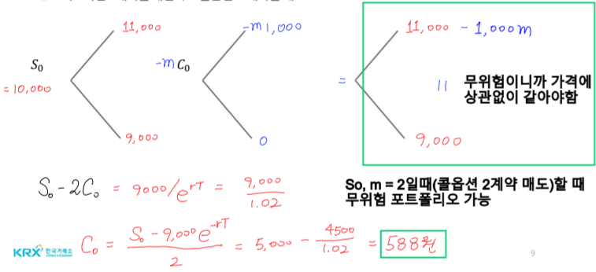

# 복습
- 풋-콜패리티: $ S_0 + P_0 = C_0 + Ke^{-rT}$
- 콜옵션 복제: $ C_0 = S_0 + P_0 - Ke^{-rT}$
    + 풋매입, 주식 보유, 채권 발행
    + 현재 $C_0$가격 평가 가능
- 만기 시점(T) Payoff
    + If $S_T > K$일 때, $S_T - K = 0 + S_T - K$
    + $C_0 = S_T - K, P_T = 0$
    + If $S_T < K$일 때, $0 = K - S_T + S_T - K$
    + $C_T = 0, P_T = K - S_T$

# 이항분포 옵션 가격 결정 모형
- 복제 포트폴리오 방법
- 무위험 포트폴리오 방법
- 위험 중립확률 방법

# 이항분포 옵션 가격결정 모형 - 원리
## 기본원리
- 풋 옵션 정보 없이 콜 옵션 복제가 가능한가?
- 기초자산과 채권을 이용해 옵션과 **동일한 현금흐름을 제공**하는 복제 포트폴리오를 구성하고 이를 이용해 옵션가격을 구함
- [가정]: 기초자산 가격이 미래시점에서 단 두 가격만을 가지고(: 콜옵션 기준, 풋옵션이면 반대로)
    + 하나는 내가격(ITM): $S_T > K$
    + 다른 하나는 외가격(OTM): $S_T < K$

# 복제포트폴리오 방법
- $ C_T = \Delta S_T - \beta e^{rT} $
- $ C_T = \Delta S_0 - \beta $
- Q: 현재 주가 10000원, 콜옵션 행사가격이 10000원으로 가정($e^{rT} = 1.02$)
    + 주가가 10% 상승하는 경우($u = 1.1$) 주가는 11000원 > K
    + 주가가 10% 하락하는 경우($d = 0.9$) 주가는 9000원 < K

## 옵션의 델타
- 기초자산 가격이 1단위 변할 때 옵션 가격의 변화 정도 $\frac{C}{P}$

# 무위험 포트폴리오 방법
- $S_0 - mC_0$
- m: 헷지비율 $\frac{1}{\Delta}$
- 기초자산과 콜옵션을 이용해 무위험 포트폴리오 구성
    + 기초자산 1계약 매입, 콜옵션 m계약 매도
- 초록색 네모(만기시점 기준)
- 만기(미래)에 9,000원으로 확정된 채권과 같다.
- 현재가치를 표현하기 위해 $S_0 - 2C_0 = \frac{9000}{e^{rT}} $

