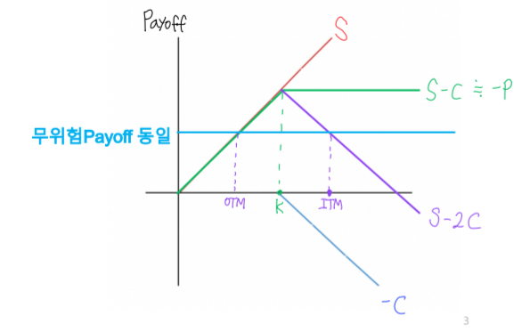
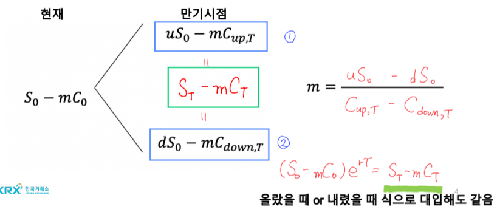
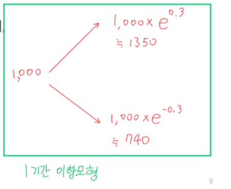

# 복습(무위험 포트폴리오)
- Covered Call: $S - C$
- 무위험 포트폴리오: $S - mC$
    + m: 헷지비율 = $ \frac{1}{\Delta}$

## 무위험포트폴리오 일반화
- 헷지비율
- $uS_0 - mC_{up, T}$
- $dS_0 - mC_{down, T}$

- $mC_0 = S_0 - (uS_0 - mC_{up, T})e^{-rT}$
- $q = \frac{e^{rT} -d}{u-d}$
- $1-q = \frac{u - e^{rT}}{u-d}$

# 이항분포 옵션 가격결정 모형
## 위험중립가치평가 방법
- 위험중립확률(q): 무위험이자율($e^{rT}$)과 콜 옵션의 기대수익률($\frac{qC_{up,T} + (1-q)C_{down,T}}{C_0}$)을 동일하게 만드는 데 필요한 상승 움직임의 확률
- $C_0$이 각각
    + $q$일때: $C_{up,T}$
    + $1-q$일때: $C_{down,T}$
- $C_0 = [qC_{up, T} + (1-q)C_{down,T}]e^{-rT}$

- 무위험 포트폴리오 일반화
$$ C_0 = \frac{(e^{rT}-d)C_{up,T}e^{-rT}}{u-d} + \frac{(d-e^{rT})C_{down,T}e^{-rT}}{u-d}$$

- 위험중립확률(q)
$$ q = \frac{e^{rT} - d}{u-d}$$

## 이항분포 옵션 가격결정 모형 예시
- 현재 주가 10000원이고 풋옵션 행사가격이 10000원으로 가정($e^{rT} = 1.02$) 풋옵션 가격은?
    + 주가가 10% 상승하는 경우 주가는 11000원($u=1.1$)
    + 주가가 10% 하락하는 경우 주가는 9000원($d=0.9$)

1. 리스크 중립확률(q)
$$ q = \frac{e^{rT} - d}{u-d} = \frac{1.02 - 0.9}{1.1 - 0.9} = \frac{0.12}{0.2} = 0.6$$

2. 위험중립가치평가모형
$$ P_0 = [qP_{up,T} + (1-q)P_{down,T}]e^{-rT} = (0.6 * 0 + 0.4 * 1000)/1.02 = 392$$

## u와 d는 어떻게 정하나?
- ex: 1기간을 1년으로 하고 변동성이 30%일 때
$$ u = e^{\sigma \sqrt{\Delta t}} = e^{0.3} $$
$$ d = \frac{1}{u} = e^{-\sigma \sqrt{\Delta t}} = e^{-0.3}$$

