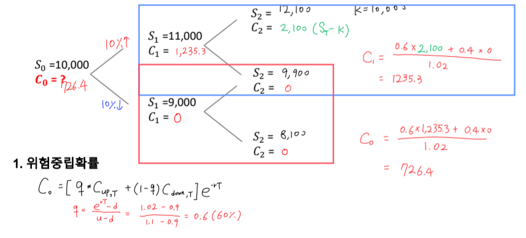
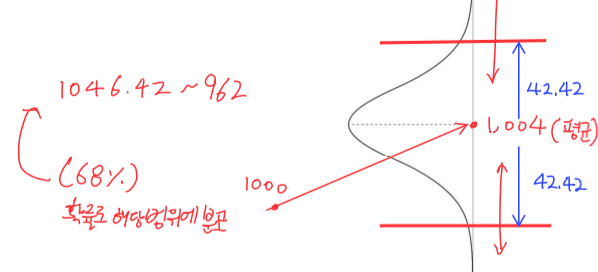
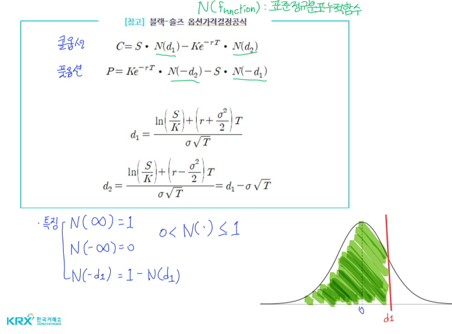
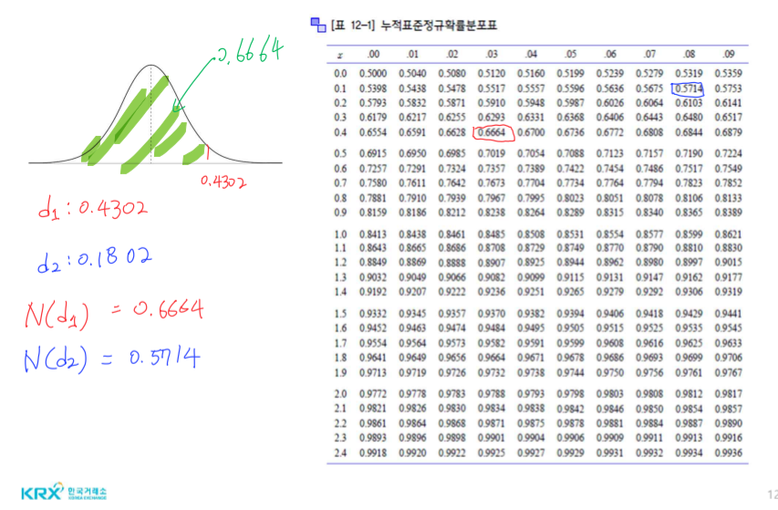

# 다기간 모형(복습)
## 문제
- 옵션 만기: 2년
- 1기간: 1년
- 매 기간마다 주가는 10% 상승 | 10% 하락
- 콜옵션 행사가격: 10,000원
- 현재 주식가격: 10,000원
- $ e^r = 1.02$
- $q = \frac{e^{rT} - d}{u - d} = \frac{1.02 - 0.9}{1.1 - 0.9} = \frac{0.12}{0.2} = 0.6$

# 블랙-숄즈 옵션가격 결정 모형
## 가정
1. 이항모형은 기초자산 가격이 일정한 비율로 오르거나 내리는 이항분포를 따른다고 가정(아래는 콜옵션 기준)
    - $ S_{up, T} $ = ITM
    - $ S_{down, T}$ = OTM

2. 블랙-숄즈 모형은 기초자산가격이 연속확률과정인 이토 프로세스를 따름
    - S: 기초자산 가격
    - dt: "순간" = 시간의 변화
    - $ \mu $: 기대 주가 수익률
    - $ \sigma $: 주가수익률의 표준편차
    - $ z ~ N(0,t) $: 확률변수, 위너 프로세스를 따른다
    - $ dz ~ N(0, dt) \therefore dz = \varepsilon \sqrt{dt}$ ( $ \varepsilon ~ N(0, 1) $ : 무작위 추출값)
    - 수익률: $ \frac{S_T - S_0}{S_0} = \frac{dS}{S_0}$

## 문제
- 주식의 연간 기대 수익률($ \mu $)이 20%
- 연간 변동성($ \sigma $)이 30%
- 주가가 이토 프로세스를 따른다
- 이 주식의 수익률 변동 패턴은?

$ \frac{dS}{S} = \mu dt + \sigma dz = 0.2dt + 0.3dz = 0.2dt + 0.3 \varepsilon \sqrt{dt} $ 

- 현재 주가가 1000원
- 5일 기간동안 관찰
- 이 기간동안의 주가 변동분은?
- $ dt = 5 / 250 = 0.02 $
- $ \frac{dS}{1000} = 0.2 * dt + 0.3 \varepsilon \sqrt{dt} = 0.2 * 0.02 + 0.3 \sqrt{0.02} \varepsilon $
- $ ds = 4 + 42.42 \varepsilon $

- 해석: 5일 후 주가변동분은 평균이 **4**이고 표준편차가 **42.42**인 정규분포에서 추출된 확률변수이다.

## 짧은 순간의 주가 변동(dS)이 이토 프로세스를 따른다면, 미래 시점에서의 주가는 대수정규분포를 따른다.

## 기타 가정
- 이항 분포와 동일한 부분
    + 거래비용, 세금 X
    + 무위험이자율은 일정
    + 무위험 차익거래가 존재하지 않음(시장 균형)
    + 증권의 거래는 연속적 발생
    + 투자자는 무위험이자율로 차입하거나 대출할 수 있음
- 옵션의 만기일까지 기초자산은 배당을 지급하지 않는다.
    + 배당을 주는 주식, 지수는 이항분포와 동일
    + 통화의 경우 BS 모형을 사용
- 옵션은 only 유로피언옵션(행사가격 K, 만기 T)이다.

## 계산식
- 복습: 이항모형 중 복제포트폴리오 방법
- $ C_T = \triangle S_T - Be^{rT} \Leftrightarrow C_0 = \triangle S_0 - B $
    + $C_T$: 미래 시점
    + $C_0$: 현재 시점

- 블랙숄즈 콜옵션 가격 결정 모형
    + $ C = S \bullet N(d_1) - Ke^{-rT} \bullet N(d_2) \Leftrightarrow C_T = S_T \bullet N(d_1) - KN(d_2) $
    + $ KN(d_2) $ = 콜옵션 권리 행사확률
    + $ N(d_1) $ = 델타 ($ \triangle $)

## 문제
- 현재 무배당 주식 가격: 10000원
- 연간 무위험 이자율: 10%
- 행사가격: 9500원
- 만기: 3개월
- 주식수익률의 표준편차: 연 50%
- 유로피언 콜옵션과, 풋옵션의 가격은?

1. d1과 d2 구하기

- $ d_1 = \frac{\mathrm{ln}(\frac{S}{K}) + (r + \frac{\sigma^2}{2})T}{\sigma \sqrt{T}} $
- $ d_2 = \frac{\mathrm{ln}(\frac{S}{K}) + (r - \frac{\sigma^2}{2})T}{\sigma \sqrt{T}} = d1 - \sigma \sqrt{T} $
- d1 = $ \frac{\mathrm{ln}(10000/9500) + (0.1 + 0.5^2 / 2) * 1/4}{0.5 \sqrt{1/4}} = 0.4302 $
- d2 = $ 0.4302 - 0.5 \sqrt{1/4} = 0.1802$ 

2. 누적 표준정규확률분포표로 N(d1), N(d2) 찾기

3. 콜옵션, 풋옵션 가격 구하기
- $ C = S \bullet N(d_1) - Ke^{-rT} \bullet N(d_2) = 10000 * 0.6664 - 9500e^{-0.025} * 0.5714 = 1371.8 $ 원
- $ P = Ke^{-rT} \bullet N(-d_2) - S \bullet N(-d_1) = 9500e^{-0.025} * (1-0.5714) - 10000 * (1 - 0.6664) = 639.1 $ 원