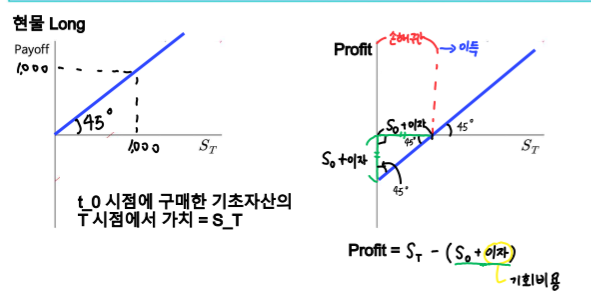
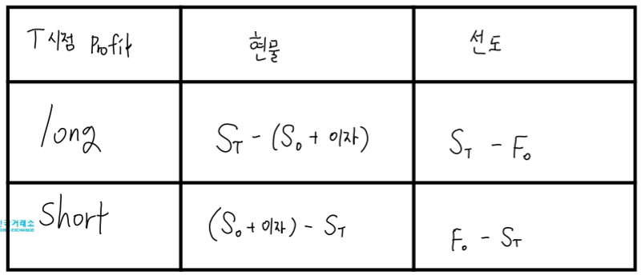
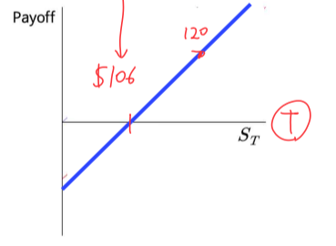
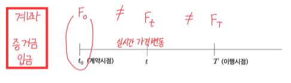

# **1강**

## **파생상품이란?**
- **기초자산에 의해 그 가치가 결정되는 계약**
- 다음 각 호의 어느 하나에 해당하는 **계약상의 권리**
    + **기초 자산**에 의해 산출된 금전등을 **장래의 특정 시점에 인도**할 것을 약정하는 **계약** → **선도/선물**
    + 기초자산에 의해 산출된 금전등을 수수하는 **거래를 성립시킬 수 있는 권리**를 부여하는 것을 약정하는 계약 → **옵션**
    + 장래의 **일정기간 동안 미리 정한 가격**으로 **기초자산**에 의해 산출된 금전 등을 **교환**할 것을 약정하는 **계약** → **스왑**

### **파생상품 종류**
- **계약형태**에 따라 선도, 선물, 옵션, 스왑, 합성으로 나누어짐

## **기초 자산 종류**
- **주가지수**: KOSPI200 선물/옵션, S&P500 선물
- **개별주식**
- **금리**
- **외환**
- **농산물**, **에너지**, **금속**

## **거래 장소**
1. **장외파생상품(Over-The-Counter; OTC)**
    - **비표준화** → 선택의 자유 ↑ But 거래 상대방이 필요
    - **상대탐색비용(= 신용 리스크)**
    - **선도**
2. **장내파생상품**
    - **표준화된**계약
    - **거래소에 의한 채무이행**
    - **결제 안정화 제도**
    - **선물**

## **파생상품의 경제적 기능**
1. **리스크 헤지 수단** → 리스크의 전가
2. **가격 발견 기능** → 미래 기초자산 가격에 대한 시장 참여자들의 예측치
3. **자원배분의 효율성** → 다수의 시장참가자가 경쟁 
4. **시장 효율성** → 저렴한 거래비용

## **계약형태**에 따른 구분 → 미래 발생할 일에 대한 계약
1. **선도(Forwards)/선물(Futures)**
    - 기초자산을 **장래 특정 시점에 인도**할 것을 약정하는 계약
2. **옵션(Options)**
    - 당사자 어느 한쪽의 의사에 따라 기초자산 **거래를 성립시킬 수 있는 권리**를 부여하는 것을 약정하는 계약
3. **스왑(Swaps)**
    - **일정 기간**동안 정한 가격으로 기초자산을 **교환**할것을 약정하는 계약

# **2강**
- Long 포지션 = Buy
- Short 포지션 = Sell
- 외상, 선결제는 선도 X
- 선도: 약속을 지금 But **이행은 정해진 미래의 날**

## **선도(Forwards)**
- 미래 시점(t = T)에 **사전에 약정한 가격과 수량으로** 기초자산을 인수도 하기로 하는 조약
- 선도 거래 t_0 시점에서 물건 필요 X, F_0을 t_0 시점에 약속만 하고 교환 X


## **선도 거래 단점**
- 거래 상대방을 구하기 어려움
- 결제 불이행(Default Risk) → 거래의무는 있으나 강제할 수단 X
- 선도 거래는 **OTC**상품 So, 장외파생상품의 단점을 보유 → 선물 상품의 등장

## **현물 거래의 손익 구조**
- **Payoff**: **만기일(T)에** 계약을 이행함에 실현되는 **현금흐름(가치)**
- **Profit**: **만기일(T)에** Payoff - 만기일 이전(t < T)실현된 현금흐름(가치)
- 현물의 경우 만기 X, 
$$
S_0 = S_t = S_T\\ 
t_0 = t = T
$$
|               현물 Long 손익구조          |               현물 Short 손익구조          |
|:---------------------------------------:|:----------------------------------------:|
|  |  |

## **선도 거래의 손익 구조**
- 선도 거래는 T시점(만기일)에서만 거래가 발생 → **Payoff = Profit**
- **F_0** = 계약 당시 가격
- **S_T** = 만기일의 가격


## **선도 가격과 현물가격의 관계**
- **무소득 투자자산의 이론(증식되지 X)** t = 0 시점에서 가격이 S_0인 기초자산에 대해 만기가 T인 선도 가격은 **시장 균형**하에서 다음과 같다. 단, r = **연속 복리 기준 무위험이자율(연이자율)**<br>

```math
F_{0} = S_{0}*e^{rT}
```

- **무소득 투자자산** = 배당금 없는 주식
- [가정]
    1. **시장 균형**
    2. **기초 자산**
    3. **이자**

- **T시점 현물 Profit = 선도 Profit**



## **문제**
- 만기가 6개월 후인 무배당 주식 선도 계약 체결
- 현재 주가는 $100, 무위험 이자율이 연속 복리 기준으로 연 12%
- 선도 가격은?
- T = 6개월 = 1/2
- S_0 = $100
- r = 0.12

```math
F_0 = S_0 * e^{rT} = 100 * e^{0.12*0.5} = 106
```
- 선도 매수자의 만기 Payoff 그래프는? (= Long 포지션의 Profit 그래프)
- 만기일 주가가 $120 일때, 수익은? 120 - 106 = 14
- 만기일 주가가 $100 일때, 수익은? 100 - 106 = -6(= Loss)


## **Summary**
- **선도거래**: 미래 시점에 사전에 약정한 가격과 수량으로 기초자산을 인수도 하기로 하는 계약
- **선도거래 손익 구조**
    + Long 포지션일 때, 만기 수익 = S_T - F_0
    + Short 포지션일 때, 만기 수익 = F_0 - S_T

# **보충: 화폐의 시간 가치(이자율)**

# **3강**
## **선물 거래**
1. 표준화된 계약
    - 기초자산의 표준화
        + ex: 금선물 = 순도 99.99% 이상 1Kg 벽돌 모양 직육면체 금(골드 바)
    - 최종 거래일(만기일 = T) 표준화
        + 코스피 200지수 선물 & 옵션: 3, 6, 9, 12월 2번째 목요일 → 4마녀의 날
        + 개별 주식 선물 * 옵션: 매월 2번째 목요일
    - 최종 결제 방법 표준화
        + 인수도 결제: 선물계약의 기초자산(실물)을 주거나 받음
        + 현금 결제: 계약의 최종 손익을 계산해서 미정산 차액을 현금으로 결제
    - 거래 단위
        + 주식 시장: 1주
        + 개별 주식 선물: **1계약 = 주식 10주**
        + So, **선물 가격 F_t의 1계약 금액 = F_t * 10**
2. 거래소에 의한 채무이행
3. 결제안정화 제도

## **선물 거래 작동 원리(결제 안정화 장치)**
1. **증거금(Margin)**: 선물 거래시 계약 이행을 보증하기 위해 거래소에 납부하는 보증금
    - 선물에 투자하고자 하는 거래자는 증거금 계좌를 개설해야 함
2. **마진콜(Margin Call)**: 일일정산 후 증거금 잔액이 부족해지면 **증거금 충당을 요구받는 것**
3. **일일정산(Daily Settlement)**: 선물 가격 변동에 따라 발생하는 손익을 매일 재계산하는 것
4. **반대거래(Offsetting Transaction)**: 최종거래일 이전 기존 매수(매도)한 계약에 대한 동일 종목 및 수량 매도(매수)하여 선물 거래에 의한 결제 의무에서 벗어나는 결제 방법



### **예시**
- Long(매수) "포지션 개시 가격 < 미래 가격" 일 때 이득
- t = 1 시점에서 유지 증거금 윗 부분은 출금 가능
- 즉, 개시 이후에는 유지 증거금 이상만 존재하면 됨
- t = 2 시점에서 유지 증거금보다 모자라게 됨 → 마진 콜
    + 추가 증거금 납입(보라색)
    + 포지션 청산(반대 거래)


## **반대 거래(반대매매)**
- 최종거래일에 결제를 할 수도 있으며, 만기일 이전에 포지션 청산도 가능
- **현금결제**의 경우: 만기 결제와 중도 청산이 모두 **가격의 차이**로 이루어짐
- **실물인수도**의 경우: **만기 결제 시에만 발생**
- 투자자의 포지션을 상쇄시키는 거래
- **미결제 약정(= 시장에 남아있는 선물 계약의 총 수)**의 감소를 가져옴
- 일반적으로 만기일(T)에 가까워질수록 미결제 약정은 감소

## **문제**
- 삼성전자 주식선물 최근 월물을 8월 10일에 2계약 매수
- 비어있는 증거금 계좌 잔액을 채워라
- 단, 주식선물의 개시증거금률이 10%이고 유지증거금은 개시 증거금의 70%라고 가정
- **계약금액(Long 2계약)** = 2 * 10(승수) * 선물가격(60,000원: 8/10일 가격) = 1,200,000원
- **개시증거금** = 계약금액 * 10% = 1,200,000 * 0.1 = 120,000원
- **유지증거금** = 개시증거금 * 70% = 120,000 * 0.7 = 84,000원
- **손익** = 금액 변화 * 20(계약 수 * 승수)

|  일자 |      사건     |  선물 가격 |  일일 손익 |입금,마진콜/인출| 증거금 계좌잔액|
|:----:|:-------------:|:--------:|:---------:|:------------:|:------------:|
| 8/10 | 선물 2계약 매수 | 60,000원 |   -       | 120,000원    | 120,000원     |
| 8/11 |+ 500원         | 60,500원 | 10,000원  |              | 130,000원    |
| 8/12 |- 2,500원      | 58,000원  | -50,000원 |              | 80,000원     |
|      |  마진콜        |          |           | 40,000원     | 120,000원    |
| 8/16 |+ 2,000원      | 60,000원  | 40,000원  |              | 160,000원    |
|      |  인출          |          |           | -40,000원    | 120,000원    |
| 8/17 |-2,000원       | 58,000원  | -40,000원 |              | 80,000원     |
|      |  마진 콜       |          |           |              |              |
| 8/18 |  반대 거래     |          |           | -80,000원     | 0원          |

- 8/12일: 유지증거금 > 증거금 계좌 잔액 So, 마진콜
- **총 수익** = **입금,마진콜/인출의 반대 부호 합**을 계산 = (80,000 + 40,000) - (120,000 + 40,000) = **-40,000원**
- **총 수익** = ($ F_t - F_0 $) * 계약 수 * 거래 승수 = (5,8000원 - 60,000원) * 2 * 10 = **-40,000원**

## **문제(왜 현물 거래가 아닌 선물 거래를 하는가?)**
- 만기일 1주당 1만원 하는 주식 20주(= 선물 2계약 * 거래 승수 10)를 살 때, 현물 거래와 선물 거래의 투자 성과를 비교
- 단, 주식 선물의 증거금률 10%라고 가정
- 초기 투자 금액 ↓ But 수익률 ↑(위혐률 ↑) **"레버리지 효과"**

|        구분          |     주식 현물 거래    |             주식 선물 거래            |
|:--------------------|:-------------------:|:-----------------------------------:|
| 투자 금액            | 200만원(20주 * 10만원)| 20만원(2계약*10승수*10만원*증거금률 10%)|
| 주가 5만원 상승 시 이익| +100만원(5만 * 20주) | 100만원                              |
| 상승 시 수익률        | 100/200 = 50%       | 100/20 = 500%                       |
| 주가 5만원 하락 시 손해| -100만원(5만 * 20주) | -100만원                             | 
| 하락 시 수익률        | -100/ 200 = -50%    | -100/20 = -500%                     |

## **Summary**

|    구분    |           선도 거래         |            선물 거래           |
|:----------:|:-------------------------:|:-----------------------------:|
| 거래 당사자 | 제한적                     |   다양                         |
|  거래 장소  | 장외(OTC)                 |  거래소(장내)                   |
|  계약 조건  | 당사자간 합의(비표준화)      | 거래소 규정으로 정함(표준화)      |
|  거래 가격  | 계약 체결 시 단 1회 생성     | 같은 종목에 대해 실시간 가격 형성 |
| 포지션 청산 | 반대 매매가 어려움           | 반대매매가 쉬움                 |
|   증거금   | 상호합의에 의해 예탁 여부 선택 | 예탁 의무화                    |
| 결제 안전성 |  결제 불이행 위험에 크게 노출 | 청산소(거래소)가 지급            |