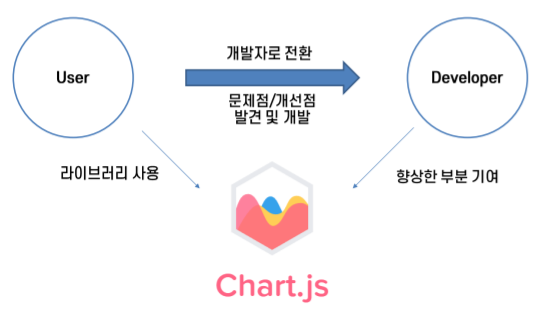
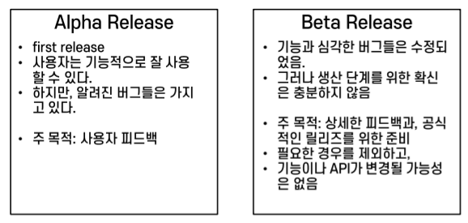

# Open Source Software 개발
- 문제 유형
    - 용어 설명, Practice에 대한 서술 문제
    - 코드 포맷스타일
- 각 용어, 영어 full-name, 예시 암기

- **Knowledge Base** or **Wiki 시스템**: 개발자 문서 작성 시, 정보에 대한 검색, 창조, 수정 등이 가능한 데이터베이스

- **PGP Signature**: 다운로드 시 파일의 위변조 증명을 서명 및 검증하기 위해 사용되는 signature


## OSS란?
- 공개적으로 액세스할 수 있게 설계되어 누구나 자유롭게 확인, 수정, 배포할 수 있는 코드
- 아래와 같은 자유를 가진 사용자에게 라이선스를 부여한 소프트웨어
    + 어떠한 목적으로 프로그램 실행 가능
    + 프로그램을 학습, 수정 가능
    + 원본/수정된 프로그램의 복사본을 재배포 가능
- **유사어**: libre/Free/no charge software, FOSS, FLOSS
- **반대어**: proprietary(소유권)/closed software
- **무조건 공짜 X**
- **OSS 예시**: Python, Linux, PostgreSQL, Docker 등
- **Closed Source Software 예시**: Mac OS, Adobe Photoshop, Windows OS 등

## 거의 대부분 OSS는 COTS(Commercial Off-the-Shelf)
- FAR(Federal Acquisition Regulation)는 COTS와 NDI 선호
- **<span style="color:#red">COTS</span>**
    + 완성품으로 일반 대중에게 판매, 대여 또는 권한을 부여할 수 있는 소프트웨어 및 하드웨어 등
- **<span style="color:#red">NDI(Network & Digital Infrastructure)</span>**

## OSS 개발 모델
- 개발자 → 신뢰적인 개발자 → 신뢰적인 저장소 → 배포자 → 사용자
- OSS 사용자는 **Licensing fess 지불 X**
- OSS 사용자는 **<span style="color:#red">트레이닝 및 지원에 대해 비용 지불</span>**
- OSS 사용자는 새로운 코드 기여에 대해 개발, 평가에 대한 책임 O

## 정부가 왜 OSS를 사용하고 창조해야 함?
- 상세한 평가, 위험 줄이기
    + 보안이 요구상에 맞는지 확인
    + 대규모 개별 리뷰 → 품질, 보안 향상
    + 지속성 보존, 정부 정책 투명성 보장
- 아무런 대가 없이 반복적 복사 가능
    + **<span style="color:#red">지원에 대해서는 개별적 부담</span>**
- **<span style="color:#red">개발 비용 공유</span>**
- 특정한 요구에 대해 수정, 반례(Counter Attack) 확인
- 특정 소수집단에 대한 욕망 제재(Vendor lock-in으로부터 해방)

# 2장_OSS 개발 시작
- 시작하기 전 두 가지 기본 작업 필요
    1. **사용자, 개발자 모으기**
    2. **Principle of Scaled Presentations**
        + 개발단계별로 표현되는 상세사항 정도를 적절한 시간과 노력과 함께 대응하는 것
        + 많은 노력 → 많은 보상
- Appearance Matter을 방문객(개발자, 사용자) 중심으로 생각
- Chart.js 라이브러리 오픈 소스 프로젝트


## 시작
1. 보유한 역량
2. 라이선스 선택, 적용
3. 커뮤니티 어조
4. 폐쇄된 프로젝트 재오픈
5. 프로젝트 공개, 발표

## 1. 보유한 역량
- **좋은 이름 선택**
    + 프로젝트가 무엇을 하는지에 대한 아이디어 제공 e.g. Angluar.js, Vue.js, MongoDB
    + 기억하기 쉽게(default: 영어)
    + 이름은 Fun
    + 다른 프로젝트 이름과 동일 여부, 상표 위반 여부 확인
    + 도메인 네임 검색
        - 구글 도메인: .com, .net, .org
        - Cafe 24
- **명확한 Mission Statement 설정**
    + Quick description, Mission Statement
        - Apache.org
    + **5문장 이하**
        - 적절한 수준의 기술적인 준비사항
        - 최소한의 정보 포함
        - Cluster, high-availability
- **프로젝트 Free 언급**
    + 첫 페이지 무조건: **<span style="color:#red">Open-Source</span>** 키워드
- **특징, 요구사항 리스트화**
    + 지원사항 요약리스트: Planned(계획예정),in Progress(진행중)
- **개발 상태, 다운로드, 버전 관리, 버그 트래킹 접근**
    + 프로젝트 연혁
    + Release note 페이지: 향상된점, 버그 고친점, 성능 향상 등
    + Roadmap 페이지: 대략적 프로젝트 일정
    + News 패널/Announcement
    + 개발 상태 페이지도 사용자 중심과 개발자 중심으로 접근
    + OS, 의존성, Binary 파일, Source 파일 제공, Stable Nightly build
    + **Stable**: 안정성, 신뢰성 보장된 최종 릴리스
    + **Nightly**: 개발 단계의 새로운 기능, 변경 사항을 포함한 시험 버전
    + **<span style="color:#red">Long-term support(LTS)</span>**: 장기간에 걸쳐 유지보수를 지원받는 소프트웨어 버전
    + **PGP(Pretty Good Privacy) signature**: 데이터 출처 인증, 무결성 확인하는 디지털 서명
    + 디버그 및 새로운 특징 추가: **Nightly source snapshots 제공으로 충분 X**
    + **<span style="color:#red">VCS(Version Control System)</span>** 사용해 관리: Github, Bitbucket 등
    + **Well-maintained project**: 버그가 없는 프로젝트 X 
        - 버그 즉시 대응, 중복 버그 통합, 개선 요청/문서변경/작업 보류 등 다양

※ **Alpha, Beta Release 특징 보기**



- **커뮤니케이션 채널**
    + 메일링 리스트, 홈페이지, 채팅룸, 포럼 등
- **개발자 가이드라인(Codes of Conduct)**
- **문서화**
    + 문서는 **<span style="color:#red">제일 필수적</span>**
    + 초기 사용자가 가장 중요하게 보는 사항
        - 설치 방법, 작동과정, 가이드에 나오는 방법 등
    + 최근 문서화의 트렌드: Simple, easy-to-edit
        - Markdown, HTML, Plain text, ReStructured Text 등
    + 얼마나 많은 기술적 전문성 요구되는 지 언급하기
    + 설치방법, 진단 테스트, 적절히 실행되었는지 확인
    + 튜토리얼 스타일에 예제 추가
    + 문서 미완성 부분 표기: **Open Requests for help**
    + **FAQ(Frequently Asked Questions) 유지**
        - ※ 가이드 라인 보기 
        - 적은 수의 질문과 대답을 가진 템플릿이면 충분
        - 완벽함 X, **편리함**
    + Online website
        - Table of contents 내 세부 콘텐츠에 대한 링크 연결
        - Front-back의 시퀀스 기능 지원
    + 개발자 문서: **코드 변화할 때마다 갱신되는 것이 주요 원칙**
    + Wiki를 사용하자
- **데모, 스크린샷, 비디오/예제 출력**
    + **<span style="color:#red">비디오 4분 이내</span>**
    + 사용자가 기대하는 즉각적인 결과물 선사 목적
    + Watch our video(x) → Watch our 3 minute video(o) → 직관적으로 적기
- **Hosting**
    + Github와 같은 협력 사이트부터 시작
    + Code repository, bug tracker, development wiki, links to development mailing lists
    + **Bug traker 유사 기능**: Defect/Ticket/Issue/Request tracker
        - 버그 트래커가 하는 역할을 생각하기
    + 다양한 오픈 소스 프로젝트 연결

## 라이선스 선택과 적용
- Do Anything: 일단 아무거나 적용
    + MIT: 추후 잠재적으로 상업적으로 변경 가능성 존재할 경우
    + GPL: else
        - GNU General Public License, version 3
- License 파일을 만들어서 라이선스에 대한 내용 수정
    + Copyright: **<span style="color:#red">연도, 저자</span>** 꼭 수정
    + Github 저장소 구성할 때 기입

### 라이선스 유형(아래로 갈수록 사용자 자유로움)
1. **Copyright(저작권)**
    - 사용자: 제작자가 정한 범위 내에서만 코드 사용 가능
    - 버그에 대한 책임: 제작자
    - 제작자가 재라이선싱, 상업적 사용 여부 결정

2. **Copyleft(카피레프트)**
    - 사용자: 일정 규칙 아래 자유롭게 사용 가능
    - 수정, 배포 후 원 제작자 명시 & 오픈 소스, 동일 카피 레프트 라이선스 유지 필요
    - **소스 코드 무조건 공개**
    - 버그 책임: 제작자
    - **상업적 사용 가능** But **<span style="color:#red">독점 소프트웨어로 변경해 배포 불가</span>**

3. **Permissive(퍼미시브)**
    - 제한 사항 몇 가지만 지키면 자유롭게 사용 가능
    - 원 제작자 명시 But **반드시 오픈 소스 공개 필요 x**
    - 버그에 대한 책임: 제작자 X
    - 상업적 사용, 독점 소프트웨어 변경 가능

4. **Creative Commons(크리에이티브 커먼즈)**
    - 제한 거의 X
    - 원 제작자 명시, 배포에 대한 특별 조건 X
    - 버그에 대한 책임: 제작자 X
    - 상업적 사용, 독점 소프트웨어 변경 가능

- 선택 방안
    + Strict한 라이선스를 원한다 → Copyright, Copyleft
    + 유연한 사용 → Permissive, Creative Commons
    + 오픈 소스 철학 따르되 코드 강제 공개 → Copyleft
    + 최대한 자유롭게 사용 → Creative Commons

| 항목                        | Copyright       | Copyleft                                                  | Permissive                                                   | Creative Commons                              |
|---------------------------|--------------------------|------------------------------------------------------------------------|------------------------------------------------------------------------|------------------------------------------------------------------------|
| **사용자가 코드로 할 수 있는 일** | 창작자가 정한 대로 사용          | 일정한 규칙 하에 사용자가 원하는 대로 사용                              | 몇 가지 제약 조건 하에 사용자가 원하는 대로 사용                         | 제약 없이 사용자가 원하는 대로 사용                                   |
| **사용 조건**               | 창작자가 정한 대로           | 2차 저작물은 창작자에게 귀속되어야 하며, 오픈소스 및 카피레프트 조건 유지 필요 | 2차 저작물은 창작자에게 귀속되어야 함                                     | 2차 저작물은 창작자에게 귀속되어야 함                                     |
| **소스 코드 공개 여부**      | 창작자가 정한 대로           | 반드시 공개되어야 함                                                   | 공개하지 않아도 됨                                                      | 소스 코드 배포에 대한 특정 조건 없음                                    |
| **버그에 대한 책임 여부**    | ✅ 있음                     | ✅ 있음                                                                 | ❌ 없음                                                                 | ❌ 없음                                                                 |
| **재라이선스 가능 여부**     | 창작자가 정한 대로           | 2차 저작물을 독점 소프트웨어로 재배포할 수 없음                          | 다른 라이선스 또는 독점 소프트웨어로 재배포 가능                          | 다른 라이선스 또는 독점 소프트웨어로 재배포 가능                          |
| **상업적 이용 제한 여부**    | 창작자가 정한 대로           | 허용됨                                                                 | 허용됨                                                                 | 허용됨                                                                 |

### 라이선스 종류
- **Permissive**
    + **Apache, BSD, MIT**
    + 사용 제한 ↓, 상용 소프트웨어에도 자유롭게 사용 가능
    + 상업적, 폐쇄형 프로젝트에서 사용 가능, 특허 문제 ↓
- **Copyleft**
    + **GPLv3, LGPLv3, AGPLv3**
    + 코드 사용 시 일정 조건(e.g. 코드 공개, 동일 라이선스 적용 등) 충족해야 함
    + Open Source 강조, 코드 수정 후 배포할 경우 소스 코드 공개 필요할 수 있음

| 항목                             | Apache            | BSD               | MIT               | GPLv3             | LGPLv3            | AGPLv3            |
|----------------------------------|-------------------|-------------------|-------------------|-------------------|-------------------|-------------------|
| **라이선스 유형**                 | 퍼미시브(Permissive) | 퍼미시브(Permissive) | 퍼미시브(Permissive) | 카피레프트(Copyleft) | 카피레프트(Copyleft) | 카피레프트(Copyleft) |
| **저작권 보호 제공 여부**         | ✅ 있음            | ✅ 있음            | ✅ 있음            | ✅ 있음            | ✅ 있음            | ✅ 있음            |
| **상업적 사용 가능 여부**         | ✅ 가능            | ✅ 가능            | ✅ 가능            | ✅ 가능            | ✅ 가능            | ✅ 가능            |
| **특허 라이선스 명시 여부**       | ✅ 있음            | ❌ 없음            | ❌ 없음            | ❌ 없음            | ❌ 없음            | ❌ 없음            |
| **폐쇄 소스 프로젝트에서 사용 가능 여부** | ✅ 가능            | ✅ 가능            | ✅ 가능            | ❌ 불가능           | ⚠️ 일부 가능         | ❌ 웹 서비스는 불가능     |
| **대표적인 사용 오픈소스 프로젝트**  | Kubernetes, Swift, Firebase | Django, React, Flutter | Angular.js, jQuery, .NET Core, Laravel | Joomla, Notepad++, MySQL | Qt, SharpDevelop | SugarCRM, Launchpad |


## 커뮤니티 어조 설정
- 협력 분위기 설정
- 그룹 내 행동 설정: Self-perpetuating
- **<span style="color:#red">체크 리스트</span>**
    + **사적 토의 X**
        - 느리고 복잡하지만 개방형 토의는 롱런에 의해 수행되어야 함
    + **무례 = 무관용(Zero-tolerance 정책)**
        - 기술적 제재 X(회원 삭제, 커밋 내용 삭제는 올바르지 않음)
        - 기술적인 부분, 코멘트 부분 분리
        - Meta-discussion을 만들지 않는 것이 중요
    + **Codes of Conduct**
        - **<span style="color:#red">norms(규범), roles(규칙), responsibility(책임), Practies</span>**에 대해 개요 표현
    + **실용적, 명확한 코드 리뷰**
        - 목적: 사회적으로 긴밀해지기 위해, Commit에 많은 사람이 볼수록 버그 적어짐
        - Github의 Diff를 통해 변화간 차이 확인
    + **Be Open mind**
        - 최대한 일찍 소스 오픈
        - **<span style="color:#red">소스 오픈 시 체크리스트</span>**
            + pw, pw로 생성된 샘플 데이터
            + 공공에 노출되면 안되는 민감한 버그 정보
            + 개인적인 코멘트 정보
            + 의존성 라이브러리로 인한 라이선스 이슈
            + 문서
            + Non-portable build 의존성(요구사항 명세)
            + **Modularity 위반**

※ 개방형 토의
- 새로운 개발자 트레이닝, 교육하는데 도움
- 기술적 이슈 설명 방식에서 역량 향상
- 개방형 아카이브에 항상 이용해지고, 동일한 단계를 다시 밟는 문제 회피하는 향후 토의 가능

## 폐쇄된 프로젝트 재오픈
- 체크리스트 확인
- 사회적, 관리적, 기술적 이슈 고민
- 오픈 소스에서 성공한 외부 개발자 참여시키기(Paid, Unpaid)
- 공표 = 씨앗 뿌리는 일 → 커뮤니케이션 네트워크의 지수적 특징 생각하기

# Technical Infrastructure
- OSS Project = 협력 기술에 중심
- **<span style="color:#fff5b1">Brooks Law(브룩스 법칙)</span>**
    + 지체되는 소프트웨어 개발 프로젝트에 인력(Manpower)을 더하는 것 = 개발을 늦출 뿐
    + 소수의 우수한 개발자
    + **팀원 간의 의사소통 채널수**
        - $C=N(N-1)/2$
        - C = 팀원 간의 의사소통 채널수
        - N = 팀원 수
    + **생산성 감소 모델**
        - $E_{eff} = E_{ind} * N - O(N^{2})$
        - $E_{eff}$ = 실제 유효한 총 생산성
        - $E_{ind}$ = 개별 팀원의 생산성
        - $O(N^{2})$ = 의사소통 및 관리 오버헤드

- **<span style="color:#red">온라인 커뮤니케이션 특징</span>**
    + 동시성
    + 쓰기 → 커뮤니케이션 발생
    + 데이터에 대한 Labeling, Routing
    + 데이터 저장, 반환에서 반복 최소화
    + 오류, 오래된 정보 정정
    + 분리된 정보 연관시킴

- **프로젝트 필요사항**
    + 웹사이트: 중앙집중형, One-way 정보
    + 메시지포럼/메일링 리스트: **프로젝트의 가장 활성화된 커뮤니케이션 장소**
    + 버전관리: 코드 변화 관리
    + 버그 트래킹
    + 실시간 채팅

## 웹사이트
- **One size fits all 추구 X**

### LibreOffice
- Coders와 Enduser로 구분된 웹사이트

### Canned Hosting
- 다수의 온라인 협업 툴을 제공하는 온라인 서비스
- 장점
    + 서버 유지: uptime monitoring, Operating System Upgrades
    + 간단함: Bugtracker, Version Control System, Discussion
- 단점
    + 제공자의 선택과 설정을 따라야함
    + 미세조정 가능 옵션이 제공되지 않을 수 있음


## 메시지 포럼/메일링 리스트
- 이메일 리스트와 웹기반 포럼 사이 완전한 통합이 필요
    + 주제에 관련된 토픽 연결
    + 관심있는 사람이 구독 가능한 형태
    + 과거 메시지의 아카이브가 탐색가능

### 일반적인 운영 메일 계정
- 이메일 리스트
    - **users {AT}oss.org**
        + (유저 입장으로 생각)서비스 향상 제안 등에 대한 토의
    - **dev {AT} oss.org**
        + 개발 관한 토의, Maintainer&Contributor들이 구독
    - **announcement {AT}oss.org**
        + (발표니까 새로운 기능) 낮은 트래픽/구독 중심, 새로운 릴리즈, 뉴스 정보
    - **notifications {AT}oss.org**
        + (알림이니까 개발자 입장으로 생각)
        + 모든 코드 커밋, 버그 트래커 티켓, 자동화된 빌드/통합 실패 등
        + Non-public 리스트
    - **Security {AT}oss.org**
        + (보안은 중요하니까 앞글자 대문자)
        + 보안에 치명적인 대외비 리포트

- 적절한 포럼 관리 SW를 선택하는 방법
    + EMail과 Web 기반 접근이 가능해야 함
    + Moderation Features(조정 기능): 초반 메일은 스팸이 아님을 알려주기
    + 다양한 관리 기능
    + 해더 조작: 정교한 필터링 및 replying 규칙 설정을 원함
    + Archiving: 관리되는 리스트에 연관된 모든 포스트 저장

- **Spam Prevention(스팸 차단)**
    + 스팸 차단 요소를 취하지 않는 메일링리스트는 Junk 메일함으로 통합
    + Filtering Posts
        - 구독자 리스트들만 포스팅을 자동 허가
        - 스팸 검출 SW를 통한 포스트 필터링: SpamAssassin
        - 중재(Moderation): 스팸 여부 직접 검사해 결정
    
- **Identification(신원식별) & Header Management(헤더 관리)**
    + Prefix 설정
        - [OSS Discuss] Making Age-Friendly City    
    + 메일 해더

```
From:
To:
Subject:
Date:
```

- Great Reply-to 토론(개인 vs 그룹)
    + Leave Reply-to alone
    + Set REply-to to list

- Archiving
    + 모든 토론은 아카이브 되어야함
    + **<span style="color:#red">체크리스트</span>**
        - **Prompt Updating**: 최근 게시된 포스트에 대한 아카이브와 게시된 포스트는 메일링 리스트에 보여져야 함
        - **Referential Stability**: 정확한 URL, 접근 가능 여부 확인
        - **Thred Support**: 관련 메시지 그룹에 연관된 개별 메시지 확인
        - **Searchability**: 검색 기능 지원이 필수

- Mailing List / Message Forum Software
    + Discourse: (https://discourse.org)
    + Sympa: (https://www.sympa.org)
    + Mailman: (https://www.list.org)
    + Google Groups: (https://groups.google.com)
        - Not Open sourse
        - Online 여부와 검색 기능 지원, 스팸 차단 기능 지원
        + Email, 웹 모두 지원