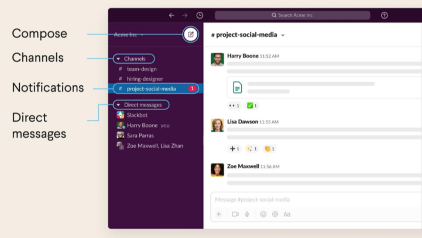
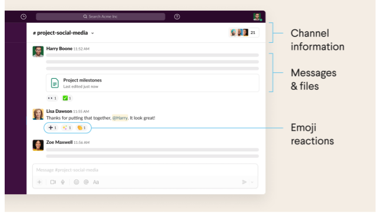
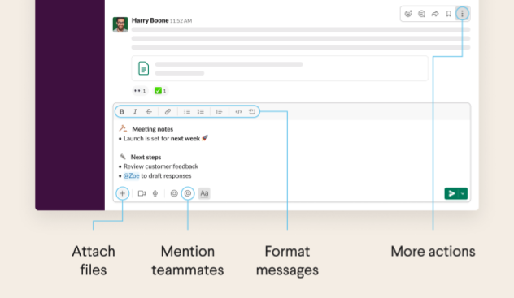

# OSS 실습 내용

# Github(p30만)
- git 명령어 사용법과 이해
- working(Local; 작업 진행 공간) → add → Stage(임시 저장)→ commit → Repository(실제 저장 공간)→ push → hub(공유 공간; github)
- 명령어
```bash
git add .
git commit -m "Message"
git push -u origin main
```

# Markdown
- 구조화된 컨텐츠 작성을 위한 쉬운 방법 중 하나
- #, *, _ 등을 사용해 Markdown-포맷 파일을 렌더링
- $ 를 사용하여 수학식 작성
- Github, Python Jupyter notebook, Jekyll Blog

## Markdown 장점
- **높은 이식성 (Highly portable)**  
  → 다양한 환경과 플랫폼에서 자유롭게 사용 가능

- **미래 지향적 (Future-proof)**  
  → 구조가 단순하고 오랫동안 유지되기 쉬움

- **의미 구조가 접근 가능하고 기계 판독 가능 (Semantic structure is accessible and machine-readable)**  
  → 구조적 문서 구성으로 웹 및 기계 학습에 유리함

- **다양한 마크다운 편집 옵션 (Multiple Markdown editing options)**  
  → 일반 텍스트부터 시각적 편집기까지 다양한 도구 지원

- **어떤 기기나 플랫폼에서도 편집 가능 (Editable on any device and platform)**  
  → 운영체제, 기기 종류에 상관없이 편집

## Markdown을 이용한 문서 작성
- 다양한 종류의 헤딩 설계: #, ## 등
- 캘리포니아 위키링크 삽입
```markdown
[link](캘리포니아 위키링크)
- 새창에서 열기(HTML 코드 사용)
<a herf="링크" target="_blank">링크</a>
```
- 캘리포니아 요약 소개: Italic(\*글자입력\*), Bold(\*\*글자입력\*\*)
- 캘리포니아 관광명소: 글머리 기호(-  → enter → tab → + or - )
- 유튜브 아이콘 및 Hotel California 뮤비 링크 삽입
```markdown
[]
(https://www.youtube.com/watch?reload=9&v=BciS5krYL80)
```
```
이미지: 
링크: [메시지](링크 주소)
```

## 캘리포니아 집값 데이터 알아보기 코드

```python
import pandas as pd
import numpy as np
import matplotlib as plt
import seaborn as sns

train = pd.read_csv('./content/sample_data/california_housing_train.csv')
test = pd.read_csv('./content/sample_data/california_housing_test.csv')
train.head()
train.describe()

train.hist(figsize=(15, 13), grid=False, bins=50)
plt.show()
correlation = train.corr()
plt.figure(figsize=(10,10))
sns.heatmap(correlation, annot=True)
plot.show
```

# Slack
- Sidebar
    + **Compose**: 어떠한 대화를 위해 글을 쓰거나 메시지를 송신
    + **Channel**: 
        - 특정 프로젝트, 주제, 팀을 위해 함께 사람들이 정보를 가져오거나 공유하는 장소
        - 이메일과 달리 특정 주제에 중점
        - 필요에 따라 join, Leave가 가능
    + **Notificaion**
        - 알림, 새로운 활동, 이름이 보여야함
    + **Direct Messages(DM)**
        - One-off 대화



- 기타 명령어
    + /remind : 리마인더 설정
    + /poll : 투표 생성(플러그인 필요)

- 기타 기능

|              채널              |            메시지 필드           |
|:------------------------------:|:------------------------------:|
|||

## Slack API 설정
- 사이트 접속: https://api.slack.com/apps
- 새 앱 생성
    + Create New App
    + From Scratch
    + 앱 이름, 워크스페이스 지정 후 생성
- Bot 토큰 생성
    + OAuth * Permissions → Bot Token Scopes에서 권한 추가
        - chat:write
        - channels:history
    + Install to Workspace → Bot User OAuth Token 복사

- 명령어
    + /weather : 날씨 정보
    + /joke : 랜덤 농담

```python
from slack_sdk import Webclient
from slack_sdk.errors import SlackApiError

SLACK_BOT_TOKEN = "토큰"
client = WebClient(token=SLACK_BOT_TOKEN)

try:
    response = client.chat_postMessage(
        cannel="#채널명"
        text="Hello World"
    )
    print("메시지 전송 완료:", response["ts"])
except SlackApiError as e:
    print(f"Error: {e.response['error']}")
```

# API(Application Programming Interface)
- 응용프로그램에서 사용할 수 있도록, OS나 프로그래밍 언어가 제공하는 기능을 제어할 수 있게 만든 인터페이스
- **API KEY** 
    + API를 사용할 수 있게 해주는 열쇠이자 신분증
    + 누가, 어떤 권한으로 API를 사용하는지 식별하고 제어하는 수단

## 기본 이론
- API: 서로 다른 소프트웨어끼리 소통할 수 있게 해주는 창구
- **Wikifier**: 일반 텍스트 안에 있는 중요한 개념을 자동으로 찾아 Wikipedia의 항목과 연결해주는 API 서비스

```python
#라이브러리 Import

request = youtube.search().list(
    part = "id, snippet" # 받고 싶은 정보
    type='video' # 타입
    q = 'Python 강의' # 검색어
    videoDuratation = 'medium' # 영상 길이
    maxResults= 3 # 최대 결과 수
)

# Video ID를 이용해 영상에 접근 가능
response['items'][0]['id']['videoId'] = "아이디명"

# 자막 추출
def get_transcript(video_id, languages=['ko'])
    transcript = YouTubeTranscriptApi.get_transcript(video_id, languages=languages)

```

# osmnx
- **GIS(Geographic Information System)**
    + 대부분의 GIS는 Closed Source
    + GPU기반 데이터 처리
    + OpenStreetMap(국토부 지도 활용)
    + Wikipedia와 개념을 연결

## 왜함?
- Location Intelligence/Analytics, Digital Transformation 등등
- 관련된 기술 구현
    + 지리적 데이터와 지도, 대쉬보드 등을 연결
    + 이벤트 탐지 및 추론
    + 의사 결정 모델 발굴
    + 인과 관계 분석

## GeoPandas
- **Geospatial**: Geo(Earth) + Spatial(공간 관련)
- Open Source library
- Pandas Datframe의 기능 확장
- Shapely와 함께 pandas 능력 조합
    + Geometric objects를 조작, 분석하기 위한 도구

## 핵심 개념
- **Index**: 빠른 조회를 위해 생성(**중복 가능**), Multi-index
- **Data**: 서로 관련된 데이터
- **Geometry**: 지리정보 데이터
- **Latitude**: 위도(가로)
- **Longitude**: 경도(세로)

## GeoDataFrame
- 기본적인 Tabular 데이터 프레임과 동일
    + 데이터 분석 가능: Sum, Counting 등
- Geometries와 features: 공간 객체
- **Attributes**: 공간 개체에 관련된 Column

## Geometry 접근 및 조작 메소드
- Geometry columns에 동작하고, index 설정 필요
    + 지역 크기
    + 중심점 파악
    + 거리 측정(직선 거리)
    + 맵 화면 출력 or Interactive 맵 구성

## 코드 
```python
# Jupyternotebook

!pip install geopandas

import geopandas as pd

path_to_data = gpd.datasets.get_path("nybb")
gdf = gpd.read_file(path_to_data)

## Writing File
gdf.to_file("my_file.geojson", driver="GeoJSON")

# 지역 측정, 다각형 범위와 중심 찾기
gdf = gdf.set_index("BoroName")
gdf["area"] = gdf.area

gdf["boundary"] = gdf.boundary
gdf["centroid"] = gdf.centroid

# 거리 계산
first_point = gdf['centroid'].iloc[0]
gdf['distance'] = gdf['centroid'].distance(first_point)
gdf['distance'].mean()

# 시각화
gdf.plot("area", legend=True)

# 중심점 함께 출력
ax = gdf["geometry"].plot()
gdf["centorid"].plot(ax=ax, color="black")
```
## OSMNX(OpenStreetMap + NetworkX)
- Geocoding + Topology + Routing
- 주어진 지도를 그래프 모델로 모델링
    + Nodes: 교차점
    + edges: 도로
- 한계점: **도로 네트워크 레이어만 제공함**
- **Geocoding**: 주소/지명 등의 고유명사를 통해 위도/경도값 좌표 획득
- **Topology**: 그래프 이론에 따라 물리/논리적 개체간 연결 표현
- **Routing**: 토폴로지 기반으로 경로 탐색

## Graph
- Node + Edge + Attribute
- 노드와 엣지로 구성
- 노드와 엣지에 Attribute(속성) 추가 가능
- 엣지는 방향 관계가 있을 수 있음