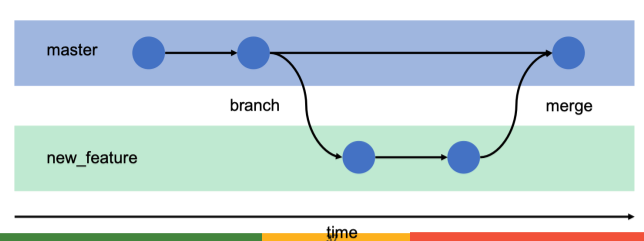
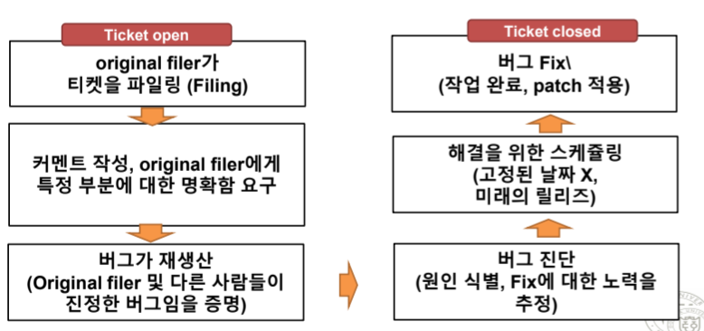

# Version Control

## Version Control System(VCS: Revision Control System)
- 프로젝트 파일 변화에 대한 제어 및 추적을 위한 기술, 프렉티스의 조합
- **Change Management**: 프로젝트 파일에 대해 실시된 이산된 변화 식별

## Version Control Vocabulary
1. **Commit**: 프로젝트의 변화 생성
2. **Push**: Online Repository에 Commit을 발행
3. **Pull(fetch, Update)**: 프로젝트 카피본에 다른사람의 commit 가져오기
4. **Commit Message(log Message)**: 각 Commit에 대한 요약 설명
5. **Repository**: 변화 저장 & 발행된 것에 대한 DB
6. **Clone**: 프로젝트 복사본 생성
7. **Checkout**: Clone과 유사하나, working 카피본만 획득
8. **Working copy**: 개발자 개인 디렉토리 트리
9. **Revision(Change, Changeset, Commit)**: 특정 시점에서 변화된 파일
10. **Diff**: 변화의 텍스트적 표현
11. **Branch**: 프로젝트의 카피 But 고립되어 있는 형태
12. **Merge(port)**: 변화를 어떤 branch에서 다른 branch로 이동시킴
13. **Conflict**: 두 사람이 코드 내 하나의 구간을 동시에 수정하는 경우
14. **Revert(Reversion)**: 이미 수행된 commit을 undo
15. **Lock**: 특정 파일이나 디렉토리에 대한 변화를 제외하는 방법

## VCS 선택하기
- 특별한 의견이 없는 한 Git, Github 사용 권장(Git: de facto standard)
- Mercurial SCM: 다른 VCS 시스템을 전체적으로 사용하고 있는 경우

## VCS 사용하기
1. **Version Everything**
    - 어떠한 정보라도 version화 하기
    - 상당수의 기여자들은 문서로부터 시작해서, 코드로 이동
        + 문서화를 통한 새로운 특징에 대해 커밋
        + 코드 Branching은 문서화로 확장
    - **generated files**는 versioning 하면 안됨: **프로그램에 의해 생성된 Editable data가 아니기 때문**
2. **Browsability**: 탐색성
3. **Use Branchesto Avoid Bottlenecks**: 병목 현상 회피를 위한 Branch 사용
    - 과감하게 Branching과 Merging을 수행하기
    - Branches: 부족한 리소스를 풍부하게 만드는 일
    - Merge: Pull request를 통해 메인 버전으로 합류시키는 것
    - 모든 Active Branch는 커뮤니티의 주목을 갈구함



4. **Singularity of Information**: 정보의 특이점
    - Merging은 동일한 변화를 커밋하면 안된다는 법칙을 가짐
    - Merging은 Special Events(다른 커밋과 구분)
    - **변화에 Revert하는 원칙은 동일**
    - Changes를 언급할 때는 일관된 syntax 이용
        + e.g. Commit c39fcac089 등
5. **Authorization**: 인증, 인가
    - 개발자의 활동영역 설정하는 것
    - 대부분의 프로젝트 = honor 체계
    - Area 기반 권한 부여 방법의 장점
        + 다른 Area로 자유롭게 확장 가능(코드 or 커밋 리뷰)
        + 신뢰와 상호 존중의 환경을 보유
    - 기술적 강압에 의한 권한 제어에 많은 시간 투자 X

## Contributions를 확인, 리뷰하기
- Commit Notifications/ Commit Emails
    + 저장소에 대한 모든 커밋(or 커밋 그룹)을 포함하는 모든 Pushing 들은 구독자들에게 알리는 공지를 생성해야함(메일링 리스트 이용)

# Bug Tracker
- 버그 트래킹: 버그 리포트 추적, 새로운 특징 요청, One-time 작업, 자발적 패치 포함
- **<span style="color:#red">Issue tracker, ticker tracker, defect tracker, artifact tracker, request tracker</span>**
- Ticket은 tracker DB 내 아이템을 지칭
- **보편적인 티켓 사이클**



## Pre-Filtering the Bug Trakcer
- 많은 티켓 DB는 동일한 문제로 고통을 겪음
    + 중복 or 유효하지 않은 티켓
    + 비경험자 혹은 잘못 알림 받은 사용자에 의해 발생
- 대처법
    + 첫 페이지에 공지사항 적기
    + 어떻게 그것이 정말로 버그인지를 설명하는 방법
    + 어떻게 기존의 보고된 버그를 찾는 방법
    + 어떻게 새로운 버그에 대해 보고할지에 대한 방법

## Best Practices for using github issues
1. 시작할 때 Defaults로 시작하기
2. 새로운 이슈 제출 전, 기존에 존재하는 이슈를 검색하기를 장려
    - Contributing.md: 이슈에 대한 워크플로우, 어떻게 작성해야 하는 지 설명
3. 이슈 리포팅과 리포트 장려
4. 다른 곳의 경로 취약점 보고서
5. 책임 영역, 긴급/비긴급, 추가 정보 기다려야하는 이슈 분리, 이슈 풀 생성 등
6. 적절한 사람 언급
7. 특정 개발자에게 이슈 할당
8. 이슈 클로징하기

# Real time Chat Systems
## Internet Relay Chat
- 웹 기반 IRC 채팅 활발해짐(10년전)
- 최근 Slack이 부상 중 But 넓은 곳에서 활용되지는 않음
- Matrix Compatibility는 프로젝트에 필요한 좋은 속성을 확인

## Chat Rooms와 성장
- Channels, Streams
    + 채팅에 속한 인원이 볼 수 있는 공유된 공간
- 모든 프로젝트는 어떠한 주제에 특정 공개 공간의 집합들을 유지(새로운 참여자들을 위한 엔트리 포인트)

## Wikis
- 변화 추적, 사용자에게 Credit 부여, 수정됨을 알림, 즉시적인 새로운 컨텐츠 퍼블리싱
- 개방형, 익명의 Wiki는 만들지 말것
- Wiki 종류: Dokuwiki, Mediawiki, Wikihow(Not 오픈소스)

## Translation
- **Internationalization(i18n)**: 소프트웨어 소스 코드를 프로그램이 번역되는 형태에 투입하는 과정
- **Localization(I10n)**: 특정 언어로 실제 변환을 제공하는 것

# 5장 패키지 릴리징

## Release Numbering: Release

- 일부 오래된 버그 수정
- **<span style="color:#red">새로운 버그, 특징, 설정 옵션 추가</span>**
- **<span style="color:#red">비호환적인 변화가 알려짐</span>**(데이터 포맷 문제)
- 사용 목적
    + 릴리즈 시리즈 내에서 릴리즈의 순서간 커뮤니케이션을 모호하지 않게 하기 위해
    + 각 릴리즈의 변화의 정도를 압축해서 표현하기 위함
    + **넘버링, 텍스트는 일관되게 하기**

## Release Number Components
- **<span style="color:#red">릴리즈 번호: Dot에 의해 분리된 숫자 그룹(e.x. Scanley 2.3, Singer 5.11.4)</span>**
- Dot은 십진수 지점 X: **<span style="color:#red">숫자 혹은 dot 컴포넌트의 수 제한 X</span>**(일반적: 3 ~ 4개 사용)
- 표기 라벨을 태킹(Scanley 2.3.0(Alpha))
- 릴리즈 버전에 관계없이 표기 라벨을 부여하기도 함
- Alpha, Beta 이외에도 다양한 릴리즈 수준을 표현
    + Stable, Unstable, Development, RC(Release Candidate)
- 3-컴포넌트 릴리즈: (major).(minor).(micro)
    + major: 주요한 변화의 발생
    + minor: 마이너한 변화
    + micro: 사소한 변화
    + 4번째 숫자는 patch number로 주로 사용

## Semantic Versioning
- **<span style="color:#red">Backward-compatible</span>: 현재 버전 릴리즈가 기능, 버그 측면에서 이전 버전과 호환가능함을 표현하는 용어
- 2.6.0 <-> 2.5.4: 클라이언트/서버 시스템인 경우
    + 2.6.0 클라이언트는 새로운 기능을 사용 가능
- 2.5.3 <-> 2.5.4: 클라이언트/서버 시스템인 경우
    + 기능의 차이는 존재하지 않지만 오류 등장 가능
- Micro 릴리즈는 bug fixes만을 다룸

# Release Branches
## Gitflow
- **<span style="color:#red">Gitflow</span>**: Git branch를 관리하기 위한 전략으로 Legacy Git Workflow를 의미하는 약어
- **master**: 기준이 되는 브랜치(제품 배포 브랜치)
- **develop**: 개발 브랜치(각자 작업한 기능 합침)
- **feature**: 단위 기능 개발 브랜치(기능 개발 완료 시 develop 브랜치로 합침)
- **release**: 배포를 위해 master 브랜치로 보내기 전 먼저 QA 실행 하기 위한 브랜치
- **hotfix**: master 브랜치로 배포했는데 버그가 생겼을 때 긴급 수정하는 브랜치

## 어떻게 프로젝트를 정규적인 릴리즈가 되도록 할 수 있는가?
- 불가능하다
    + 전체 개발트리가 릴리즈를 위해, Clean 및 Ready되는 시점은 어느 순간도 존재 X(새로 시작된 특징은 다양한 상태로 놓여져 있다.)
- Full-tree snapshots는 불가피하게 진행중인 개발작업을 방해할 수 있다.

## Release Branches
- 개별적인 버그와 특징에 대해 short-lived branches 생성
- 작업이 완료되는대로 가능한 main branch에 그들의 작업을 merge하길 기대함

## Mechanics of Release Branches
- Branch는 메인 라인 혹은 다른 Branch로부터 파생됨
- 메인 라인은 "1.0.x"릴리즈로 생각
    + 개발자의 변화는 처음으로 통합되고
    + Release 제약에 의해 자유롭고,
    + 선두적인 Branch이다.
- 안정적인 Release Branch에 대해, Tag 혹은 snapshot으로 지정

# Stabilizing a Release

## Stabilization(중요)

- **<span style="color:#red">Release Branch를 릴리즈가 가능한 상태로 만드는 과정**<span style="color:#red">
- **Featuer-Based Release**
    + 많은 변화 → 코드 불안정화, 더 많은 버그 출현
- **Time-Based Release**
    + 규칙적인 리듬에 새로운 릴리즈를 내놓는 것
    + 매 6개월마다, 버그와 특징에 관계없이 릴리즈
- 오픈소스 프로젝트에서 두 가지 전략
    + Release Owner에 의한 리더십
    + 변화에 대한 투표

## Dictatorship by Release Owner
- 최종 결정을 위한 충분한 권한 주기
- 릴리즈에 대한 일반적인 패턴
    + 변화에 대해 잘못된 것은 없다고 생각하지만, 그것에 대한 test할 시간이 충분하지 X So, 이번 release에 넣기에는 어렵다.
- 프로젝트 리더와 동일하지 않아도 괜찮

## Votin on Changes
- 어떠한 변화가 릴리즈에 투입될지에 대해 투표
    + **변화를 배제**하는 것이 안정화의 가장 중요한 기능
- Release Branch에 적용하는 투표 원칙
    + 적어도 3명의 개발자가 그것에 대해 투표해야 함
    + 그 중 한명은 거부권(Vetoes)를 가짐

## Release Manager
- 1 ~ 2명의 사람이 릴리즈 과정을 주도(변화에 대한 최종결정을 가진 Release Owner와는 차이가 있음)
- **주요 역할**
    + **<span style="color:#red">얼마나 많은 변화가 현재 고려중에 있는 지 추적</span>**
    + **<span style="color:#red">얼마나 많은 변화가 승인되었는지</span>**
    + **<span style="color:#red">얼마나 많은 것이 승인될 가능성이 있는지</span>**

# Packaging
- Free 소프트웨어 배포의 전통적인 형태 = 소스 코드(Compiled 혹은 Source form)
- 패키징 할 때, 주요 준수 사항
    + Format, Name and Layout, Compilation and Installation, Binary Packages

## Format(중요)
- 소스 코드는 디렉토리 트리를 유지하는 표준 포맷 내로 제공되어야 함
- **TAR format**: Unix 및 Unix 계열을 위한 포맷(compress, gzip, bzip, bzip2)
- **zip format**: Window 계열을 위한 포맷
- **Minified Version**: Javascript 프로젝트를 위한 소스파일도 함께 제공
- **<span style="color:#red">Tar과 zip의 차이</span>**
    + 압축도구의 차이(Window: GUI기반 도구 사용, Unix: CLI기반 도구 사용)
    + 실행/설치 차이(Windows: .exe로 자동 설치 가능, Unix: 압축 해제 후 빌드 및 수동 설치가 일반적)
    
## Minification(용어 중요)
- Data compression 개념과는 차이가 있음
- **<span style="color:#red">First Impression</span>**: 사용자가 배포된 패키지를 처음 사용한 직후 해당 프로젝트에 대한 느낌

## Name and Layout
- 패키지 이름: 소프트웨어 이름 + 릴리즈 번호 + archive 타입에 적절한 suffix로 구성됨
    + Scanley-2.5.0.tar.gz
- **<span style="color:#red">디렉토리 Top level에 존재하는 파일</span>**
    + README, Install, LICENSE/COPYING, Changes, News 파일이 존재

## Name and Layout
- 릴리즈는 정적 참조 포인트에서 파일들(Working copy 혹은 working files 단계가 아니어야 함)
- 여러 개의 소스 패키지에서 마이너한 차이점
    + CRLF(Carriage Return and Line Feed)와 LF간의 차이
    + CRLF: Windows 계열
    + LF: Unix 계열
- 첫 글자가 소문자/대문자 여부 관계 X
    + 압축해제시 생성되는 폴더 이름에는 주의할 것

## Compilation and Installation
- Unix 계열 시스템에서 C/C++ 기반 프로그램은 다음과 같이 사용자에게 요구
- **<span style="color:#red">예시</span>**

```bash
./configure # 빌드 과정을 위한 환경에 대한 자동 감지
make # 소프트웨어 빌드
sudo make install # 시스템에 빌드된 소프트웨어 설치
```
- 오늘날 Docker 기반의 컨테이너 기반 환경에 의해 손쉽게 프로그램 Deploy(배치) 가능

## Binary Packages
- Binary: 패키지의 사전 설정된 형태라는 뜻
- 공식 소스 릴리즈에 binary 패키지의 base를 확실히 할 것
- Packager은 수정사항을 개발자에게 가져와서 그들의 계획에 표현하기를 독려함