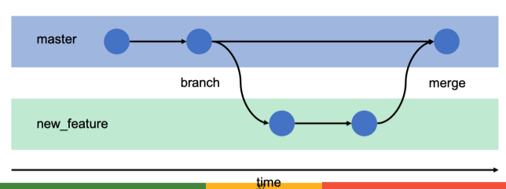
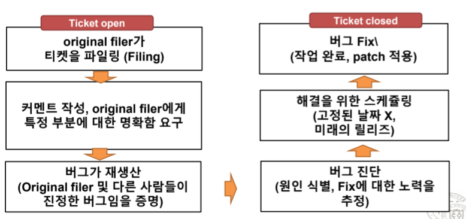

# Version Control

## Version Control System(VCS: Revision Control System)
- 프로젝트 파일 변화에 대한 제어 및 추적을 위한 기술, 프렉티스의 조합
- **Change Management**: 프로젝트 파일에 대해 실시된 이산된 변화 식별

## Version Control Vocabulary
1. **Commit**: 프로젝트의 변화 생성
2. **Push**: Online Repository에 Commit을 발행
3. **Pull(fetch, Update)**: 프로젝트 카피본에 다른사람의 commit 가져오기
4. **Commit Message(log Message)**: 각 Commit에 대한 요약 설명
5. **Repository**: 변화 저장 & 발행된 것에 대한 DB
6. **Clone**: 프로젝트 복사본 생성
7. **Checkout**: Clone과 유사하나, working 카피본만 획득
8. **Working copy**: 개발자 개인 디렉토리 트리
9. **Revision(Change, Changeset, Commit)**: 특정 시점에서 변화된 파일
10. **Diff**: 변화의 텍스트적 표현
11. **Branch**: 프로젝트의 카피 But 고립되어 있는 형태
12. **Merge(port)**: 변화를 어떤 branch에서 다른 branch로 이동시킴
13. **Conflict**: 두 사람이 코드 내 하나의 구간을 동시에 수정하는 경우
14. **Revert(Reversion)**: 이미 수행된 commit을 undo
15. **Lock**: 특정 파일이나 디렉토리에 대한 변화를 제외하는 방법

## VCS 선택하기
- 특별한 의견이 없는 한 Git, Github 사용 권장(Git: de facto standard)
- Mercurial SCM: 다른 VCS 시스템을 전체적으로 사용하고 있는 경우

## VCS 사용하기
1. **Version Everything**
    - 어떠한 정보라도 version화 하기
    - 상당수의 기여자들은 문서로부터 시작해서, 코드로 이동
        + 문서화를 통한 새로운 특징에 대해 커밋
        + 코드 Branching은 문서화로 확장
    - **generated files**는 versioning 하면 안됨: **프로그램에 의해 생성된 Editable data가 아니기 때문**
2. **Browsability**: 탐색성
3. **Use Branchesto Avoid Bottlenecks**: 병목 현상 회피를 위한 Branch 사용
    - 과감하게 Branching과 Merging을 수행하기
    - Branches: 부족한 리소스를 풍부하게 만드는 일
    - Merge: Pull request를 통해 메인 버전으로 합류시키는 것
    - 모든 Active Branch는 커뮤니티의 주목을 갈구함

4. **Singularity of Information**: 정보의 특이점
    - Merging은 동일한 변화를 커밋하면 안된다는 법칙을 가짐
    - Merging은 Special Events(다른 커밋과 구분)
    - **변화에 Revert하는 원칙은 동일**
    - Changes를 언급할 때는 일관된 syntax 이용
        + e.g. Commit c39fcac089 등
5. **Authorization**: 인증, 인가
    - 개발자의 활동영역 설정하는 것
    - 대부분의 프로젝트 = honor 체계
    - Area 기반 권한 부여 방법의 장점
        + 다른 Area로 자유롭게 확장 가능(코드 or 커밋 리뷰)
        + 신뢰와 상호 존중의 환경을 보유
    - 기술적 강압에 의한 권한 제어에 많은 시간 투자 X

## Contributions를 확인, 리뷰하기
- Commit Notifications/ Commit Emails
    + 저장소에 대한 모든 커밋(or 커밋 그룹)을 포함하는 모든 Pushing 들은 구독자들에게 알리는 공지를 생성해야함(메일링 리스트 이용)

# Bug Tracker
- 버그 트래킹: 버그 리포트 추적, 새로운 특징 요청, One-time 작업, 자발적 패치 포함
- **Issue tracker, ticker tracker, defect tracker, artifact tracker, request tracker**
- Ticket은 tracker DB 내 아이템을 지칭
- **보편적인 티켓 사이클**

## Pre-Filtering the Bug Trakcer
- 많은 티켓 DB는 동일한 문제로 고통을 겪음
    + 중복 or 유효하지 않은 티켓
    + 비경험자 혹은 잘못 알림 받은 사용자에 의해 발생
- 대처법
    + 첫 페이지에 공지사항 적기
    + 어떻게 그것이 정말로 버그인지를 설명하는 방법
    + 어떻게 기존의 보고된 버그를 찾는 방법
    + 어떻게 새로운 버그에 대해 보고할지에 대한 방법

## Best Practices for using github issues
1. 시작할 때 Defaults로 시작하기
2. 새로운 이슈 제출 전, 기존에 존재하는 이슈를 검색하기를 장려
    - Contributing.md: 이슈에 대한 워크플로우, 어떻게 작성해야 하는 지 설명
3. 이슈 리포팅과 리포트 장려
4. 다른 곳의 경로 취약점 보고서
5. 책임 영역, 긴급/비긴급, 추가 정보 기다려야하는 이슈 분리, 이슈 풀 생성 등
6. 적절한 사람 언급
7. 특정 개발자에게 이슈 할당
8. 이슈 클로징하기

# Real time Chat Systems
## Internet Relay Chat
- 웹 기반 IRC 채팅 활발해짐(10년전)
- 최근 Slack이 부상 중 But 넓은 곳에서 활용되지는 않음
- Matrix Compatibility는 프로젝트에 필요한 좋은 속성을 확인

## Chat Rooms와 성장
- Channels, Streams
    + 채팅에 속한 인원이 볼 수 있는 공유된 공간
- 모든 프로젝트는 어떠한 주제에 특정 공개 공간의 집합들을 유지(새로운 참여자들을 위한 엔트리 포인트)

## Wikis
- 변화 추적, 사용자에게 Credit 부여, 수정됨을 알림, 즉시적인 새로운 컨텐츠 퍼블리싱
- 개방형, 익명의 Wiki는 만들지 말것
- Wiki 종류: Dokuwiki, Mediawiki, Wikihow(Not 오픈소스)

## Translation
- **Internationalization(i18n)**: 소프트웨어 소스 코드를 프로그램이 번역되는 형태에 투입하는 과정
- **Localization(I10n)**: 특정 언어로 실제 변환을 제공하는 것