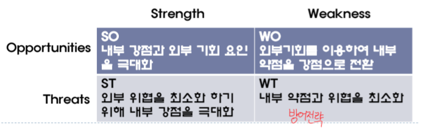
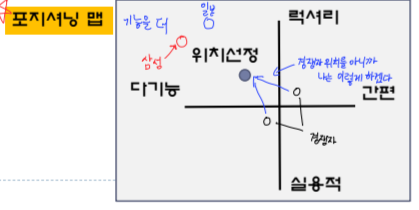
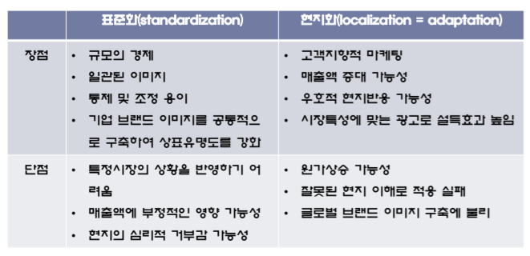
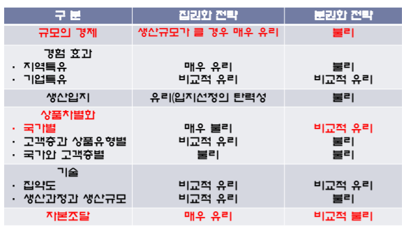

# **4P 전략(product, price, place, promotion)**

## **기업 분석**
1. **거시 환경 분석**
- **PEST분석**
    + 사건과 추세의 파악과 예측 
    + SWOT 中 OT 파악 
2. **산업 환경 분석**
- 마이클 포터 **Five Forces Model**
    + 산업 매력도 평가 
    + 핵삼 성공 요인 파악 
3. **경쟁 기업 분석**
- **미시 환경 분석**
    + SWOT 中 SW 파악 
    + 미래 전략의 예측 

## **PEST 분석 → SWOT**
### **PEST**
#### 1. **Political**: 세금, 관세, 무역제재, 정치적 안정성
#### 2. **Economic**: 경제 성장률, 인플레이션, 환율
#### 3. **Social**: 인구 성장률, 연령, 직업 태도, 안전, 사회전반적 추세
#### 4. **Technological**: R&D활동, 자동화, 기술혁신

### **SWOT**

## **STP → 4P**
### **STP**
#### 1. **S(소비자 시장의 세분화)**
    + 지리적 세분화
    + 인구 통계적 세분화: 소득, 인구, 연력, 성별, 교육, 직업
    + 심리 묘사적 세분화: 개성, 태도
    + 행동적 세분화
#### 2. **T(타켓팅)**
    + 적정 크기와 성장 관련 특징들을 갖는 세그먼트들을 선정
#### 3. **P(포지셔닝)**
    + 소비자에게 차별화시키기 위한 위치 선정

### **4P**
#### 1. **Product(제품)** → **유형적, 무형적 요소 모두 포함**
    - 모방이 안되는 **무형적 속성이 중요**
    - **제품 및 서비스 속성**
        + 제품이나 서비스의 **편익**
    - **브랜드**
        + 이름, 용어, 사인, 디자인 등
    - **패키징**
    - **레이블**
        + 정보 전달 및 제품 촉진
    - **제품 지원 서비스**
#### 2. **Price(가격)**
- **시장 유형**에 따른 가격 결정
    - **완전 경쟁**
        + 어떤 구매자, 판매자도 시장 가격에 큰 영향 X
        + 가격 순응자
    - **독점적 경쟁**
        + 일정 가격 범위 내에서 거래
    - **과점적 경쟁**
        + 경쟁사의 가격전략, 마케팅 전략에 민감하게 반응
    - **독점**
        + 시장이 허용하는 범위에서 자유롭게 가격 책정
        + 공급 곡선 X
- **신제품 가격 전략 유형**
    1. **초기 고가격 전략**
    2. **시장 침투 가격 전략**
        - **일시적으로** 저가격 책정 → **시장 점유율 확보**
#### 3. **Place**
- **마케팅 경로**
: 제품, 서비스를 개인 소비자나 기업 고객이 사용하고 소비할 수 있도록 하는 상호 의존적인 조직 일체 
**온라인 VS 오프라인**

#### 4. **Promotion**
- 촉진 믹스: 고객 가치를 설득적으로 전달하고 고객 관계 구축을 위한 도구들의 조합
    - **광고**: 일방적 커뮤니케이션 → 설득 효과 ↓
    - **판매 촉진**: 할인, 쿠폰, 진열
    - **인적 판매**: 대면 판매 But 비용 ↑

## **글로벌 시장에서 표준화 VS 현지화**
글로벌 전략 수립은 기업활동의
    - 조정을 단순화 하기 위해 **표준화**
    - 조정은 복잡하지만 현지 상황을 고려한 **현지화**를 선택할 지 결정
        + 제품은 현지화 필수

### **표준화**
#### 1. **원가 절감**
- 생산 마케팅에 있어 **규모의 경제 달성**
#### 2. **노하우의 활용 및 이전**
#### 3. **품질과 서비스의 통일된 이미지**
- 범세계적 고객 대상
- e.g. 다른 이미지: 해외와 한국에서의 이케아 이미지

### **현지화**
같은 방식으로 하나의 마케팅을 실행한다는 것의 문제가 있다는 것을 인식
- **지속적인 경쟁우위를 누리기 위해 현지화 필요**

### **표준화 VS 현지화 간 선택**

### **추가** 

