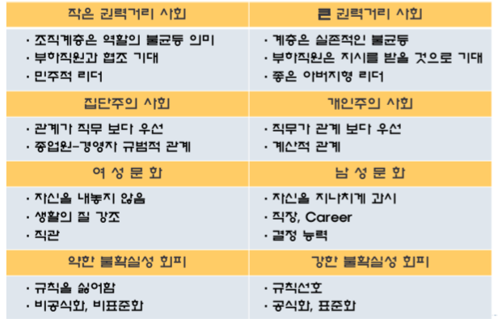

# 문화와 문화 장애를 극복하는 의사소통의 글로벌 비즈니스
: 국가간 차이는 **문화**를 중심으로 부각됨
- 성공적인 비즈니스 수행을 위해 **그 시장에 맞는 새로운 적용이 필요**

1. **제품의 적용**: 표준화 VS 현지화
2. **기업의 적용**: 현지 요구조항을 이행(무조건 현지화)
3. **개인적 적응**

## **문화**
사람들이 **공유**하는 가치관이나 규범

- **Parochialism(편협함, 지역주의적 관점)**
    + **이질적인 문화적 배경을 가진 기업을 관리하는데 있어 장애물이 되는 가치관**
    + **자국 중심 주의**
    + 해외 시장 진출에 있어서 **편협함**이 걸림돌이 될 수 있음

## **문화적 환경에 대한 이해**

### **Hall의 고배경, 저배경 문화**
- **공유**된 정보를 근거로 메시지를 해석하고 만든다.
- 구성원을 **연결**시켜주고 관계 유지할 때 배경에 영향을 준다.
- **배경에 대한 구성원의 경험이 의사소통에 영향을 미치고 상이한 문화에 속하는 구성원은 특정 상황에 대해 상이하게 반응**

### **Hofstede's 5차원 모형**
1. **권력의 거리(Power Distance)**
    - Large: 한국
    - Small: 미국
2. **불확실성 회피 성향(Uncertainty Avoidance)**
    - High: 한국
    - Low: 미국
3. **개인주의 성향(Individualism vs Collectivism)**
    - Collectivism: 한국
    - Individualism: 미국
4. **남성성의 정도(Masculinity VS Femininity)**
    - Femininity: 한국(역할, 가치 모호)
    - Masculinity: 미국(스포츠, 성공)
5. **장기 지향성(Long-term Orientation VS Short term)**: 인생에 대한 시간적 성향, 사람들과의 관계(노력, 근검 절약, 체면, 부끄러움 등)
    - Long-term: 한국
    - Short-term: 미국

### **관리자에게 주는 시사점**
- 사고 방식, 적절한 행동에 대한 이해와 현지 적용 능력이 부족한 것이 원인
- **로컬 문화의 부주의**: 마케팅, 경영에 큰 손실을 낳게 하고 비즈니스 교섭 성패에도 영향

## **해외 시장에서 문화 장애를 극복하는 의사소통**
### **Communication**
- **공통된** 것을 형성하고자 하는 것
- **공통적** 이해를 추구
- 즉, **문화**가 반영

### **해외 시장에서 문화 장애를 극복하는 의사소통**

## **miscommunication**

### 1. **지각의 오류(고정관념, 스테레오 타입)**
- Misperception, 잘못된 **인식**이 해석, 평가에서 오해를 유발할 가능성 多
- **지각**: 개인 스스로에게 의미 있고 **경험된 외부환경**으로 부터 자극을 통해 선별 조직을 평가하는 과정
- **지각의 패턴**: **문화적**으로 결정, 일관적이고 **부정확**
- **지각 여과기의 왜곡효과**

#### **고정 관념**
1. 우리는 모두 같다 → **차이를 인정**
2. 나의 모습 그대로 행동 → **잠시는 통하지만 얼마 안가 매력 하락**
3. 상대방을 진정으로 좋아해야 함 → **서로 차이를 이해하고 존중하는 태도**
4. 상대 문화 관습 그대로 받아들임 → **원주민이 될 필요 X**

### 2. **오해석(Misinterpretation: Category;범주화)**
- **해석의 일관된 패턴**은 신속하게 행동하게 해줌
- **Category**: 복잡한 환경을 단순화, 해석의 기반 제공

### 3. **자민족 우월 주의**