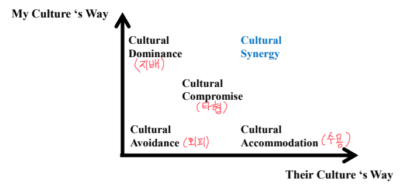

# 문화적 시너지
- **DEI**(Diversity: 다양성, Equity: 형평성, Inclusion: 표용성)

## **문화적 문맹**
- **판단**과 **인식**의 단어를 혼돈하기에 문제를 더 악화시킬 수 있음
- 판단 → 편견
- 단순히 다르다는 점을 인정

## **문화적 문맹**
- 문화적 다양성을 외면 → 차이가 있음에도 외국인을 자신과 유사하다고 보는 경우

### **단점**
- 조직의 **비용**: 모호함, 복잡함, 혼란 가중
- 수렴의 어려움: **miscommunication**
- **과잉 일반화** → 증거 하나로 결론 내기
- **자민족중심주의**발생

### **장점**
- **시너지** 발생
- **의미의 확장** → Group thinking(집단 사고)의 문제 해결
- **대안의 확장**

### **시너지**
- Fuller가 만든 신조어
- 새로운 사고방식
- 다르다 → 각자가 기여하는 몫 이상의 것을 성취 가능

## 문화적 다양성이 조직에 미치는 영향에 대한 인식과 관리

|   조직유형   |     구분     |    인식     |   전략  |    예상 결과    |
|:----------:|:------------:|:----------:|:-------:|:--------------:|
|편협주의     |우리방법 유일   |다양성을 모름 |차이점 무시|문화때문인걸 모름 |
|자민족중심주의|우리방법 최고   |다양성이 문제 |차이점 최소|문제는 모두 문화 탓|
|시너지중심    |창조적 조합 최선|긍정/부정 모두|차이점 관리|문제점은 관리    |

# 보이지 않는 문화

| 그릇된 가정 | 적절한 가정 |
|:---------:|:----------:|
|동질성      |이질성       |
|유사성      |유사성+차이성 |
|지역주의    |동종성       |
|자민족중심   |문화적 상황론|

- **동종성**: 우리방법은 유일한 것이 아님
- **문화적 상황론**: 동일한 목표 도달에 여러 좋은 방법이 존재

## 창조 순서
- 상황 기술 → 문화 해석 → 문화적 창조성 → 문화적 시너지
- 상황 기술: 갈등 상황의 존재 인식
- 문화 해석: 집단 간 유사성과 차이성을 식별

# **시너지를 포함한 전략 도출**

- **문화적 지배(Cultural Dominance = 제국주의)**
    + 파트너보다 상대적으로 우월할 때

- **문화적 수용(Cultural Accommodation)**
    + 현지인처럼 하고자 함

- **문화적 타협(Cultural Compromise)**
    + 강한 파트너가 약한 파트너보다 덜 포기하는 형태

- **문화적 회피(Cultural Avoidance)**
    + 문제를 공론화, 직접적 갈등을 피하고자 함
    + 아시아: 알면서 모른 척
    + 서구: 모름

- **문화적 시너지(Cultural Synergy)**
    + 문화적 다양성을 이용해 해결하려고 함
    + 자기 인식이 필요