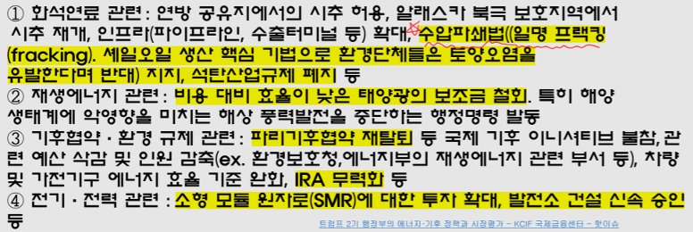
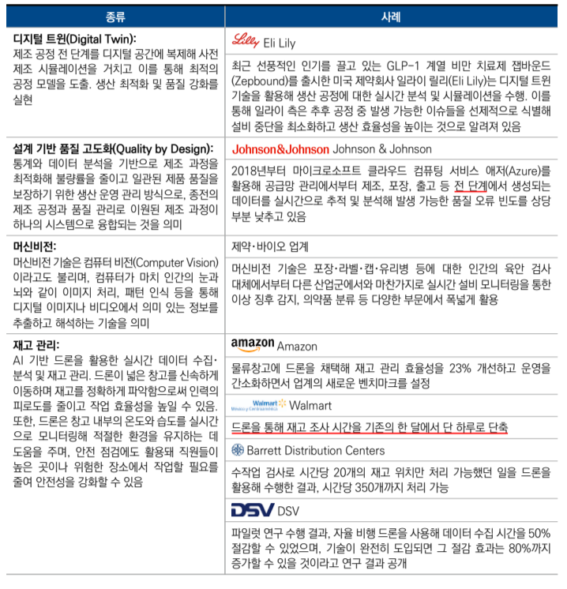

# 북미 진출 전략
- 미국 객 3 주 2

# 시장 평가 및 주요 이슈
## 가. 시장 전망
### _________(___%대 경제 성장률)을 위한 __적인 통화정책 시작 → 확장세는 둔화 But 침체 없는 경기 성장 전망
- 25년 실질성장률: _ . _%(미국), 2.4%(캐나다) 전망
    + 22년 하반기부터 이어진 고강도 ___정책에 따른 침체 우려 But 강력한 성장세 이어왔으나, **누적된 _____ 효과로 24년 하반기부터 성장세 ___ 예상**
- 24년 9월 FED가 금리 ___ 시작 → _______ 억제를 위해 이어온 ______ 정책 종료(**금리 _____ 종료 = ____ 종료**) 
    + 이에 따라 목표한 **_______ 시나리오에 도달할 가능성 상승**
    + 개입 빼고 시장의 힘으로 돌아갈 때 _____ 을 할 것으로 예상중(= **현재 경기 좋다는 평가**)

### 시장의 관심은 ____(0.5% 금리 인하)으로 인한 미국 경제 '____' 유도 가능 여부 → 정부 개입 없이 가능한지 여부
- 파월 의장은 기자회견(24.10)에서 경제가 예상대로 진행 시 올해 __ . __%씩 **__차례** 총 50bp 추가 금리 인하 가능성 시사(= 상황이 나쁘지 않다는 것을 시사)

- IMF도 미국 올해 경제 성장률 전망치를 지난 1월 2.7%에서 지난 22일 1.8%로 내림
    + 관세로 인한 불확실성(경기 침체 가능성 **25% → 37% 증가**)
    + 경제성장률 = **_____**
- 물가상승률: **__% 전망**
- 3월 실업률: **__ . __% ** = **____**
- 22년 물가(7.9%) 잡으려고 금리 상승 → 23년 물가(4.2%) → 24년 하반기(3.1%)에 금리 하락

# 2. 25년 주요 이슈 및 전망
## 가. 트럼프 정부 시나리오에 따른 정책 변화
- 트럼프(공화당) 당선
    + **_____ 3개주**(펜실베니아, 미시간, 위스콘신), **____ 4개주**(네바다, 애리조나, 조지아, 노스캐롤라이나)
    + ____: 퇴직한 부자들이 자주 가는 남쪽 지역(공화당)

※ ____: 러스트벨트(옛 중공업 공업지대; 노조로 인한 민주당 텃밭)지역에서 분리된 것으로 ___당 우위 
※ ____: 미국 남부지역으로 ___당 우세주가 많음 
- 119대 연방 의회 선거에서 **상, 하원 모두 다수당 확보**
    + **상원 100석**(50개 주 두 명씩): 공화당 53석, 민주당 47석
    + **______(무제한 토론을 통한 합법적 의사진행 방해)**를 무력화하는 의석 60석 확보 실패
    + 하원: 공화당 219석, 민주당 215석, 1석 공석
- 주지사(4년마다 대선과 같은 해에 투표; 50명): 공화당 27명, 민주당 23명

### 투표 특징
- 인종: 라티노(히스패닉인), 아시안이 트럼프쪽으로 많은 투표
- 성별: 백인 남성이 특히 많이 지지
- 학력: 학력이 높을 수록 해리스 지지하는 경향

### 트럼프, 한층 강력한 보호무역주의 정책 추진 전망
- 트럼프 관세전략: **____관세, ____관세**
- 미국의 **____________ 해소를**최우선 경제 과제 중 하나로 설정
    + 전 세계 수입에 보편(무차별) 기본 관세 10 ~ 20% 부과
    + 대중 수입에 대상 관세율을 60%로 인상 공약
- **______법** 입법을 추진
    + _______법: 상대국이 미국에 관세나 세금을 부과하면 미국도 동일한 수준의 상호관세를 부과하는 보복 관세
### 트럼프 1기 행정부 추진 관세 정책
- _______조(______조 관세): **불공정** 무역 관행에 대응하기 위해 중국산 제품에 25% 관세 부과
- _______조(_______조): **안보**
    + 세이프가드 관세: 합법으로 타당하다면 WTO 제소해도 소용 없는 임시 조치

### 트럼프 1기 행정부 추진 관세 정책
- **________조(______조)**: 교역 상대국의 불공정한 무역행위로 미국 무역에 제약이 생기는 경우 광범위한 영역에서 보복할 수 있도록 허용
- **_________조**: **_______**으로도 알려져 있는데, 이는 해당 조항이 미국 대통령에게 자국의 안보를 명목으로 수입을 제한할 수 있는 권한을 부여하기 때문, **다른 수입제한조치에 비해 제한 범위가 넓고 특정 기한 없음**
- **세이프가드**: 특정물품 수입 급증으로 수입국의 국내 산업 피해를 입거나 입을 우려가 있을 경우 해당 품목 수입 임시 제한 or 관세 인상을 통한 긴급 수입 제한 조치를 할 수 있는 제도, **GATT조항(제 19조)**에도 규정된 **임시조치**

### 트럼프 집권 시 환율 문제가 중요한 통상 이슈로 부상 예상
- 트럼프가 생각하는 미국 무역적자 원인: 달러 __평가
    + IF 저평가 → 수출 유리, 수입 불리
- 약달러를 통한 미국 수출 경쟁력 제고를 위해 다음 수단 활용 예상
    + 연준의 금리 인하 압박
    + 정부 외환시장 개입 → 달러 인덱스 하락
    + 외국 정부 상대로 통화 가치 절차 압박 
- **관세를 무기로 쓰고 있지만, 환율 정책을 쓸 가능성이 크다**: 기축통화 발행 비용의 일정한 분담을 원함

### 반도체 수출입 규제 강화와 범위확대 예상
- 트럼프는 첨단 노드 반도체에 집중되어 있는 대중 수출 통제를 포함한 규제 조치가 차기 정부에서 **______**기술까지 확대될 것으로 전망
    + Legacy: 자동차, 항공기, 가전 등에 쓰이는 다양한 기술(현재 반도체 시장의 70%, 중국 29% 시장 점유율) 
- 미국 정부는 **수출 통제 강화, 국가안보 목적 관세 부과, 중국의 상계 관세 부과, 미국의 대중 반도체 투자 규제, 중국산 조달 금지 조치**를 할 것으로 보임
- 경제회복 및 자국 산업 보호를 위한 **______** 경제 추구 전망
    + 대규모 감세, 세금 공제 확대, 규제 완화로 소비와 경제 성장 촉진
    + 25년 만료 예정인 17년 트럼프 세제개혁법(**____: 세금 감면 및 일자리법**) 연장 및 보완 추진 
- 감세 공약 요약

- **________(영어)**(미국산 우선 구매) 정책을 통한 자국 산업 보호, 제조업 수요 증대
    + **연방정부가 조달하는 물품에 있어(모든 물품 X)** 미국산 우선 구매가 가능하므로 미국 기업은 정부조달 입찰에서 외국기업보다 높은 가격을 써낼 수 있음

### 미국 내 전통에너지 생산 확대를 통한 에너지 안보, 자립 촉진 예상
- **___에너지 생산 확대**: 화석연료 생산 제한 폐지, 세금 감면을 통한 투자/생산 장려, 연방 토지 내 석유/가스 시추 허가 등 
- **기존 ____ 정책 철회**: 그린 뉴딜, 전기차 의무화 및 탄소 배출량 감축 정책
- **미국 에너지 정책의 자율성 확보**: 파리기후협정 재탈퇴, ESG 정책 중단

### 양자 무역 협상 선호 및 다자 무역협정 재검토 전망
- IPEF(인도-태평양 프레임워크), TTC(EU-미국 무역기술위원회), USMCA 등 다자간 무역협정 탈퇴 및 국가 간 무역협정 재협상 시사
- **____영어(__________)** = GAT 1조 최혜국 대우(MFN)

|정책요소|               바이든                  |                      트럼프                     |
|:-----:|:------------------------------------:|:----------------------------------------------:|
|미중관계| 디리스킹, 대중국 전략 품목 301조 관세 부과 | 디커플링, 중국의 PNTR 지위 철회                   |
|무역통상| 다자간 무역협상                         |양자 간 무역협상                                  |
|공급망  | 프렌드/니어쇼어링                       | 리쇼어링 및 온쇼오링 강화                         |
|기후변화| IRA, 기후변화 대응                      | 파리기후협정 재탈퇴                              |
|제조업  | Buy American 정책 유지                 | IRA 기후 관련 지원금 축소, CHIPS법 보조금 축소, 폐지|

## 나. 북미 AI 지배력 강화를 위해 추진중인 전략
### 25년 글로벌 AI 시장은 전년 대비 18.7% 상승한 7,576억 달러 규모 전망
- 글로벌 AI 지수상 AI 경쟁력(83개국 기준): 미국 꾸준히 1위, 캐나다 8위, 한국 6위
- AI 산업 육성을 위한 북미 양국의 정책 지원
- 바이든 정부는 국가 AI 연구기관(**_____(영어)**)설립
- 23년 미국 정부는 AI 위험성을 지적하는 행정명령 공표, 진흥 규정은 법률로 지정하고 규제는 행정명령으로 운용하는 전략을 통해 AI 산업 진흥을 **우선시**하는 정책 중
- 바이든(규제) < 트럼프(진흥)

### AI 기술 접목한 스마트 팩토리, 미 제조업 부흥 견인
- 기업들은 효율성을 높이고 조직 전반의 회복 탄력성을 구축하기 위해 스마트 팩토리 도입
- 첨단 제조 분야에 미 정부의 적극적 지원과 막대한 자본력이 동 시장 성장동력으로 분석
- 사례

## 미국 _____가 촉발한 ____ 수요 증가 대응 본격화
### 첨단 기술 도입과 친환경 에너지 전환에 따른 ___ 수요 증가
- So, **트럼프가 전통 에너지를 중요하게 생각**
- 디지털화, AI 기술 채택에 따른 데이터 센터 설립이 늘면서 필요 전력량도 동반 상승
    + 현재같은 속도로 데이터 센터 증가 시 운영에 필요한 전력 소비량: 2030년말까지 현 전력 소비량의 2.5배 높은 수준에 달할 것으로 전망
- 미 10대 전력 기업 가운데 9개가 **최근 전력 수요 급증 요인으로 ______를 꼽음**
- 일부 지역: 데이터 센터로 인한 전력 사용 급증 대응을 위해 화력 발전소 폐쇄 지연, 전력 확보 가능 지역 중심으로 토지 가격 상승

### 전력 수요 확대에 따른 성장하는 _____ 시장
- 재생에너지 전환과 첨단 기술도입에 따른 전력 수요 확대로, 안정적이고 경제적으로 전력을 공급할 수 있는 _____ 수요 및 설치가 큰 폭으로 증가
- 신규 전력 생산에서 ESS를 필요로 하는 재생에너지 비중이 늘고 있고, 데이터 센터 증가에 따른 전력 수요 확대
- 배터리 가격하락 → ESS 경제성이 개선
- IRA를 통한 세제 혜택 등이 ESS 시장 성장의 요인으로 분석
- 캘리포니아, 텍사스, 애니조나 등 일조량이 풍부한 미 서부와 남부 지역 중심으로 대규모 ESS 프로젝트가 활발하게 진행 중

### 탄소 중립 노력에 관심 높아지는 _____ 발전 사업
- 건설에 시간 소요가 크지만 안전을 가정하면 아주 높은 효율성
- 최근 전기화 트렌드에 따른 전력 수요 증가와 탈탄소 기조 강화로 안정적인 무탄소 전원인 원자력 재조명
- SMR(소형 모듈형 원자로)배치 가속화 추진 예정
- **캐나다 정부 ____ 도입 적극 추진**
- 한국: SMR 기술 분야에서 높은 평가, 23년 중순 SMART를 포함한 SMR 관련 협약 체결(한-캐)

## 마. 북미 동맹 강화, 중국 견제 속 수출 전망
### 미, 캐나다는 공통의 가치와 깊은 인적 연결을 바탕으로 긴밀한 관계 유지
- 캐나다의 최대 무역 파트너(미국), 23년 기준으로 캐나다 전체 수출의 약 **77.4%**가 미국으로 향함
- 캐나다 원유 97% 미국으로 수출, 미국의 캐나다 무역의존도(25%)
- 공급망 재건과 동맹 강화를 통해 중국 의존도 축소
    + 북미 국가들은 GVC에서 RVC, 리쇼어링 등으로 공급망 구조 지역화를 적극 추진
    + 북미 동맹 강화, 경제/정치/안보적 이유로 대중국 경제 의존도 줄이려는 공동 노력의 일환으로 작용

### ____ 개념 확장을 기반으로 한 미국 공급망 재편 전략
- 국가 안보 위협 요소: 전쟁/테러 → 감염병, 자원 고갈, 기후변화 등 다양화
- 국가 안보 개념과 무역/통상을 연계해 _______ 기조 강화중
- 미국의 대중 견제가 구체화되고 포괄적으로 전개됨에 따라 중국을 배제한 공급망 재편이 진행될 것으로 전망
    + **_____ 공감대를 바탕으로**한 대중 견제 관련 법안 추진 중
- **캐나다 정부의 대중 견제 기조 강화, 동맹국 공급망 참여 노력 확대**
    + 중국산 전기차에 대해 기존 6%이던 수입 관세에 100% 추가 관세 부과할 계획을 발표

## 바. _______, 초고가 아니면 초저가인 평균 실종 사회
- 소비 양극화: 질적으로 다른 두 갈래로 전환되는 현상
- **____층 감소, _____ & _____층 증가**
    + 저소득층: 4%p 증가
    + 고소득층: 7%p 증가
- **____, ____**지속 → **___보다 ___가 더 큰 폭으로 상승**해 가계에 부담으로 작용하며 중산층이 감소한 것으로 분석
- 고소득층: 고물가에도 명품과 고가의 서비스를 지속해서 소비
    + 상위 20% 고소득층: 해외 여행, 엔터테인먼트, 기타 서비스의 지속적 지출
- 경제적 여유 있는 소비자: 여행(1순위) 등 서비스 소비 + 호화로운 여행 선호
    + 여행객이 덜 붐비는 비수기 여행 + 고급 여행 패키지 선호
- **_____족(____________:영어)** 등장
- 식품, 에너지, 주거비가 여전히 높은 수준으로 유지 → 저소득층에게 부담
- 팬데믹 동안의 저축을 모두 소진, 월급에 의존해 생활, 신용카드 사용액이 증가, 자동차와 기타 대출 연체가 증가 추세

### 양극단을 겨냥한 _______(프리미엄화와 초저가 마케팅) 추진
- 카드사 프리미엄 고객에게는 회원비를 면제해주는 제휴 서비스로 고소득층 고객을 유입시켜 소비 자극
    + 유기농 신선상품, 하이엔드 브랜드 입점
- 식품, 생필품군에서도 초고가, 초저가 제품을 동시에 판매 중인 추세
- 패스트푸드 초저가 메뉴와 초고가 풀 서비스 레스토랑이 동시에 트렌드로 언급되며 **외식 문화도 ____ 현상 반영**

# 4. 비즈니스 환경 분석
## 정치환경: 트럼프 당선으로 인한 판도 변화
- 트럼프 재집권에 따른 미국 우선주의 정책 회귀 및 대내외 정책 변화
- 감세, 보편 관세 부과, 국경 보안 강화, 범죄 및 이민 정책 개혁
- 대중 정책에 강경한 입장, 경제/안보 전반의 중국 견제 강화 추구 등
- 미국 보호무역 강화와 공급망 안정성 확립을 통한 자국 산업 활성화 전망
    + 기업에 대한 **___, _______** → 경제 회복 가속화, 물가 억제, 금리 정상화 추구
    + **______ 강화**: 대중국 무역, 투자 제재 확대와 기존 무역협정 재검토
    + 반도체,에너지, 희소금속 등 전략적 핵심 분야에서 자국 생산 확대

### 캐나다 트뤼도 총리(자유당)집권 9년차, 흔들리는 지지율
- 중국의 연방 총선 개입 의혹, 트럭 운전사 시위 중 대피, 공금 횡령 등으로 지지도 하락
- 보수당 피에르 포일리에브르에 뒤지는 것으로 나타남
    + 포일리에브르: 과도한 정부 부채와 부동산 버블 해결을 주요 공약으로 내세움 
- **현재 총리: ______ (자유당)**
- 환경 정책, 난민 수용과 소수 민족 포용과 같은 이민 정책 등 업적은 호평
- 시크교 독립운동가 피살 관련 인도와읭 외교 갈등

## 라. 정책, 규제 환경
- 불공정 무역 관행에 대응하기 위한 미국 우선주의, 보호무역 확대
    + 관세 인상을 통해 미국 무역 불균형 해소, 자국 제조업 강화 및 산업 육성 추진
    + **_____, ______**으로 안정적인 공급망 구축 
- **_____ 무역 협상 우선**, 다자간 무역협정 탈퇴 및 기존 무역협정 재검토 시사
- 26년 USMCA 6년 재검토시 중국산 자동차 부품의 멕시코 우회 수입 방지 조치 반영, 에너지, 기술, 통신 등 핵심 분야에 대한 재협상 및 규제 강화 포함 전망

### 첨단산업 중심의 공급망 강화 기조 지속
- 미국의 반도체 리더십 구축을 목표로 반도체 등 핵심 산업 보조금을 통한 지역 경제 활성화 노력(**__________ 유지**)
- 핵심 산업의 공급망 문제를 국가안보와 직접적 연결을 통해 중국에 대한 의존도 축소 추진
- 의약품 및 원료의약품의 국내 공급망 현황과 취약점 분석을 바탕으로 공급망 확보 추진 중(상호관세에서 제외)
    + 필수 의약품의 자국 생산 촉진을 위해 급진적 통화 관세 부과 및 수입 제한 **_____ 발동**가능성 주시 필요
- **_______**: 강력한 정책도구로 의회를 거치지 않고 직접 발령하는 지시로 즉각적인 변화를 이끌어낼 수 있음

### 대중 규제 기조 속 중국 의존 탈피를 위한 무역, 투자 제재 강화
- 중국산 전자제품, 철강, 의약품의 수입 4년 내 단계적 중단 추진
- 중국의 **__________ 관계(_____; ______)**지위 철회로 고관세 부과

-------------------------------------------------------------------------------

# 중국 진출전략
- 중국: 객 2 주 2

# 키워드
- 가격 경쟁력(공급과잉)
- _____: 수출량 증가, 수출액 감소하는 현상
    + ___위축과 ____과잉으로 인해 가격을 낮춰 판매량 증대 시키는 마케팅 전략
- _____: 의료, 가전, 가구 등 라오싼양을 대체하는 3대 신 수출 품목(전기차, 배터리, 태양광)
- _______: 낮은 비용으로 _____ , ___ 기술과 제품을 만든다: 혁신과 고품질을 강조하는 제조강국을 지향함(ex: 딥시크)
    + 2024년 중국언론이 가장 많이 쓴 단어(고효율, 첨단기술, 고수준)
- _______: 노후 제품을 신제품으로 교체(소비의 핵심 키워드: 보조금으로 생각)

# 시장 전망
- 경제: 경기 둔화가 지속되면서 24년 5% 내외, 25년 __ ~ ____% 성장률 전망
- 4.1%(KIEP)로 전망 25.5.14 중국 정부는 양회에서는 올해 성장률 5%로 설정
- 중국 경기 하방을 방어해온 정부 주도의 인프라, 제조업 투자와 수출이 **_______효과**로 성장세 둔화, 중국 경제 감속 예상
- **_____효과**: 비교대상이 되는 시점의 수치가 지나치게 높아 상대적으로 감소율이 높아보이는 현상
- 소비, 투자 심리 위축, 부동산 경기 침체 장기화 등 내수 회복 **_____(추진력, 성장동력)**약화
- 정부 주도 첨단, 신흥 분야 투자와 신흥 소비가 25년 중국경제 핵심 성장동력
    + **_____탄소피크 _____탄소중립**
    + 신인프라, 신제조업 투자, 탄소중립, 첨단화에 의한 신소비 수요 확대
    + 기존 소비는 이미 포화 상태 → **새로운 소비 창출 필요**
    + 소비 회복세 미진, 부동산 경기 침체, 민간 투자심리 약화, 미-중 경쟁 장기화 및 미-EU 견제 심화와 같은 지정학적 리스크 등 대내외 불확실성 상존
- **_______**: 20년 신인프라가 처음으로 정부 업무 보고에 등장, 관련 분야에 동력과 자신감을 불어넣을 것으로 기대(5G 기지국 건설, 특고압, 도시간 고속철도 및 도시궤도 교통, 신에너지 자동차 충전스탠드, 빅데이터 센터, AI, 산업 인터넷 등 7개 분야 포함)
- **______**: 제조업 + 서비스업, 마윈의 알리바바는 신제조업은 인터넷, 데이터, AI, 클라우드, IoT 등을 제조 프로세스에 통합해 전통적 제조업을 바꾸는 것

### 주요 경제 지표
- 성장률: 5.2, 5.1, 4.5 (23 ~ 25)
- 실업률: 5.6, 5.2, 5.1, 5.1 (22 ~ 25)
- 물가상승률: 0.2, 0.6, 1.0 (23 ~ 25) **________**, debt/부동산 영향으로 경기침체

# 25년 주요 이슈 및 전망
## GVC 및 통상 질서 재편 가속
### 중국 견제 심화 및 지정학적 리스크 확대로 국제 통상환경 약화
- 미 트럼프 재당선 및 **_______**(공화당이 상,하원 모두 장악)실현으로 미-중 관계 불확실성 확대
- 더욱 강력한 대중 견제 조치 예고: ____영어(_______) 박탈
- 대중 견제에 따른 영향
    + 중국 수출 감소
    + 중국 경제 성장동력 약화
    + 우회수출 차단에 따른 산업망, 공급망 불안정 등 악영향 전망
    + 평균 수입 관세율: 약 40% 도달 예상(25.5.14: 90일간 30%)
- **________**: 국제분쟁에서 중립 위치를 유지하고 정치/군사적으로 국제사회에서 고립한다는 정책, 개입주의와 반대되는 개념으로 다른 나라 일에 개입하지 않고 동맹관계도 체결하지 않는 미국의 전통적 외교 정책
- **______**: 특정 상품 규제, 관세 회피를 위해 제 3국으로 해당 상품, 부품, 요소를 수출해 가공 후 원산지 변경을 통해 제재 시행국으로 수출하는 행위
- 우회 수출 방지를 위해 트럼프는 관세를 매김(베트남, 캐나다, 멕시코 등)
- 고관세는 중국의 대미 수출경쟁력 약화, 나아가 전체 수출 둔화를 심화시킬 전망
- 현재 중국은 공급 과잉 → 싼 가격에 많이 파는 중
- 수출의 경제 성장 견인력 약화는 중국 경기 회복 흐름에 부정적 영향
    + 대미 수출 전년 대비 90% 감소, 중국 전체 수출 약 13% 감소
    + 중국기업 해외 생산라인을 활용한 우회수출 영향을 더한 경우 중국 전체 수출 약 8% 감소, 중국 경제 성장률 1 ~ 1.3%p 감속 전망

## 중요: 미중 경쟁 격화, 고관세 회피를 위한 기업들의 글로벌 공급망 혼란을 가중시키는 부정적 요인으로 작용
- 중국 제품 대상 ____ 조사 등 주요국 대중 견제 참여 확대

- 지정학적 충돌 악화 및 장기화는 글로벌 공급망, 국제 유가 및 원자재 가격, 해상 물류 등에 악영향
- _____ ___국, ____국 중심의 공급망 재편 및 통상 질서 구축에 속력

### 선진국에 대한 무역 의존도를 낮추면서 ____ ___국(__개국), 아세안, 브릭스 등 국가와의 경제협력 확대 ← 중국이 미국의 관세에도 영향을 벗어날 수 있는 이유
    + 18년 미-중 무역 경쟁 발발 이후 미국은 중국의 2위 교역 파트너로 밀려남(1위: 아세안), 1위와의 비중 격차도 지속 확대
    + 일대일로 관련 프로젝트(_____영어) 등 다자체계를 활용해 일대일로 연선국 및 동남아 지역과의 교역 확대, 중국 중심 산업망 강화 전망
- _____영어: 아세안 + 6개국 - 인도 = 15개국, 중국 중심 공급망
- 파나마 운하: 일대일로 협정을 통해 운하 주변 개발과 인프라 투자에 적극 나서게 됨. But 파나마는 미 해군 함정의 운하 무상 통과 보장, 일대일로 탈퇴 밝힘(25.2.7)
- 아시아-아프리카-남미 등 신흥국 중심 경제 우군 확보하여 주요국의 대중 압박 대응
    + 일대일로, 중국-아프리카 포럼, 상하이협력기구, 브릭스 등 **____체계**아래 신흥국과의 경협을 강화
    + 상대국이 감당할 수 있고 실질적 도움이 되는 **'_______ 프로젝트'**를 통해 중국 중심의 국제 물류 채널 구축 & 중국 기업의 해외 진출 촉진 및 관련 품목 수출 확대
- **________**: 러시아, 중국, 카자호스탄, 키르기스스탄, 타지키스탄 5개국이 1996.4.26일 결성한 **________**가 전신이며, 거기에 우즈베키스탄(2001년) 가입하면서 명칭 변경하여 생겨난 국제기구

### 주요 원자재, 광물 등 자원의 안정적 수급과 수출 통제 강화를 통해 신공급망 모색

- 자원 무기화 대비 및 원자재의 안정적 공급망 확보
- 중국이 공급 주도권을 진 핵심광물에 대한 수출 통제 강화, 주요국의 대중 제재 조치에 **맞대응**가능성 심화
    + 희토류, 텅스텐, 마그네슘 등 품목의 세계 대중 의존도는 80% 상회 
- 중국기업의 **_____(해외진출)** 증가로 관련 산업망이 해외로 연장되며 글로벌 공급망 재편 및 중국 중심의 공급망 새태계 구축 촉진

## ___ ______ 확보 및 _____ 방어를 위한 저가 수출 지속 예상
### 중국 경제 감속 및 소비 회복세 미진으로 경제성장률의 _________ 심화
- 소비, 생산의 저조한 회복 흐름 속 정부 주도의 투자 확대도 한계
- 세계 경제가 완만한 회복 흐름을 보이는 가운데, 중국 수출 호황은 세계시장 수요보다 중국 제품의 가격경쟁력이 크게 작용한 결과
- **_______**: ___위축과 ____과잉으로 인해 가격을 낮춰 판매량을 증대시키는 마케팅
    + 수출 증가, 수출액 감소하는 현상 

### 구조조정, 기업의 _____ 악화 방어를 위한 (____과잉으로 인한) 저가 수출은 당분간 지속될 전망
- 중국 공급 과잉 및 구조조정, 중국 내수시장 경쟁 격화에 의한 저가 수출 공세가 이어질 전망
- ____은 대표적 공급 과잉 및 산업 구조조정 품목
- _____의 경우 중국 내수시장 포화에 의한 경쟁 격화로 수출 가격을 낮춰서라도 수출량을 확보하는 모양새
- **____**: 기존 수출을 주도하던 라오싼양을 대체하는 3대 신수출 품목(**____, _____, _____**)
- 단, 대중 고관세 및 중 기업 마진율 압박 등의 요인으로 장기화 여부는 관망 필요

## 다. ________으로 두 마리 토끼(_____, ________) 잡기
### 새로운 질적 생산력 강화 → 내수 확대 및 경제 체질 개선 촉진
- **______**: 낮은 비용으로 **_____, _____** 기술과 제품을 만든다: **혁신과 고품질**을 강조하는 제조강국을 지향(ex: 딥시크)
    + 3대 특징: **______, _____, _____**
- 첨단기술 중심의 첨단화, 녹색화, 스마트화 성장으로 전환하고 총요소생산성을 올려 '혁신이 주도하는 지속가능한 성장'을 실현하겠다는 의미
- 신질생산력 발전은 **_____, _______육성, 전통 산업 구조조정 및 업그레이드**까 핵심 과제
    + 거국 체제 구축을 통해 전략 과학 기술 역량 강화 및 국가혁신체계 효율 제고
    + 미래 산업체계 구축 및 전통 산업 업그레이드 촉진 예상

### 정부 주도 첨단 기술, 제조업 투자를 확대하여 첨단, 핵심 기술 역량 강화 예상
- 정부의 관련 지원책 강화로 민간 부문의 제조업 투자 호황은 지속될 전망
- **______**: 노후 제품을 신제품으로 교체
    + 정부가 보조금으로 ______을 유도 → _____ 투자 확산

## 라. (소비)완만한 개선 흐름 속 '불균형적 회복' 심화
### 경기둔화, 부동산 경기 침체에 의한 자산 감소 효과로 소비 회복 부진
- 중국 경제 감속이 지속되고 있는 가운데, 부동산 경기 침체가 장기화 양상을 보이면서 **중국 소비 둔화세 심화**
- 리오프닝 이후 소비 회복세를 이끌어온 외식 부문마저 **____효과 종료로 둔화 추세**
- 내수 부진, 시장 경쟁 격화의 영향으로 정부의 소비 진작 정책 효과가 희석되는 양상

### 신수요, 신제품, 신브랜드가 눈에 띄는 성장세를 보이며 시장 구조조정 가속화
- 브랜드: **vivo, 화웨이** 등 성장세가 두드러짐
- 문화: 콘서트 관객수, 공연 수입은 각각 333%, 493% 급증

# 비즈니스 환경 분석

## 가. (중요)정치 환경
### 시진핑 집권 3기 중국식 현대화 추진 및 1인 지배 체제 강화
- **_______**: 당을 강하게 하고 정부를 약하게 하는 시진핑 주석 1인 체제 강화하고자 하는 정책
- 주석 연임을 위해 중국식 현대화를 전면 추진함으로 장기적 발전 목표 실현 제시 ex) 공동 부유
- 반부패 기조 또한 강화될 것으로 예상
    + 기존 당, 정 분리 원칙을 깨고 **당 우선 정책을 가속**
- **_______의 ______**과 **_____**정책을 강화하고자 함
    + **_____**: 국내시장과 국제시장을 큰 두축으로 해서 선순환을 만드는 것으로 수출에**__** 포커스 → 내수에**____** 포커스를 맞춤
- 시진핑 1기 키워드 **__________**
- 시진핑 2기 키워드 **_____________**
- 시진핑 3기 키워드 **____________**

### 대국 외교 추진 가속화
- 중국의 국제적 위상 강화, 글로벌 영향력 확대에 중점
- 아프리카, 동아시아, 인-태 지역에서의 영향력 확대
- 대미: 미-중 양국 관계의 안정성을 강조하는 동시에 핵심문제에 대해서는 강경한 외교 정책(주도권을 갖고 있는 분야와 신흥국 중심 우군 확보를 통한 압박 대응)
- **______**: 일대일로 연선국 및 WTO, UN, BRICS 등 다자 국제기구에서의 역할을 지속 강화할 것으로 전망

### 중국 공산당의 영도 및 집권체제 강화(______)
- 전면 개혁 한층 심화, 중국식 현대화
- **중국 __________**개정, 시진핑 '1인 체제' 공고화 및 총리 위상(현: 리창) 약화
- **_______**를 무력화한셈

## 나. 경제 환경
### 중국 경제성장률 ____ ~ _____% 달성 예상
- 24 경제성장률 5% 달성(4분기 엄청난 경기부양책에 5.4% 성장)
- 내수 부족 및 부동산 경기 침체 지속, 지정학적 리스크 등이 경기하방 압력으로 작용해 중국 경제는 **불균형 회복 흐름**을 보일 것으로 전망
- 대외적인 대중 견제, 중국 부동산 위기, 소비 둔화, 구조조정 등

### 부동산 경기 침체, 소비 둔화, 민간 투자 부진 속 제조업, 인프라 투자 확대, 수출 호황 등이 경기 둔화를 방어하는 긍정적 요인으로 작용
- 생산: **_____, ______**산업 관련 품목이 성장세를 보이며 생산 성장세 견인
- 소비: **______** 정책 등 다양한 소비 진작책 시행에도 불구, 소비 회복세 불균형 심화
- 투자: 부동산 경기 침체 지속 중,+ 제조업, 인프라 투자가 전체 둔화세 방어
- 교역: 24년 1 ~ 3분기 모두 플러스 전환, **무역 흑자 기록**

### 경기 부양 및 유동성 공급을 위해 금리 ____ 등 금융정책 강화
- 금리: 유동성 공급을 위해 대출 금리, 예금 금리 __
- 유동성: 지속적으로 완화적인 통화정책 기조 견지
    + 기준금리, 지급준비율 인하, 채권발행 확대, 부동산 임대 금융 지원 강화 등
- 환율: 안정적인 위안화 환율 유지 + 국제화 추진 가속화
    + 글로벌 결제 통화 중 4.69%(11개월 연속 세계 4위 결제 통화)

## 다. 산업 환경
- 제조업과 서비스업 중심의 산업구조로 빠르게 전환(3차 산업인 서비스업 55.9%)
- '________' 굴기로 제조업 기술혁신과 고도화가 이뤄지면서 고부가가치 산업과 첨단기술분야에서의 시장입지 확대중
- **_________**: 중국 국내총생산액에서의 3신 경제 부가가치 비중은 지속확대
- 23년 중국 3신(**____, _______, _______**)경제 부가가치는 전년 대비 6.4% 증가
- 3신 경제 부가가치 비중은 3차 산업 비중이 가장 높음
- **_______체계*: 내수확대 및 자립형 공급망 구축 속 **_______**추진
- 과학기술 혁신을 통한 산업의 고품질 발전을 도모하는 신질생산력 실현을 위해 신산업 체계 구축 박차
- **혁신, 친환경**: 정부의 **______ 정책**추진 및 **_______** 기조로 기술 혁신과 친환경 산어븨 발전이 산업 주요 트렌드로 부상

## 라. 정책, 규제 환경
- **_______**: 내수 확대, 침체된 소비, 산업의 고품질 발전을 위한 정책 추진
- **_________**: 소비 회복을 위해 신소비환경조성, 신소비성장동력 육성에 대한 조치 발표
    + 외식, 문화, 오락, 중국 브랜드 육성, 실버, 육아, 헬스 등 서비스 소비 촉진
    + 중국 내 소비 잠재력을 자극해 내수 확대 + 경기 회복 모멘텀을 강화할 예정
- **신형 도시화**: 인구 도시화에 맞춰 토지개혁 추진 → 내수 진작 도모
- 부동산 살리기: 지원 정책 패키지를 통해 부동산 경기 침체 방어
- 산업의 고수준 발전: 전통 제조업 고도화 및 미래 산업의 혁신적 발전 추진
- 대외 개방: 중국 투자 상황 개선, 국제 투자 환경에서의 입지를 강화하기 위한 정부 차원의 고수준 대외 개방 입장 견지
    + **개방형 경제체제 개혁을 심화**할 것으로 예상
- 투자 유치: 네거티브리스트는 **제조업 분야의 외자 진입 제한을 전면 철회**
- **수출 규제**: 주요국의 견제 심화에 따라 자국 산업 및 전략적 자원 보호를 내세워 **핵심 광물, 산업에 대한 통제**를 진행해왔으며, 지속 강화할 것
    + **__________**를 시행하여 관리 및 통제할 예정
- **수입 규제**: EU, 미국 등 주요국 대상 **_______ 부과** 등 수입 규제 실시 → 맞대응 수입 규제 시행

# 시장 분석
## 가. 시장 특성 및 전략적 가치
### 고령화, 저출산, 1인 가구 등 사회 구조 변화에 따른 실버산업, 반려동물 산업, 맘코노미 시장 성장세 뚜렷
- 실버산업: 65세 이상 인구 비중 15.4%, **온라인화 확대**
- 맘코노미: 저출산 심화 속 젊은 부모들의 영유아, 산모 제품 수요 프리미엄화
- 펫코노미: 1인가구 증가 및 핵가족 확산으로 반려산업 성장 지속

### 경제 성장 둔화에 따른 '이성,____, ______, _____ 소비가 신 소비 트렌드로 부상
- 이성소비: 합리적 소비 형태 증가(YONO)
- _____, 애국 소비: 외모 중심의 소비활동 경제 소비와 **_____(애국) 소비**성향 확대
- ____ 소비: 웰빙을 중시하는 **자신을 위한 소비** 패턴으로 변경
- 교역: **무역 흑자 기록**

## 소비 트렌드
- 새로운 소비 주도 세력 세대에 의한 소비 패턴 변화
    + Z세대: 합리적, 가성비 소비 추구, **_____ 소비 주력**, **_____** 소비 성향
    + 쉬코노미: 여성이 경제 주체
    + 신중산층: 가성비 + 정서적 가치 중시, 고학력, 온라인 소비
        - **_____(자신을 다스리는)소비**
        - 온라인으로 고가 제품 소비에 익숙
    + 신노인: 높은 소비력 바탕으로 고급 소비 추구, 온라인 쇼핑을 즐김
        - 개인 < 가족생활에 필요한 품목 구매 비중 높음 
        - 캔디, 간편식품, 면, 쌀, 조미료 등 
        - 온라인/수입선호/건강관리 소비 트렌드 
- 실버족(50세 이상 중노년): **피동적 소비자**
    + 50 - 59세: **_____(웨지: 자신을 위한)** 소비에 집중, 수입/디지털 제품 수용도 높음
    + 60 - 69세: 브랜드 인지도, 방문 서비스 중시, 일상용품/기능성 제품 선호
    + 70세 이상: **소비주체가 30, 40대 자녀**, 영양제/가정용 의료 기기 선호
- **_______**의 잠재력 지속
    + 3선 이하의 도시 및 농촌지역
    + 총면적 90% 차지, 인구 10억명, 지역 평판/단골 확보는 매우 중요(쿠폰 < 접객)
    + 모바일 인터넷 의존, 가성비 소비
- **__________ 구매** 급부상
    

-------------------------------------------------------------------------------

# 일본 진출 
- 일본: 객 3 주 1
- 키덜트: 어른이 돼서도 어린시절 감성을 추구하는 성인 → 고가 형성
- DX(디지털 전환), GX(친환경 전환)
- **__________**: 중산층의 가처분 소득이 줄어들어 체감 물가가 상승하는 현상

# 가. 시장 전망
## GDP 성장률: 24년 0.3 → 25년 1.1% 상승 전망, 1/4분기 성장률: -0.2% (5.16)
- 임금 인상률이 둔화되더라도 실질 임금이 상승세를 지속하면서 개인 소비는 회복 기조를 유지할 전망
    + 실질 가처분 소득 안정으로 개인 소비의 완만한 회복 예상
    + 임금 상승, 인플레이션 억제, 금리 인상으로 인한 자산소득 증가가 소비를 뒷받침
- 설비 투자는 증가세를 이어갈 것으로 보임(DX & GX)
- 임금 인상과 미 곡물 가격 상승은 소비자 물가를 높이는 요인이나, 엔저 안정화, 원유 가격 하락 영향으로 물가는 2% 목표 하회 전망
    + 25년 후반에는 소비자 물가 1%대 중반 둔화 예측
- **______ = 일본의 잃어버린 30년(디플레이션)을 벗어낫다는 의미**
    + 디플레이션 → 금리 0% → 벗어남(물가 상승) → 금리 인상 가능성 ↑

# 25년 주요 이슈 및 전망
## 이시바 내각 출범, 여소야대 정국 속 국정 장악력 우려
- **_______**: 자민당(191석), 공명당(24석) 합계(215석)으로 과반수인 233석 확보 X, 야당은 모두 의석수 증가 
- 자민당 정치 자금 문제로 지지율 하락 → 기시다 전 총리의 총재 선거 불출마 선언 → 자민당 신 총재 선거 → 역대 최다인 9명 입후보 → 내각 인선 발표 후 중위원 조기 해산 및 총선거 실시 → 중위원 선거 참패로 여소야대 정국을 맞아 이시바 총리를 재선출

## ______ 내각 주요 정책이 일 경제, 사회, 한-일 관계에 미치는 영향
### 취임전
- 경제: 통화 정책 정상화, 재정 건전화, 지방 균형 발전(**______**)
- 외교: 아-태 지역 집단 안보 구축(아시아판 NATO 창설을 통한 지역 안보체제 구축)
- 환경: 재생 에너지 비율 확대(재생에너지, **____ 발전 활용 가능성** 일부 언급)

### 취임후
- 금리 인상 신중론
    + 완화적 통화정책 언급, 연내 추가 금리 인상 불투명 → **엔화 ____ 지속 전망**
- 금리 인상 → 통화정책 정상화, 재정지출 효율화 → 기초 재정 수지 흑자화 → _______ 탈출 제시
- 경제/산업: 산업 경쟁력을 유지하기 위한 기술혁신, 제조업, 첨단기술 분야 경쟁력 강화, 고용/투자 촉진을 위한 생산 거점 국내 회귀 등 지원을 강조
    + 최저임금 평균 ______엔 인상과 남녀 임금 격차 해소
- 아시아판 NATO 창설 유보 입장 선회
    + 개헌에 필요한 의석수 확보 어려움
    + 동아시아 위협인식이나 안보 이해가 상이
- 미국 대선 결과의 향방 및 엔고 전환이 경제에 미치는 파급효과를 고려해 **추가 금리 인상은 연말로 연기될 것이라는 전망**
    + 실제: 25년 1월 금리 인상(24년 4분기 경제성장률이 2.8%로 높았기 때문에 금리 인상 가능)
    + ____(24.12) → _____(25.01)

## 이시바 내각 운영 전망
### 2차 이시바 내각 전망
- 파벌에 속하지 않은 자민당 소수파인 이시바 총리가 당원들의 협조를 이끌어낼 수 있을지가 중요한 문제
- 일본 국민 인식은 여전히 비판적
- **______**이 된 자민당이 예산안과 법안 등의 처리를 위해 야당의 협조를 적극적으로 구해야하는 상황

### 이시바 내각 주요 정책
- 재정: 통화정책 정상화와 재정건전성 강화를 우선
    + 금리인상을 통한 통화정책 정상화
    + 재정지출 효율화 추진 → _________ 흑자화 → ______ 탈출 제시(0.25 → 0.5)

- 경제/산업: DX, GX, 첨단/제조업 기술경쟁력 제고, 지방 균형 발전 강조
    + 산업 경쟁력 유지를 위한 기술혁신, 제조업, 첨단 기술 분야 경쟁력 강화
    + 고용, 투자 촉진을 위한 생산거점 국내 회귀 등 지원을 강조
    + 최저임금 평균 1500엔 인상(현: 1055엔), 남녀임금 격차 해소

- 환경/에너지: 원자력발전 필요성 제시, 신재생 에너지 활용을 통한 에너지 자급률 확대

- 대외 관계: 한일관계 악화 우려는 낮을 것으로 예상

## 나. 역대급 엔저와 고물가가 소비에 영향 확대, 대응 위한 경제정책을 추진
- 달러-엔 환율은 24년 상반기까지 지속적 상승 추세 → 일본 내 물가 상승과 소비 시장 위축에 영향을 끼침
- **_______**상황 발생(수출유리, 수입 불리 → 에너지, 자원 수입에 불리)
- _______가 확실시되자 재정 악화에 제동이 걸리지 않을 것이라는 견해 → **미 국채 ____ 확산**(신용등급 하락, 감세 정책, 경기 둔화 불확실성 ↑) → **미 국채 장기 금리 ___** → 미-일 금리차 확대 예상에 엔 매도, 달러 매수 → **엔저 심화 분위기 조성**
- 국채 수요 ↓ → 보상 심리로 국채 가격 ↑(10년물 국채 금리 4.5% 넘어섬)
- 국채 가격 ↑ = 미래 성장 기대가 부정적, 위축 될 것이라는 것
- 고물가를 넘는 개인 소득의 확대를 모토로 과감한 경제정책 추진
- **________**: 임금 동결
- **현재**: 임금 인상(5% 상승하지만 현재 한국에는 못 미치는 상황)
- 춘투 시즌에 맞춰 기업 대상 큰 폭의 **임금 인상을 촉구**, 경영계도 이에 호응하여 33년만에 최대 임금 인상 실시
- (계획중) 소득세와 주민세에 대한 정액 감세 시리, 고물가를 넘는 소득 증대를 실현하고 가계소비 진작을 기대

### 여전한 절약 지향 소비 추세, 소비심리 개선 기대
- **슈퍼엔저**로 인한 고물가가 임금인상률을 상회해 **실제임금이 실제로는 감소한 체감**으로 나타난 현상으로 추정
- 소비자태도지수: 50이 안됨 → 절약
- 소비자의 실질 가처분소득 증가세와 실질 소비 지출이 서로 비례해 움직이지 못하고 있음을 지적(미래 불확실성으로 인한 소비심리 위축 현상이라는 분석)
- 물가상승 > 월급상승 → 절약

## 다. 30년만의 기록적인 임금상승률, 인재 확보의 새로운 과제
- 24년 춘계 노사협상(춘투) 최종결과 5.33% 임금 상승 기록
- 생산 가능 인구 감소 등 인구구조 변화에 따라 **일손 부족 현상**이 심화, 정부 및 기업은 인재 유치를 위해 **임금 인상을 적극적으로 독려하고 단행**
- 일본은 기업별노조 → 대기업은 임금 상승 견인 But 중소기업은 임금 상승 어려움
- 대기업: 철강, 정보통신 분야가 평균 10%를 웃도는 임금 상승률을 기록하며 높은 **_______**을 견인
- 중소기업: 5%의 임금상승률을 기록한 분야는 금융이 유일
- 24년 임금 인상 시행 기업
    + 대기업: 94.1%
    + 중소: 84.2%(전년대비 감소)
- 노동인구 부족으로 구직자가 기업을 선택하는 시장으로 서서히 전환 추세(더 나은 조건을 가진 대기업으로 이직 → 평균 임금 상승 견인)

### 22년 연속 최저임금 인상, 근로자의 취업 조정으로 인력 부족을 야기할 우려
- 25년 최저임금: 1055엔
- 최저임금 상승 → **________**을 넘어선 근로자들일 추가 취업 조정을 실시할 가능성 ↑ → 인력 부족에 박차를 가할 우려
- **_________**: 주민세, 소득세 등의 세금이나 사회보험료가 들지 않게 하기 위해 **근로자가 노동시간을 억제하는 취업조정을 실시하는 것**

## 라. 설비 투자 증가와 국내 생산 거점 강화
### 여전한 미-중 대립으로 일 국내 생산거점 강화 및 해외기업 일본 진출 확대
- 대규모 반도체 지원 보조금 → 반도체 산업을 중심으로 한 일본 국내 공급망 강화 중
- TSMC의 구마모토현 신공장 건설을 계기로 소니, 토요타 및 소재 메이커인 후지필름 등의 구마모토현 공장 및 설비 투자 확대
- But 긍정적이지는 않음
- 일 정부/기업의 국내 중심 공급망 재편은 한국기업에도 기회가 될 수 있음
#### 대표 기업(중요)
- **________**: 옛 토시바메모리(현 SK하이닉스 지분 15%, 자본구조: 한미일 합작투자)
- **________**: 22년 소니, 도요타, 키옥시아, NTT, NEC, 소프트뱅크, 미쓰비시 UFJ은행의 8개 대기업이 출자한 회사

## 마. 2025년 문제: 고령화와 인력 부족의 심화
### 의료, 간병 서비스의 _____수요 급증
- 베이비붐세대(단카이, 많음) 고령화 → 인력 부족 문제 심화 → ____영어(______) 수요 급증
- 25년부터 60년의 실질 성장률별 시나리오에 따른 GDP 대비 사회보장비 비율을 예측, 고도의료 이용 상황이 현재와 동일하게 유지되는 경우, '60년 의료/간병비는 명목 GDP의 13.3%에 도달, 이는 '19년 대비 60% 증가한 수치
- 간병업계는 저출산 고령화로 인해 만성 인력 부족 상태 + 이직률 높음
- **외국인 노동자의 적극적인 수용** + 일본인 종사자 확보도 노력 중

## 바. 일본의 ____, 실행 단계로 진입
### 정부 지원 정책, 투자에 힘입어 일본 ___는 '____' 단계로 진입
- Green Transformation: 저탄소, 탈탄소 전환(**전 ______정권 새로운 자본주의**)
- DX 전력 수요 증가에 따른 에너지 확보 중요성 강조
- '50년(중국은 60년) 탄소중립 실현을 위해 탈탄소가 어려운(철강, 화학)의 대응이 중요, '24년 5월 수소, CCS 도입 관련 법률 마련

### 기술 경쟁력을 바탕으로 일본 기업의 탈탄소 공급망 구축 본격화
- 일본의 전체 사업 수익에서 GX 관련 수익의 비율은 **약 10%, 독일에 이은 세계 2위 수준**으로 하이브리드차, 에너지 효율이 높은 산업용 제품의 수익이 큼

### 일본의 DX
- ____ 전 총리의 '디지털 개혁'을 계승, 발전, 디지털 사회 실현을 핵심 정책으로 국가 디지털 경쟁력 하락 및 과제 선진국으로서의 위기의식 고조
- 23년 세계 디지털 경쟁력 순위에서 64개국 중 32위(18년 부터 순위 하락, 한국 6위, 중국 19위)
- 24년 디지털 경쟁력 순위 68개국 중 31위(한국 6위)

## 사. 2025년 절벽 DX 추진 실패 시 일본 경제 위험
1. 유지 보수 비용 증가 & 기업 기밀 유출
- DX를 통한 새로운 전사적 자원 관리 시스템을 도입하지 않을 경우, 각 기업이 자체적으로 기존 **노후화 시스템 유지, 보수하는 비용이 증가**
2. 표준화된 IT 인력 확보 어려움 및 인재 육성 비용 상승
- 신규 시스템과 기존 시스템 간 개발 언어 불일치로 노후화된 시스템에 대응하는 **인력부족**에 직면 가능
3. 시스템 고립화로 인한 산업 경쟁력 감소
- 각 기업 시스템이 고립화되고 일본 기업 간의 기술 교류 뿐만 아니라 세계 기업과 유기적인 교류가 불가능해짐

### 대응
- 정부: 국제적 신뢰성 있는 표준화 시스템 구축
- 기업: 데이터 내재화 추진

## 아. 자동차를 잇는 일본의 2대 수출산업 _______ 소비
### 8조엔을 눈앞에 둔 _______ 소비, 일본 대표 산업으로 성장
- 방일 외국인수 4개월 연속 최고치 경신
- 10년만에 5배로 성장하며 일본 경제를 지지하는 존재감을 나타냄
- 인바운드 확대는 코로나로 침체된 **일본 소비시장 활성화에 긍정적 영향** But 내국인 생활 물가 상승으로도 이어짐
- 서비스업 인력 부족 문제 대두, 정부는 **________** 대책 수립중

### 숙박, 음식 등 체험형 소비 비율 증가, 일 전국으로 ______ 효과 확산 노력
- 체험소비(**______**)가 증가: 숙박, 음식, 교통 등 체험형 소비 비율은 늘지만, 단순 쇼핑은 감소
- 코토소비 관심을 활용해 '지방의 고부가가치 관광지'로 인바운드 효과를 일본 전국에 확대하고자 함
- **______**: "모노(물건)"을 소비하기 보다는 "코토(시간)"을 소비하는 것(제품 < 체험)
- **______**: 체험소비 → **코토소비** → 토키소비(공유, 교류, 참여, 공헌) 
- 토키소비 특징: 비재현성, 한정성, 참가성, 공헌성

# 비즈니스 환경 분석

## 가. 정치환경
### 이시바 총리로 교체 후 중의원 선거 참패로 _______ 구도를 맞은 자민당 정권
- 정치자금 스캔들 → 낮은 지지율(기시다 총리) → 총재 선거 불출마(총리직 퇴임)
- 이시바가 총재로 선출
- 중의원 해산 후 총선거 → 465석 중 연립여당 합산 215석 확보로 과반에 미치지 못하는 여당 세력 확보(여소야대)

### 이시바 총리 주요 정책 방향
- _____, _____
- 지방창생, 출산율 제고, 수도권 집중 해소
- ______ 완전 탈출 목표 → 물가 상승 이상의 임금 인상 달성을 위해 1500엔 달성을 목표로 제시

## 나. 경제환경
### 25년 실질 GDP 성장률은 24년 대비 높은 1.1% 전망, 실질임금 상승세 유지에 따른 개인 소비 회복, 설비 투자 증가세 지속 영향
- 생산: 자연재해의 영향으로 산업생산지수 하락 → 단기 경기 침체 가능성 상승
- 소비: 임금 인상 및 관광객 증가 → 개인 소비에 긍정적 신호(일본은행: 완만한 증가 기조로 상향 조정)
    + 지속되는 엔저현상 → 물가상승압력 강함 → 개인소비 악화요인으로 지목
- 설비투자: 3년 연속 증가, 디지털(DX), 탈탄소(GX) 관련 투자 지속 예상
- 물가: 인건비 상승분 가격 전가로 인한 서비스 물가 상승, 엔화 가치 상승에 따른 수입 물가 상승에 완화가 상쇄되어 소비자 물가 상승률 둔화
- 환율: 일-미 금리차 감소로 인한 달러약세, 엔화강세 완만한 진행 전망
- 고용: 생산인구 감소 → 기업들 구인난 심화 & 고물가 → 구직자의 이직/겸업 수요는 증가 추세