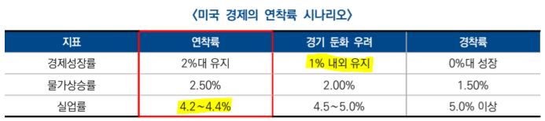
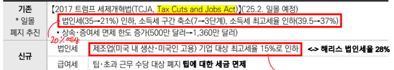
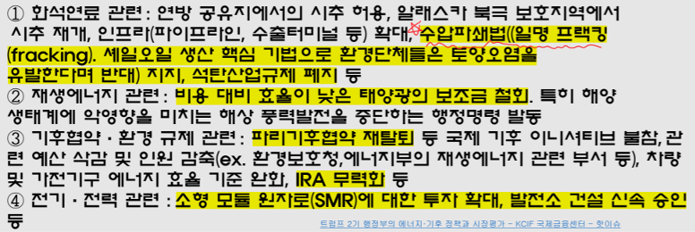
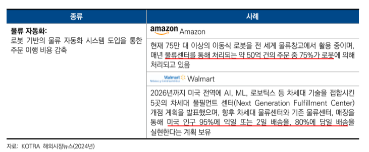
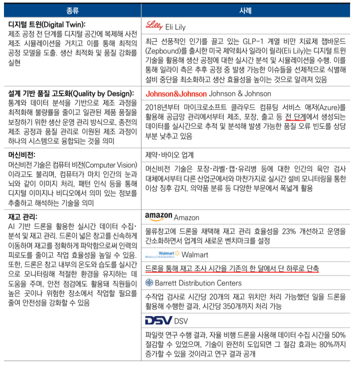

# 북미 진출 전략
- 미국 객 3 주 2

# 시장 평가 및 주요 이슈
## 가. 시장 전망
### 경제 연착륙(2%대 경제 성장률)을 위한 완화적인 통화정책 시작 → 확장세는 둔화 But 침체 없는 경기 성장 전망
- 25년 실질성장률: 2.2%(미국), 2.4%(캐나다) 전망
    + 22년 하반기부터 이어진 고강도 긴축정책에 따른 침체 우려 But 강력한 성장세 이어왔으나, **누적된 통화 긴축 효과로 24년 하반기부터 성장세 둔화 예상**
- 24년 9월 FED가 금리 인하 시작 → 인플레이션 억제를 위해 이어온 통화 긴축 정책 종료(**금리 인하 종료 = 긴축 종료**) 
    + 이에 따라 목표한 **경제 연착륙 시나리오에 도달할 가능성 상승**
    + 겨에 개입 빼고 시장의 힘으로 돌아갈 때 연착륙을 할 것으로 예상중(= **현재 경기 좋다는 평가**)

### 시장의 관심은 빅컷(0.5% 금리 인하)으로 인한 미국 경제 '연착륙' 유도 가능 여부 → 정부 개입 없이 가능한지 여부
- 파월 의장은 기자회견(24.10)에서 경제가 예상대로 진행 시 올해 0.25%씩 **두차례** 총 50bp 추가 금리 인하 가능성 시사(= 상황이 나쁘지 않다는 것을 시사)

- IMF도 미국 올해 경제 성장률 전망치를 지난 1월 2.7%에서 지난 22일 1.8%로 내림
    + 관세로 인한 불확실성(경기 침체 가능성 **25% → 37% 증가**)
    + 경제성장률 = **경기둔화화**
- 물가상승률: **3% 전망**
- 3월 실업률: **4.2% ** = **연착륙**
- 22년 물가(7.9%) 잡으려고 금리 상승 → 23년 물가(4.2%) → 24년 하반기(3.1%)에 금리 하락

# 2. 25년 주요 이슈 및 전망
## 가. 트럼프 정부 시나리오에 따른 정책 변화
- 트럼프(공화당) 당선
    + **블루월 3개주**(펜실베니아, 미시간, 위스콘신), **선벨트 4개주**(네바다, 애리조나, 조지아, 노스캐롤라이나)
    + 선벨트: 퇴직한 부자들이 자주 가는 남쪽 지역(공화당)

※ 블루월: 러스트벨트(옛 중공업 공업지대; 노조로 인한 민주당 텃밭)지역에서 분리된 것으로 민주당 우위 
※ 선벨트: 미국 남부지역으로 공화당 우세주가 많음 
- 119대 연방 의회 선거에서 **상, 하원 모두 다수당 확보**
    + **상원 100석**(50개 주 두 명씩): 공화당 53석, 민주당 47석
    + **필리버스터(무제한 토론을 통한 합법적 의사진행 방해)**를 무력화하는 의석 60석 확보 실패
    + 하원: 공화당 219석, 민주당 215석, 1석 공석
- 주지사(4년마다 대선과 같은 해에 투표; 50명): 공화당 27명, 민주당 23명

### 투표 특징
- 인종: 라티노(히스패닉인), 아시안이 트럼프쪽으로 많은 투표
- 성별: 백인 남성이 특히 많이 지지
- 학력: 학력이 높을 수록 해리스 지지하는 경향

### 트럼프, 한층 강력한 보호무역주의 정책 추진 전망
- 트럼프 관세전략: **상호관세, 보편관세**
- 미국의 **대외 무역적자 해소를**최우선 경제 과제 중 하나로 설정
    + 전 세계 수입에 보편(무차별) 기본 관세 10 ~ 20% 부과
    + 대중 수입에 대상 관세율을 60%로 인상 공약
- **상호무역법** 입법을 추진
    + 상호무역법: 상대국이 미국에 관세나 세금을 부과하면 미국도 동일한 수준의 상호관세를 부과하는 보복 관세
### 트럼프 1기 행정부 추진 관세 정책
    + 무역법301조(슈퍼 301조 관세): **불공정** 무역 관행에 대응하기 위해 중국산 제품에 25% 관세 부과
    + 무역법232조(무역확장법 232조): **안보**
    + 세이프가드 관세: 합법으로 타당하다면 WTO 제소해도 소용 없는 임시 조치

### 트럼프 1기 행정부 추진 관세 정책
- **무역법 301조(슈퍼 301조)**: 교역 상대국의 불공정한 무역행위로 미국 무역에 제약이 생기는 경우 광범위한 영역에서 보복할 수 있도록 허용
- **무역확장법 232조**: **국가안보조항**으로도 알려져 있는데, 이는 해당 조항이 미국 대통령에게 자국의 안보를 명목으로 수입을 제한할 수 있는 권한을 부여하기 때문, **다른 수입제한조치에 비해 제한 범위가 넓고 특정 기한 없음**
- **세이프가드**: 특정물품 수입 급증으로 수입국의 국내 산업 피해를 입거나 입을 우려가 있을 경우 해당 품목 수입 임시 제한 or 관세 인상을 통한 긴급 수입 제한 조치를 할 수 있는 제도, **GATT조항(제 19조)**에도 규정된 **임시조치**

### 트럼프 집권 시 환율 문제가 중요한 통상 이슈로 부상 예상
- 트럼프가 생각하는 미국 무역적자 원인: 달러 고평가
    + IF 저평가 → 수출 유리, 수입 불리
- 약달러를 통한 미국 수출 경쟁력 제고를 위해 다음 수단 활용 예상
    + 연준의 금리 인하 압박
    + 정부 외환시장 개입 → 달러 인덱스 하락
    + 외국 정부 상대로 통화 가치 절차 압박 
- **관세를 무기로 쓰고 있지만, 환율 정책을 쓸 가능성이 크다**: 기축통화 발행 비용의 일정한 분담을 원함

### 반도체 수출입 규제 강화와 범위확대 예상
- 트럼프는 첨단 노드 반도체에 집중되어 있는 대중 수출 통제를 포함한 규제 조치가 차기 정부에서 **일부 범용**기술까지 확대될 것으로 전망
    + Legacy: 자동차, 항공기, 가전 등에 쓰이는 다양한 기술(현재 반도체 시장의 70%, 중국 29% 시장 점유율) 
- 미국 정부는 **수출 통제 강화, 국가안보 목적 관세 부과, 중국의 상계 관세 부과, 미국의 대중 반도체 투자 규제, 중국산 조달 금지 조치**를 할 것으로 보임
- 경제회복 및 자국 산업 보호를 위한 **미국 우선주의** 경제 추구 전망
    + 대규모 감세, 세금 공제 확대, 규제 완화로 소비와 경제 성장 촉진
    + 25년 만료 예정인 17년 트럼프 세제개혁법(**TCJA: 세금 감면 및 일자리법**) 연장 및 보완 추진 
- 감세 공약 요약

- **Buy American**(미국산 우선 구매) 정책을 통한 자국 산업 보호, 제조업 수요 증대
    + **연방정부가 조달하는 물품에 있어(모든 물품 X)** 미국산 우선 구매가 가능하므로 미국 기업은 정부조달 입찰에서 외국기업보다 높은 가격을 써낼 수 있음

### 미국 내 전통에너지 생산 확대를 통한 에너지 안보, 자립 촉진 예상
- **전통에너지 생산 확대**: 화석연료 생산 제한 폐지, 세금 감면을 통한 투자/생산 장려, 연방 토지 내 석유/가스 시추 허가 등 
- **기존 친환경 정책 철회**: 그린 뉴딜, 전기차 의무화 및 탄소 배출량 감축 정책
- **미국 에너지 정책의 자율성 확보**: 파리기후협정 재탈퇴, ESG 정책 중단

### 양자 무역 협상 선호 및 다자 무역협정 재검토 전망
- IPEF(인도-태평양 프레임워크), TTC(EU-미국 무역기술위원회), USMCA 등 다자간 무역협정 탈퇴 및 국가 간 무역협정 재협상 시사
- **PNTR(항구적정상무역관계)** = GAT 1조 최혜국 대우(MFN)

|정책요소|               바이든                  |                      트럼프                     |
|:-----:|:------------------------------------:|:----------------------------------------------:|
|미중관계| 디리스킹, 대중국 전략 품목 301조 관세 부과 | 디커플링, 중국의 PNTR 지위 철회                   |
|무역통상| 다자간 무역협상                         |양자 간 무역협상                                  |
|공급망  | 프렌드/니어쇼어링                       | 리쇼어링 및 온쇼오링 강화                         |
|기후변화| IRA, 기후변화 대응                      | 파리기후협정 재탈퇴                              |
|제조업  | Buy American 정책 유지                 | IRA 기후 관련 지원금 축소, CHIPS법 보조금 축소, 폐지|

## 나. 북미 AI 지배력 강화를 위해 추진중인 전략
### 25년 글로벌 AI 시장은 전년 대비 18.7% 상승한 7,576억 달러 규모 전망
- 글로벌 AI 지수상 AI 경쟁력(83개국 기준): 미국 꾸준히 1위, 캐나다 8위, 한국 6위
- AI 산업 육성을 위한 북미 양국의 정책 지원
- 바이든 정부는 국가 AI 연구기관(**NAIRR**)설립
- 23년 미국 정부는 AI 위험성을 지적하는 행정명령 공표, 진흥 규정은 법률로 지정하고 규제는 행정명령으로 운용하는 전략을 통해 AI 산업 진흥을 **우선시**하는 정책 중
- 바이든(규제) < 트럼프(진흥)

### AI 기술 접목한 스마트 팩토리, 미 제조업 부흥 견인
- 기업들은 효율성을 높이고 조직 전반의 회복 탄력성을 구축하기 위해 스마트 팩토리 도입
- 첨단 제조 분야에 미 정부의 적극적 지원과 막대한 자본력이 동 시장 성장동력으로 분석
- 사례

## 미국 데이터 센터가 촉발한 전력 수요 증가 대응 본격화
### 첨단 기술 도입과 친환경 에너지 전환에 따른 전력 수요 증가
- So, **트럼프가 전통 에너지를 중요하게 생각**
- 디지털화, AI 기술 채택에 따른 데이터 센터 설립이 늘면서 필요 전력량도 동반 상승
    + 현재같은 속도로 데이터 센터 증가 시 운영에 필요한 전력 소비량: 2030년말까지 현 전력 소비량의 2.5배 높은 수준에 달할 것으로 전망
- 미 10대 전력 기업 가운데 9개가 **최근 전력 수요 급증 요인으로 데이터 센터를 꼽음**
- 일부 지역: 데이터 센터로 인한 전력 사용 급증 대응을 위해 화력 발전소 폐쇄 지연, 전력 확보 가능 지역 중심으로 토지 가격 상승

### 전력 수요 확대에 따른 성장하는 ESS 시장
- 재생에너지 전환과 첨단 기술도입에 따른 전력 수요 확대로, 안정적이고 경제적으로 전력을 공급할 수 있는 ESS 수요 및 설치가 큰 폭으로 증가
- 신규 전력 생산에서 ESS를 필요로 하는 재생에너지 비중이 늘고 있고, 데이터 센터 증가에 따른 전력 수요 확대
- 배터리 가격하락 → ESS 경제성이 개선
- IRA를 통한 세제 혜택 등이 ESS 시장 성장의 요인으로 분석
- 캘리포니아, 텍사스, 애니조나 등 일조량이 풍부한 미 서부와 남부 지역 중심으로 대규모 ESS 프로젝트가 활발하게 진행 중

### 탄소 중립 노력에 관심 높아지는 원자력 발전 사업
- 건설에 시간 소요가 크지만 안전을 가정하면 아주 높은 효율성
- 최근 전기화 트렌드에 따른 전력 수요 증가와 탈탄소 기조 강화로 안정적인 무탄소 전원인 원자력 재조명
- SMR(소형 모듈형 원자로)배치 가속화 추진 예정
- **캐나다 정부 SMR 도입 적극 추진**
- 한국: SMR 기술 분야에서 높은 평가, 23년 중순 SMART를 포함한 SMR 관련 협약 체결(한-캐)

## 마. 북미 동맹 강화, 중국 견제 속 수출 전망
### 미, 캐나다는 공통의 가치와 깊은 인적 연결을 바탕으로 긴밀한 관계 유지
- 캐나다의 최대 무역 파트너(미국), 23년 기준으로 캐나다 전체 수출의 약 **77.4%**가 미국으로 향함
- 캐나다 원유 97% 미국으로 수출, 미국의 캐나다 무역의존도(25%)
- 공급망 재건과 동맹 강화를 통해 중국 의존도 축소
    + 북미 국가들은 GVC에서 RVC, 리쇼어링 등으로 공급망 구조 지역화를 적극 추진
    + 북미 동맹 강화, 경제/정치/안보적 이유로 대중국 경제 의존도 줄이려는 공동 노력의 일환으로 작용

### 안보 개념 확장을 기반으로 한 미국 공급망 재편 전략
- 국가 안보 위협 요소: 전쟁/테러 → 감염병, 자원 고갈, 기후변화 등 다양화
- 국가 안보 개념과 무역/통상을 연계해 자국 우선주의 기조 강화중
- 미국의 대중 견제가 구체화되고 포괄적으로 전개됨에 따라 중국을 배제한 공급망 재편이 진행될 것으로 전망
    + **초당적 공감대를 바탕으로**한 대중 견제 관련 법안 추진 중
- **캐나다 정부의 대중 견제 기조 강화, 동맹국 공급망 참여 노력 확대**
    + 중국산 전기차에 대해 기존 6%이던 수입 관세에 100% 추가 관세 부과할 계획을 발표

## 바. 바이퍼 케이션, 초고가 아니면 초저가인 평균 실종 사회
- 소비 양극화: 질적으로 다른 두 갈래로 전환되는 현상
- **중산층 감소, 저소득&고소득층 증가**
    + 저소득층: 4%p 증가
    + 고소득층: 7%p 증가
- **고물가, 고금리**지속 → **소득보다 물가가 더 큰 폭으로 상승**해 가계에 부담으로 작용하며 중산층이 감소한 것으로 분석
- 고소득층: 고물가에도 명품과 고가의 서비스를 지속해서 소비
    + 상위 20% 고소득층: 해외 여행, 엔터테인먼트, 기타 서비스의 지속적 지출
- 경제적 여유 있는 소비자: 여행(1순위) 등 서비스 소비 + 호화로운 여행 선호
    + 여행객이 덜 붐비는 비수기 여행 + 고급 여행 패키지 선호
- **요노족(You Only Need One)** 등장
- 식품, 에너지, 주거비가 여전히 높은 수준으로 유지 → 저소득츠에게 부담
- 팬데믹 동안의 저축을 모두 소진, 월급에 의존해 생활, 신용카드 사용액이 증가, 자동차와 기타 대출 연체가 증가 추세

### 양극단을 겨냥한 분리 마케팅(프리미엄화와 초저가 마케팅) 추진
- 카드사 프리미엄 고객에게는 회원비를 면제해주는 제휴 서비스로 고소득층 고객을 유입시켜 소비 자극
    + 유기농 신선상품, 하이엔드 브랜드 입점
- 식품, 생필품군에서도 초고가, 초저가 제품을 동시에 판매 중인 추세
- 패스트푸드 초저가 메뉴와 초고가 풀 서비스 레스토랑이 동시에 트렌드로 언급되며 **외식 문화도 양극화 현상 반영**

# 4. 비즈니스 환경 분석
## 정치환경: 트럼프 당선으로 인한 판도 변화
- 트럼프 재집권에 따른 미국 우선주의 정책 회귀 및 대내외 정책 변화
- 감세, 보편 관세 부과, 국경 보안 강화, 범죄 및 이민 정책 개혁
- 대중 정책에 강경한 입장, 경제/안보 전반의 중국 견제 강화 추구 등
- 미국 보호무역 강화와 공급망 안정성 확립을 통한 자국 산업 활성화 전망
    + 기업에 대한 **감세, 규제완화** → 경제 회복 가속화, 물가 억제, 금리 정상화 추구
    + **디커플링 강화**: 대중국 무역, 투자 제재 확대와 기존 무역협정 재검토
    + 반도체,에너지, 희소금속 등 전략적 핵심 분야에서 자국 생산 확대

### 캐나다 트뤼도 총리(자유당)집권 9년차, 흔들리는 지지율
- 중국의 연방 총선 개입 의혹, 트럭 운전사 시위 중 대피, 공금 횡령 등으로 지지도 하락
- 보수당 피에르 포일리에브르에 뒤지는 것으로 나타남
    + 포일리에브르: 과도한 정부 부채와 부동산 버블 해결을 주요 공약으로 내세움 
- **현재 총리: 마크 카니(자유당)**
- 환경 정책, 난민 수용과 소수 민족 포용과 같은 이민 정책 등 업적은 호평
- 시크교 독립운동가 피살 관련 인도와읭 외교 갈등

## 라. 정책, 규제 환경
- 불공정 무역 관행에 대응하기 위한 미국 우선주의, 보호무역 확대
    + 관세 인상을 통해 미국 무역 불균형 해소, 자국 제조업 강화 및 산업 육성 추진
    + **리쇼어링, 니어쇼어링**으로 안정적인 공급망 구축 
- **양자간 무역 협상 우선**, 다자간 무역협정 탈퇴 및 기존 무역협정 재검토 시사
- 26년 USMCA 6년 재검토시 중국산 자동차 부품의 멕시코 우회 수입 방지 조치 반영, 에너지, 기술, 통신 등 핵심 분야에 대한 재협상 및 규제 강화 포함 전망

### 첨단산업 중심의 공급망 강화 기조 지속
- 미국의 반도체 리더십 구축을 목표로 반도체 등 핵심 산업 보조금을 통한 지역 경제 활성화 노력(**반도체 법 보조금 유지**)
- 핵심 산업의 공급망 문제를 국가안보와 직접적 연결을 통해 중국에 대한 의존도 축소 추진
- 의약품 및 원료의약품의 국내 공급망 현황과 취약점 분석을 바탕으로 공급망 확보 추진 중(상호관세에서 제외)
    + 필수 의약품의 자국 생산 촉진을 위해 급진적 통화 관세 부과 및 수입 제한 **행정명령 발동**가능성 주시 필요
- **행정명령**: 강력한 정책도구로 의회를 거치지 않고 직접 발령하는 지시로 즉각적인 변화를 이끌어낼 수 있음

### 대중 규제 기조 속 중국 의존 탈피를 위한 무역, 투자 제재 강화
- 중국산 전자제품, 철강, 의약품의 수입 4년 내 단계적 중단 추진
- 중국의 **항구적정상무역 관계(PNTR; 최혜국대우)**지위 철회로 고관세 부과