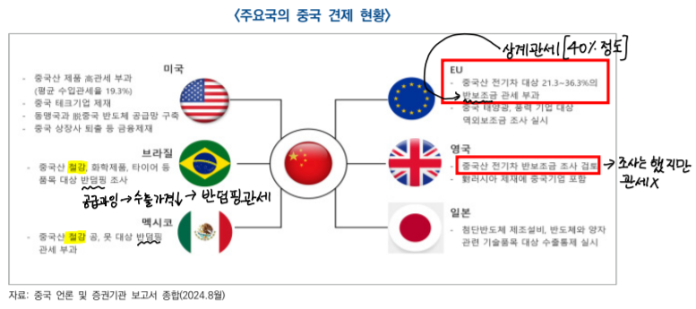

# 중국 진출전략

## 시장 전망
- 경제: 경기 둔화가 지속되면서 24년 5% 내외, 25년 4 ~ 4.5% 성장률 전망
- 4.1%(KIEP)로 전망 25.5.14 중국 정부는 양회애서는 올해 성장률 5%로 설정
- 중국 경기 하방을 방어해온 정부 주도의 인프라, 제조업 투자와 수출이 **역기저효과**로 성장세 둔화, 중국 경제 감속 예상
- **역기저효과**: 비교대상이 되는 시점의 수치가 지나치게 높아 상대적으로 감소율이 높아보이는 ㅎㄴ상
- 소비, 투자 심리 위축, 부동산 경기 침체 장기화 등 내수 회복 **모멘텀(추진력, 성장동력)**약화
- 정부 주도 첨단, 신흥 분야 투자와 신흥 소비가 25년 중국경제 핵심 성장동력
    + **2030탄소피크 2060탄소중립**
    + 신인프라, 신제조업 투자, 탄소중립, 첨단화에 의한 신소비 수요 확대
    + 기존 소비는 이미 포화 상태 → **새로운 소비 창출 필요**
    + 소비 회복세 미진, 부동산 경기 침체, 민간 투자심리 약화, 미-중 경쟁 장기화 및 미-EU 견제 심화와 같은 지정학적 리스크 등 대내외 불확실성 상존
- **신인프라**: 20년 신인프라가 처음으로 정부 업무 보고에 등장, 관련 분야에 동력과 자신감을 불어넣을 것으로 기대(5G 기지국 건설, 특고압, 도시간 고속철도 및 도시궤도 교통, 신에너지 자동차 충전스탠드, 빅데이터 센터, AI, 산업 인터넷 등 7개 분야 포함)
- **신제조업**: 제조업 + 서비스업, 마윈의 알리바바는 신제조업은 인터넷, 데이터, AI, 클라우드, IoT 등을 제조 프로세스에 통합해 전통적 제조업을 바꾸는 것
- 성장률: 5.2, 5.1, 4.5 (23 ~ 25)
- 실업률: 5.6, 5.2, 5.1, 5.1 (22 ~ 25)
- 물가상승률: 0.2, 0.6, 1.0 (23 ~ 25) **디플레이션**, debt/부동산 영향으로 경기침체

## GVC 및 통상 질서 재편 가속
- 중국 견제 심화 및 지정학적 리스크 확대로 국제 통상환경 약화
- 미 트럼프 재당선 및 **레드웨이브**(공화당이 상,하원 모두 장악)실현으로 미-중 관계 불확실성 확대
- 더욱 강력한 대중 견제 조치 예고: PNTR(최혜국 대우) 박탈
- 대중 견제에 따른 영향
    + 중국 수출 감소
    + 중국 경제 성장동력 약화
    + 우회수출 차단에 따른 산업망, 공급망 불안정 등 악영향 전망
    + 평균 수입 관세율: 약 40% 도달 예상(25.5.14: 90일간 30%)
- **고립주의**: 국제분쟁에서 중립 위치를 유지하고 정치/군사적으로 국제사회에서 고립한다는 정책, 개입주의와 반대되는 개념으로 다른 나라 일에 개입하지 않고 동맹관계도 체결하지 않는 미국의 전통적 외교 정책
- **우회수출**: 특정 상품 규제, 관세 회피를 위해 제 3국으로 해당 상품, 부품, 요소를 수출해 가공 후 원산지 변경을 통해 제재 시행국으로 수출하는 행위
- 우회 수출 방지를 위해 트럼프는 관세를 매김(베트남, 캐나다, 멕시코 등)
- 고관세는 중국의 대미 수출경쟁력 약화, 나아가 전체 수출 둔화를 심화시킬 전망
- 현재 중국은 공급 과잉 → 싼 가격에 많이 파는 중
- 수출의 경제 성장 견인력 약화는 중국 경기 회복 흐름에 부정적 영향
    + 대미 수출 전년 대비 90% 감소, 중국 전체 수출 약 13% 감소
    + 중국기업 해외 생산라인을 활용한 우회수출 영향을 더한 경우 중국 전체 수출 약 8% 감소, 중국 경제 성장률 1 ~ 1.3%p 감속 전망

## 중요: 미중 경쟁 격화, 고관세 회피를 위한 기업들의 글로벌 공급망 혼란을 가중시키는 부정적 요인으로 작용
- 중 제품 대상 반덤핑 조사 등 주요국 대중 견제 참여 확대

- 지정학적 충돌 악화 및 장기화는 글로벌 공급망, 국제 유가 및 원자재 가격, 해상 물류 등에 악영향
- 일대일로 연선국,신흥국 중심의 공급망 재편 및 통상 질서 구축에 속력
- 선진국에 대한 무역 의존도를 낮추면서 **일대일로 연선국(60개국), 아세안, 브릭스 등** 국가와의 경제협력 확대 ← 중국이 미국의 관세에도 영향을 벗어날 수 있는 이유
    + 18년 미-중 무역 경쟁 발발 이후 미국은 중국의 2위 교역 파트너로 밀려남(1위: 아세안), 1위와의 비중 격차도 지속 확대
    + 일대일로 관련 프로젝트(RCEP) 등 다자체계를 활용해 일대일로 연선국 및 동남아 지역과의 교역 확대, 중국 중심 산업망 강화 전망
- RCEP: 아세안 + 6개국 - 인도 = 15개국, 중국 중심 공급망
- 파나마 운하: 일대일로 협정을 통해 운하 주변 개발과 인프라 투자에 적극 나서게 됨. But 파나마는 미 해군 함정의 운하 무상 통과 보장, 일대일로 탈퇴 밝힘(25.2.7)
- 아시아-아프리카-남미 등 신흥국 중심 경제 우군 확보하여 주요국의 대중 압박 대응
    + 일대일로, 중국-아프리카 포럼, 상하이협력기구, 브릭스 등 **다자체계**아래 신흥국과의 경협을 강화
    + 상대국이 감당할 수 있고 실질적 도움이 되는 **'작고 아름다운 프로젝트'**를 통해 중국 중심의 국제 물류 채널 구축 & 중국 기업의 해외 진출 촉진 및 관련 품목 수출 확대
- **상하이협력기구**: 러시아, 중국, 카자호스탄, 키르기스스탄, 타지키스탄 5개국이 1996.4.26일 결성한 **상하이파이브**가 전신이며, 거기에 우즈베키스탄(2001년) 가입하면서 명칭 변경하여 생겨난 국제기구