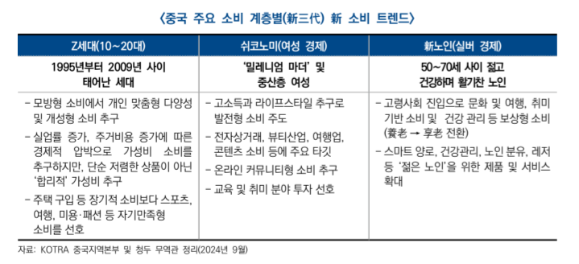

# 중국 진출전략

# 키워드
- 가격 경쟁력(공급과잉)
- 이가환량: 수출량 증가, 수출액 감소하는 현상
    + 소비위축과 공급과잉으로 인해 가격을 낮춰 판매량 증대 시키는 마케팅 전략
- 신싼양: 의료, 가전, 가구 등 라오싼양을 대체하는 3대 신 수출 품목(전기차, 배터리, 태양광)
- 신질생산력: 낮은 비용으로 고품질, 고효율 기술과 제품을 만든다: 혁신과 고품질을 강조하는 제조강국을 지향함(ex: 딥시크)
    + 2024년 중국언론이 가장 많이 쓴 단어(고효율, 첨단기술, 고수준)
- 이구환신: 노후 제품을 신제품으로 교체(소비의 핵심 키워드: 보조금으로 생각)

## 시장 전망
- 경제: 경기 둔화가 지속되면서 24년 5% 내외, 25년 4 ~ 4.5% 성장률 전망
- 4.1%(KIEP)로 전망 25.5.14 중국 정부는 양회애서는 올해 성장률 5%로 설정
- 중국 경기 하방을 방어해온 정부 주도의 인프라, 제조업 투자와 수출이 **역기저효과**로 성장세 둔화, 중국 경제 감속 예상
- **역기저효과**: 비교대상이 되는 시점의 수치가 지나치게 높아 상대적으로 감소율이 높아보이는 ㅎㄴ상
- 소비, 투자 심리 위축, 부동산 경기 침체 장기화 등 내수 회복 **모멘텀(추진력, 성장동력)**약화
- 정부 주도 첨단, 신흥 분야 투자와 신흥 소비가 25년 중국경제 핵심 성장동력
    + **2030탄소피크 2060탄소중립**
    + 신인프라, 신제조업 투자, 탄소중립, 첨단화에 의한 신소비 수요 확대
    + 기존 소비는 이미 포화 상태 → **새로운 소비 창출 필요**
    + 소비 회복세 미진, 부동산 경기 침체, 민간 투자심리 약화, 미-중 경쟁 장기화 및 미-EU 견제 심화와 같은 지정학적 리스크 등 대내외 불확실성 상존
- **신인프라**: 20년 신인프라가 처음으로 정부 업무 보고에 등장, 관련 분야에 동력과 자신감을 불어넣을 것으로 기대(5G 기지국 건설, 특고압, 도시간 고속철도 및 도시궤도 교통, 신에너지 자동차 충전스탠드, 빅데이터 센터, AI, 산업 인터넷 등 7개 분야 포함)
- **신제조업**: 제조업 + 서비스업, 마윈의 알리바바는 신제조업은 인터넷, 데이터, AI, 클라우드, IoT 등을 제조 프로세스에 통합해 전통적 제조업을 바꾸는 것
- 성장률: 5.2, 5.1, 4.5 (23 ~ 25)
- 실업률: 5.6, 5.2, 5.1, 5.1 (22 ~ 25)
- 물가상승률: 0.2, 0.6, 1.0 (23 ~ 25) **디플레이션**, debt/부동산 영향으로 경기침체

## GVC 및 통상 질서 재편 가속
- 중국 견제 심화 및 지정학적 리스크 확대로 국제 통상환경 약화
- 미 트럼프 재당선 및 **레드웨이브**(공화당이 상,하원 모두 장악)실현으로 미-중 관계 불확실성 확대
- 더욱 강력한 대중 견제 조치 예고: PNTR(최혜국 대우) 박탈
- 대중 견제에 따른 영향
    + 중국 수출 감소
    + 중국 경제 성장동력 약화
    + 우회수출 차단에 따른 산업망, 공급망 불안정 등 악영향 전망
    + 평균 수입 관세율: 약 40% 도달 예상(25.5.14: 90일간 30%)
- **고립주의**: 국제분쟁에서 중립 위치를 유지하고 정치/군사적으로 국제사회에서 고립한다는 정책, 개입주의와 반대되는 개념으로 다른 나라 일에 개입하지 않고 동맹관계도 체결하지 않는 미국의 전통적 외교 정책
- **우회수출**: 특정 상품 규제, 관세 회피를 위해 제 3국으로 해당 상품, 부품, 요소를 수출해 가공 후 원산지 변경을 통해 제재 시행국으로 수출하는 행위
- 우회 수출 방지를 위해 트럼프는 관세를 매김(베트남, 캐나다, 멕시코 등)
- 고관세는 중국의 대미 수출경쟁력 약화, 나아가 전체 수출 둔화를 심화시킬 전망
- 현재 중국은 공급 과잉 → 싼 가격에 많이 파는 중
- 수출의 경제 성장 견인력 약화는 중국 경기 회복 흐름에 부정적 영향
    + 대미 수출 전년 대비 90% 감소, 중국 전체 수출 약 13% 감소
    + 중국기업 해외 생산라인을 활용한 우회수출 영향을 더한 경우 중국 전체 수출 약 8% 감소, 중국 경제 성장률 1 ~ 1.3%p 감속 전망

## 중요: 미중 경쟁 격화, 고관세 회피를 위한 기업들의 글로벌 공급망 혼란을 가중시키는 부정적 요인으로 작용
- 중국 제품 대상 반덤핑 조사 등 주요국 대중 견제 참여 확대

- 지정학적 충돌 악화 및 장기화는 글로벌 공급망, 국제 유가 및 원자재 가격, 해상 물류 등에 악영향
- 일대일로 연선국,신흥국 중심의 공급망 재편 및 통상 질서 구축에 속력
- 선진국에 대한 무역 의존도를 낮추면서 **일대일로 연선국(60개국), 아세안, 브릭스 등** 국가와의 경제협력 확대 ← 중국이 미국의 관세에도 영향을 벗어날 수 있는 이유
    + 18년 미-중 무역 경쟁 발발 이후 미국은 중국의 2위 교역 파트너로 밀려남(1위: 아세안), 1위와의 비중 격차도 지속 확대
    + 일대일로 관련 프로젝트(RCEP) 등 다자체계를 활용해 일대일로 연선국 및 동남아 지역과의 교역 확대, 중국 중심 산업망 강화 전망
- RCEP: 아세안 + 6개국 - 인도 = 15개국, 중국 중심 공급망
- 파나마 운하: 일대일로 협정을 통해 운하 주변 개발과 인프라 투자에 적극 나서게 됨. But 파나마는 미 해군 함정의 운하 무상 통과 보장, 일대일로 탈퇴 밝힘(25.2.7)
- 아시아-아프리카-남미 등 신흥국 중심 경제 우군 확보하여 주요국의 대중 압박 대응
    + 일대일로, 중국-아프리카 포럼, 상하이협력기구, 브릭스 등 **다자체계**아래 신흥국과의 경협을 강화
    + 상대국이 감당할 수 있고 실질적 도움이 되는 **'작고 아름다운 프로젝트'**를 통해 중국 중심의 국제 물류 채널 구축 & 중국 기업의 해외 진출 촉진 및 관련 품목 수출 확대
- **상하이협력기구**: 러시아, 중국, 카자호스탄, 키르기스스탄, 타지키스탄 5개국이 1996.4.26일 결성한 **상하이파이브**가 전신이며, 거기에 우즈베키스탄(2001년) 가입하면서 명칭 변경하여 생겨난 국제기구

## 주요 원자재, 광물 등 자원의 안정적 수급과 수출 통제 강화를 통해 신공급망 모색

- 자원 무기화 대비 및 원자재의 안정적 공급망 확보
- 중국이 공급 주도권을 진 핵심광물에 대한 수출 통제 강화, 주요국의 대중 제재 조치에 **맞대응**가능성 심화
    + 희토류, 텅스텐, 마그네슘 등 품목의 세계 대중 의존도는 80% 상회 
- 중국기업의 **추하이(해외진출)** 증가로 관련 산업망이 해외로 연장되며 글로벌 공급망 재편 및 중국 중심의 공급망 새태계 구축 촉진

## 성장 모멘텀 확보 및 채산성 방어를 위한 저가 수출 지속 예상
### 중국 경제 감속 및 소비 회복세 미진으로 경제성장률의 수출 의존도 심화
- 소비, 생산의 저조한 회복 흐름 속 정부 주도의 투자 확대도 한계
- 세계 경제가 완만한 회복 흐름을 보이는 가운데, 중국 수출 호황은 세계시장 수요보다 중국 제품의 가격경쟁력이 크게 작용한 결과
- **이가환량**: 소비위축과 공급과잉으로 인해 가격을 낮춰 판매량을 증대시키는 마케팅
    + 수출 증가, 수출액 감소하는 현상 

### 구조조정, 기업의 채산성 악화 방어를 위한 (공급과잉으로 인한) 저가 수출은 당분간 지속될 전망
- 중국 공급 과잉 및 구조조정, 중국 내수시장 경쟁 격화에 의한 저가 수출 공세가 이어질 전망
- 철강은 대표적 공급 과잉 및 산업 구조조정 품목
- 자동차의 경우 중국 내수시장 포화에 의한 경쟁 격화로 수출 가격을 낮춰서라도 수출량을 확보하는 모양새
- **신싼양**: 기존 수출을 주도하던 라오싼양을 대체하는 3대 신수출 품목(**전기차, 태양광, 배터리**)
- 단, 대중 고관세 및 중 기업 마진율 압박 등의 요인으로 장기화 여부는 관망 필요

## 신질 생산력으로 두 마리 토끼(경기부양, 산업 고도화) 잡기
- **신질생산력**: 낮은 비용으로 **고품질, 고효율** 기술과 제품을 만든다: **혁신과 고품질**을 강조하는 제조강국을 지향(ex: 딥시크)
    + 3대 특징: **첨단기술, 고효율, 고수준**
- 첨단기술 중심의 첨단화, 녹색화, 스마트화 성장으로 전환하고 총요소생산성을 올려 '혁신이 주도하는 지속가능한 성장'을 실현하겠다는 의미
- 신질생산력 발전은 **신기술, 신산업 육성, 전통 산업 구조조정 및 업그레이드**까 핵심 과제
    + 거국 체제 구축을 통해 전략 과학 기술 역량 강화 및 국가혁신체계 효율 제고
    + 미래 산업체계 구축 및 전통 산업 업그레이드 촉진 예상
- 정부 주도 첨단 기술, 제조업 투자를 확대하여 첨단, 핵심 기술 역량 강화 예상
- 정부의 관련 지원책 강화로 민간 부문의 제조업 투자 호황은 지속될 전망
- **이구환신**: 노후 제품을 신제품으로 교체
    + 정부가 보조금으로 이구환신을 유도 → 제조업 투자 확산

## (소비)완만한 개선 흐름 속 '불균형적 회복' 심화
- 중국 경제 감속이 지속되고 있는 가운데, 부동산 경기 침체가 장기화 양상을 보이면서 **중국 소비 둔화세 심화**
- 리오프닝 이후 소비 회복세를 이끌어온 외식 부문마저 **기저효과 종료로 둔화 추세**
- 내수 부진, 시장 경쟁 격화의 영향으로 정부의 소비 진작 정책 효과가 희석되는 양상

### 신수요, 신제품, 신브랜드가 눈에 띄는 성장세를 보이며 시장 구조조정 가속화
- 브랜드: **vivo, 화웨이** 등 성장세가 두드러짐
- 문화: 콘서트 관객수, 공연 수입은 각각 333%, 493% 급증

## 비즈니스 환경 분석

### 정치 환경
- 시진핑 집권 3기 **중국식 현대화 추진** 및 1인 지배 체제 강화
- **당강정약**: 당을 강하게 하고 정부를 약하게 하는 시진핑 주석 1인 체제 강화하고자 하는 정책
- 주석 연임을 위해 중국식 현대화를 전면 추진함으로 장기적 발전 목표 실현 제시 ex) 공동 부유
- 반부패 기조 또한 강화될 것으로 예상
    + 기존 당, 정 분리 원칙을 깨고 **당 우선 정책을 가속**
- **내수위주의 쌍순환**과 **공동부유**정책을 강화하고자 함
    + **쌍순환**: 국내시장과 국제시장을 큰 두축으로 해서 선순환을 만드는 것으로 수출에**만** 포커스 → 내수에**도** 포커스를 맞춤
- 시진핑 1기 키워드 **중국제조2025**
- 시진핑 2기 키워드 **내수위주의 쌍순환**
- 시진핑 3기 키워드 **중국식 현대화**

#### 대국 외교 추진 가속화
- 중국의 국제적 위상 강화, 글로벌 영향력 확대에 중점
- 아프리카, 동아시아, 인-태 지역에서의 영향력 확대
- 대미: 미-중 양국 관계의 안정성을 강조하는 동시에 핵심문제에 대해서는 강경한 외교 정책(주도권을 갖고 있는 분야와 신흥국 중심 우군 확보를 통한 압박 대응)
- **다자외교**: 일대일로 연선국 및 WTO, UN, BRICS 등 다자 국제기구에서의 역할을 지속 강화할 것으로 전망

#### 중국 공산당의 영도 및 집권체제 강화(당강정약)
- 전면 개혁 한층 심화, 중국식 현대화
- **중국 국무원 조직법**개정, 시진핑 '1인 체제' 공고화 및 총리 위상(현: 리창) 약화
- **총리 책임제**를 무력화한셈

## 경제 환경
- 중국 경제성장률 4.0 ~ 4.5% 달성 예상
- 24 경제성장률 5% 달성(4분기 엄청난 경기부양책에 5.4% 성장)
- 내수 부족 및 부동산 경기 침체 지속, 지정학적 리스크 등이 경기하방 압력으로 작용해 중국 경제는 **불균형 회복 흐름**을 보일 것으로 전망
- 대외적인 대중 견제, 중국 부동산 위기, 소비 둔화, 구조조정 등
- 부동산 경기 침체, 소비 둔화, 민간 투자 부진 속 **제조업, 인프라 투자 확대, 수출 호황** 등이 경기 둔화를 방어하는 긍정적 요인으로 작용
    + 생산: **탄소중립, 신흥전략**산업 관련 품목이 성장세를 보이며 생산 성장세 견인
    + 소비: **이구환신** 정책 등 다양한 소비 진작책 시행에도 불구, 소비 회복세 불균형 심화
    + 투자: 부동산 경기 침체 지속 중,+ 제조업, 인프라 투자가 전체 둔화세 방어
    + 교역: 24년 1 ~ 3분기 모두 플러스 전환, **무역 흑자 기록**
    + 금리: 유동성 공급을 위해 대출 금리, 예금 금리 인하
    + 유동성: 지속적으로 완화적인 통화정책 기조 견지
        + 기준금리, 지급준비율 인하, 채권발행 확대, 부동산 임대 금융 지원 강화 등
    + 환율: 안정적인 위안화 환율 유지 + 국제화 추진 가속화
        + 글로벌 결제 통화 중 4.69%(11개월 연속 세계 4위 결제 통화)

## 산업 환경
- 제조업과 서비스업 중심의 산업구조로 빠르게 전환(3차 산업인 서비스업 55.9%)
- '중국제조2025' 굴기로 제조업 기술혁신과 고도화가 이뤄지면서 고부가가치 산업과 첨단기술분야에서의 시장입지 확대중
- **3신경제**: 중국 국내총생산액에서의 3신 경제 부가가치 비중은 지속확대
- 23년 중국 3신(**신산업, 신업태, 신비즈니스모델**)경제 부가가치는 전년 대비 6.4% 증가
- 3신 경제 부가가치 비중은 3차 산업 비중이 가장 높음
- **신산업체계**: 내수확대 및 자립형 공급망 구축 속 **신질생산력**추진
- 과학기술 혁신을 통한 산업의 고품질 발전을 도모하는 신질생산력 실현을 위해 신산업 체계 구축 박차
- **혁신, 친환경**: 정부의 **이구환신 정책**추진 및 **탄소중립** 기조로 기술 혁신과 친환경 산어븨 발전이 산업 주요 트렌드로 부상

## 정책, 규제 환경
- **이구환신**: 내수 확대, 침체된 소비, 산업의 고품질 발전을 위한 정책 추진
- **신소비진작책**: 소비 회복을 위해 신소비환경조성, 신소비성장동력 육성에 대한 조치 발표
    + 외식, 문화, 오락, 중국 브랜드 육성, 실버, 육아, 헬스 등 서비스 소비 촉진
    + 중국 내 소비 잠재력을 자극해 내수 확대 + 경기 회복 모멘텀을 강화할 예정
- **신형 도시화**: 인구 도시화에 맞춰 토지개혁 추진 → 내수 진작 도모
- 부동산 살리기: 지원 정책 패키지를 통해 부동산 경기 침체 방어
- 산업의 고수준 발전: 전통 제조업 고도화 및 미래 산업의 혁신적 발전 추진
- 대외 개방: 중국 투자 상황 개선, 국제 투자 환경에서의 입지를 강화하기 위한 정부 차원의 고수준 대외 개방 입장 견지
    + **개방형 경제체제 개혁을 심화**할 것으로 예상
- 투자 유치: 네거티브리스트는 **제조업 분야의 외자 진입 제한을 전면 철회**
- **수출 규제**: 주요국의 견제 심화에 따라 자국 산업 및 전략적 자원 보호를 내세워 **핵심 광물, 산업에 대한 통제**를 진행해왔으며, 지속 강화할 것
    + **희토류 관리 조례**를 시행하여 관리 및 통제할 예정
- **수입 규제**: EU, 미국 등 주요국 대상 **반덤핑관세 부과** 등 수입 규제 실시 → 맞대응 수입 규제 시행

## 시장 분석
- 고령화, 저출산, 1인 가구 등 사회 구조 변화에 따른 실버산업, 반려동물 산업, 맘코노미 시장 성장세 뚜렷
- 실버산업: 65세 이상 인구 비중 15.4%, **온라인화 확대**
- 맘코노미: 저출산 심화 속 젊은 부모들의 영유아, 산모 제품 수요 프리미엄화
- 펫코노미: 1인가구 증가 및 핵가족 확산으로 반려산업 성장 지속
- 경제 성장 둔화에 따른 **'이성,엔즈, 궈차오, 웨지** 소비가 신 소비 트렌드로 부상
- 이성소비: 합리적 소비 형태 증가(YONO)
- 앤즈, 애국 소비: 외모 중심의 소비활동 경제 소비와 **궈차오(애국) 소비**성향 확대
- 웨지 소비: 웰빙을 중시하는 **자신을 위한 소비** 패턴으로 변경

## 소비 트렌드
- 새로운 소비 주도 세력 세대에 의한 소비 패턴 변화
    + Z세대: 합리적, 가성비 소비 추구, **위예지 소비 주력**, **궈차오** 소비 성향
    + 쉬코노미: 여성이 경제 주체
    + 신중산층: 가성비 + 정서적 가치 중시, 고학력, 온라인 소비
        - **뤼지(자신을 다스리는)소비**
        - 온라인으로 고가 제품 소비에 익숙
    + 신노인: 높은 소비력 바탕으로 고급 소비 추구, 온라인 쇼핑을 즐김
        - 개인 < 가족생활에 필요한 품목 구매 비중 높음 
        - 캔디, 간편식품, 면, 쌀, 조미료 등 
        - 온라인/수입선호/건강관리 소비 트렌드 
- 실버족(50세 이상 중노년): **피동적 소비자**
    + 50 - 59세: **위예지(웨지: 자신을 위한)** 소비에 집중, 수입/디지털 제품 수용도 높음
    + 60 - 69세: 브랜드 인지도, 방문 서비스 중시, 일상용품/기능성 제품 선호
    + 70세 이상: **소비주체가 30, 40대 자녀**, 영양제/가정용 의료 기기 선호
- **하침시장**의 잠재력 지속
    + 3선 이하의 도시 및 농촌지역
    + 총면적 90% 차지, 인구 10억명, 지역 평판/단골 확보는 매우 중요(쿠폰 < 접객)
    + 모바일 인터넷 의존, 가성비 소비
- **커뮤니티 공동 구매** 급부상
    

