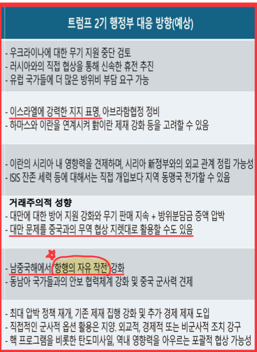
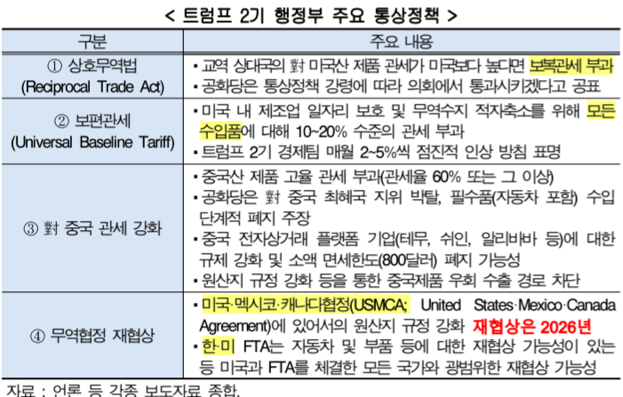

# **글로벌 및 주요국 경제 동향과 전망(추가 자료)**
- IMF: **"미국 중심의 보호무역주의는 세계 경제에 위협"이 될 것**
- 미국 신정부의 보호무역주의 확대, 이민 제한 정책 → 무역 갈등 심화, 노동력 공급 차질 야기 → **미국과 세계 경제 모두에 부정적 영향 초래 위험성 우려**
    + **R의 공포: 경기 침체의 공포**

## **한국의 경제동향**
- 한은: '25년 경제 성장률 전망치 1.5%(11월 전망치 대비 0.4%P 하향)'
- 현대경제연구소: '25년 경제 성장률 전망치 1.7%(9월 전망치 대비 0.5%P 하향)'

## **트럼프 2기 주요 내용**
- **경제, 통상, 환경, 물가안정, 에너지, 이민, 정부 혁신 등** 선거 공액에서 강조했던 분야와 거의 일치
- **해로운 행정명령과 조치에 대한 철회**
    + 바이든 행정부의 총 78개 법안 또는 조치에 대한 철회
    + **인프라 투자법, IRA 에너지 인프라 관련 조항, 청정에너지법, 기후위기 대응 등과 관련해 발표했던 행정 명령 철회 조치**
    + **파리기후협약, WHO 탈퇴**
- 중국 등에 대한 고율관세 부과와 같은 파급력 높은 조치
- **미국 우선주의 통상 정책**
- **USMCA 재협상, 301조 추가 관세 검토, 철강/알루미늄 수입조치, 수출 통제 시스템 검토**
- **전기차 의무화 폐지**

### **중요 행정명령**
1. **해로운 행정명령과 조치 철회**: IRA 폐지 등
2. **채용 중지**: 공무원 추가 채용 중지
3. **국제 환경 협약에서 미국 우선 주의**: 파리협정 탈퇴
4. **WHO 탈퇴**
5. **미국 남부 국경 국가 비상사태 선언**: 불법 이민 막기, 미국 이민법 강화(불법 입국자 추방)
6. **미국 우선주의 통상 정책**
7. **미국의 에너지 해방**
8. **미국 출생 시민권 폐지**
9. **국경 강화, 급진적 환경주의 반대, 사형제 부활과 공공안전 보호**
10. **극단적 젠더 이데올로기에서 여성 보호**, **불필요한 급진적 DFI 프로그램 및 차별 폐지**
    + DEI(다양성 제약), 생물학적 성별을 두 가지만 인정


# **글로벌 트렌드(현대경제 연구원)**

## **1. 계산의 시간**
- 트럼프는 1기의 **미국 우선주의** 대외정책 기조를 강화하며 보다 공격적인 방식을 채택할 것
- 트럼프는 미국이 경제, 군사적 패권국의로서의 위상 회복 의지를 드러냄
    + **경제적 패권 강화**
    + **군사적 패권 유지**: 방위비 분담금 증액
    + **국제질서 재편**: 양자 관계 중심 접근 선호

- **주요 대외정책 기조**

| 구분 |                    트럼프 1기                   |          트럼프 2기 예상         | 
|:----:|:----------------------------------------------:|:-------------------------------:|
| 외교 | 미국 우선주의 및 고립주의, 경제 중심 양자 외교 선호| 심화 및 제한적 다자협력 및 동맹활용|
| 군사 | 인-태 전략 강화, 국방비 증액 기조                 | 동일                            |
| 경제 | 미국 우선주의 기조 하 강력한 보호 무역 강조        | 기술 패권 집중                  |
| 미중 | 대립, 경쟁(무역 전쟁 및 기술, 안보 갈등 전면화)    | 전면적 대립 경쟁               |

- 2기 외교에서는 1기와 유사한 **미국 우선주의** 기조를 유지하며 더욱 강경한 접근 방식 택할 가능성 높음
    + 2기에서는 정책 집행의 속도, 강도를 높여 목표를 달성하려는 움직임 예상(**2년 뒤 중간 선거**)

- 국방, 안보 분야에서 NATO와 같은 기존 동맹국들에 국방비 증액 압박(GDP 5% 수준)하는 한편, 군사적 옵션을 동원해 중국과의 패권 경쟁에서 우위를 점하고자 할 것
    + 동맹국의 독립적인 군사적 역할을 강화시켜 미국의 직접적인 부담을 줄이기
    + 유럽, 동아시아 전역에 배치된 군사적 자원을 재분배 → 효율성 높이기
    + **버터와 대포의 관계**

- 유럽과 중동에 산적한 분쟁들이 잠재적 위협으로 남게 될 가능성
    + 트럼프의 **거래주의적 성향**은 약소국이 러시아의 군사적 팽창이나 중국의 영향력 확대와 같은 도전에 효과적 대응을 어렵게 만드는 요인으로도 작용 가능



## **2. 글로벌 관세전쟁의 시작**
- 세계 각국의 연쇄적인 **관세 인상 및 보호무역주의 강화** 유인을 제공함으로 글로벌 교역구조 변화와 함께 경제 전반에도 큰 피해를 유발할 전망
- 강력한 통상정책 추진 전망 → 미국은 **물론** 세계 경제 전반에 부정적인 영향을 미칠 것으로 우려
- 트럼프 1기에서 "중국 관세인상 → 무역 수지 적자 축소"와 "공급망 정책 → FDI 유입 규모 확대"라는 성과
    + 무역 수지 적자 규모: 736달러 축소
    + FDI 유입 규모: 4조 달러(2017) → 4.6조달러(2020)
- 즉, **보조금 안주고 관세 조정**으로 무역 수지, FDI를 개선했다고 말함 But **총수출/총수입**은 감소
- 1기에서의 경험을 토대로 **무차별적인** 통상 정책을 통해 경제적 이익 추구와 타 분야 정책 지렛대로 활용 가능성 큼
    + **상호무역법 제정**, **보편관세 도입**
- 19세기말 관세전쟁 → 무역 감소, 물가 급등 → 상호 경제적 피해 유발 → 세계적인 불황 장기화 유발
- 1930년: **스무트-홀리 관세법**으로 수입품에 평균 59%, 최고 400% 관세 부과 → 세계 각국의 보복관세와 수입제한, 환율 통제 유발 → 대공황 심화 요인으로 작용

<details>
<Summary>스무트-홀리 관세법</Summary>

```
1929년부터 약 10년 간 이어진 대공황은 사실 그렇게 오래가지 않을 수도 있었으나 미국이 불황기 자국 산업을 보호하겠다며 이 법 을 제정함. 이에 영국, 프랑스, 캐나다 등이 보복에 나섰으며 미국 상품에 고율 의 관세를 부과하면서 미국은 수출에서 큰 피해를 봄. 관세 보복의 악순환 속에 전세계 무역 규모는 1929년과 1934년 사이 3분의 1 토막이 났음. 기업이 도산 하고 미국 실업률은 25%, 독일 실업률은 42%로 히틀러의 나치집권을 초래했 고 이는 2차세계대전으로 이어졌음
```

</details>

### **상호무역법(Reciprocal Trade Act)**
- 무역 상대국의 미국산 제품에 대한 관세가 미국의 관세보다 높은 경우, 미국도 **이에 상응하는 수준의 보복관세를 부과**
- **보편관세**: 모든 국가에 일괄적 적용 관세



## **3. 미국, 경제적 예외주의(American Economic Exceptionalism)의 시대**
- 세계 경제 둔화에도 나홀로 성장세를 유지한 미국의 "경제적 예외주의' 개념이 재부각
    + 미국의 경제적 독주로 경기 차별화가 이어지는 가운데 트럼프 2기에는 더욱 강화될 가능성 높음
    + **경제적 예외주의**: 미국이 정치, 경제, 문화 등 모든 분야에서 다른 나라와는 구분되는 특별함을 갖고 있다는 뜻
- 2024년 미국은 잠재 성장률을 크게 상회하는 **강한 경기 회복세**를 보이며 **주요 선진국 대비 높은 성장률** 기록
    + 글로벌 경기둔화 우려에도 2.8% 성장률을 기록(선진국 1 ~ 3%)
- 실물 경제 측면에서 내수가 강한 성장세 유지 & 금융 시장에서도 주요 지표의 강세가 지속 중인 상황
    + 개인소비지출, 민간투자 등 강한 내수에 힘입어 시장 예상보다 높은 성장률 지속
    + 강달러, 주식시장 호조 등 금융 시장에서도 미국의 독주가 관찰
- 트럼프의 미국 우선주의 → 미국 경기 호조 지속 + 경제 격차 더욱 확대될 전망
    + 신자유주의(감세, 규제 완화), 보호무역주의 등으로 설명되는 바, 경기 호조세가 지속될 가능성이 높음

## **4. 다시 시작된 부채질**
- 주요국이 본격적인 **금리 인하기로 진입하면서 글로벌 부채가 재상승할 가능성 확대**
- **주요국의 완화적인 통화정책이 지속될 것으로 보임**, 신흥국 중심으로 가계 및 기업부채가 증가할 것으로 우려
- 미국을 제외한 주요국의 경기가 부진한 상황에서 향후에도 **완화적인 통화정책 기조는 지속될 것**
- 이에 감소하였던 가계 및 기업 부채가 신흥국 중심으로 다시 증가할 가능성 확대 상황
- 글로벌 경기 성장세가 약하된 상황에서 부채의 증가세는 경제 악순환을 초래할 우려가 큼
    + 트럼프발 고금리 강달러 현상에서
    + 신흥국이 $로 돈 빌림 → 달러 표시 부채 부담 30% 급등
    + 신흥국 중심으로 만기가 돌아오는 달러표시 부채가 리스케줄링(새무상환 연기)이 어려워짐
    + 2018년 셧다운됐던 당신 신흥국 부도 위험 최고
- 통화 정책은 통상 '긴축 - 적정 긴축 - 안정적 - 적정 완화 - **완화**' 다섯 단계로 이행
- 완화 정책 사용 → 대출 활성화 → **금리 하락 유도(대출 증가)**
- 그러면 **왜 현재 금리 인하 정책?**
    + 미국 관세 부과 → 미국은 높은 관세로 수입 감소, 수입 대체를 위해 미국 내 생산 증가 → 다른 나라는 미국으로 수출 감소, 수출 감소 만큼 내수를 늘려야 경제 유지 → **금리를 내려 내수를 부양해야 함**

## **5. 새로운 패권경쟁, AI**
- AI는 윤리, 안정성 등 다방면에서의 부정적인 인식에도 불구하고 국가 경제 및 **안보**에 결정적인 역할을 할 것으로 주목받으며 새로운 패권경쟁 이슈로 부상
- 향후, 글로벌 AI 시장은 물론 주요 인프라(데이터 센터)의 비용 또한 빠르게 확대될 전망


# **국내 트렌드**

## **3. 인내하는 소비자들**
- 경기 회복세가 지연 → 현재의 불황기를 견디기 위해 소비를 참는 소비자 증가
    + 소비를 참거나 생활에 꼭 필요한 소비만 하는 시기로 전환(욜로 → 요노)
    + 필수재 중심 소비가 이어질 전망
    + 가전제품 및 오락, 취미, 경기 용품의 소매판매 감소세가 두드러짐
- 경기 회복세 지연뿐만 아니라 높은 물가 수준, 실질임금 정체 등 소비에 우호적이지 않은 여거이 지속된 영향
    + 대부분의 국가가 유사(**임금에 비해 물가 상승이 높음**)
- 전반적인 소비 부진 속에도 **필수재 중심의 소비**가 이어질 전망
    + 최근 정치적 불확실성, 저성장 지속 전망 등으로 소비심리도 악화
    + 소비자 심리지수: 88.4p(24.12) → 95.20p(25.02)
