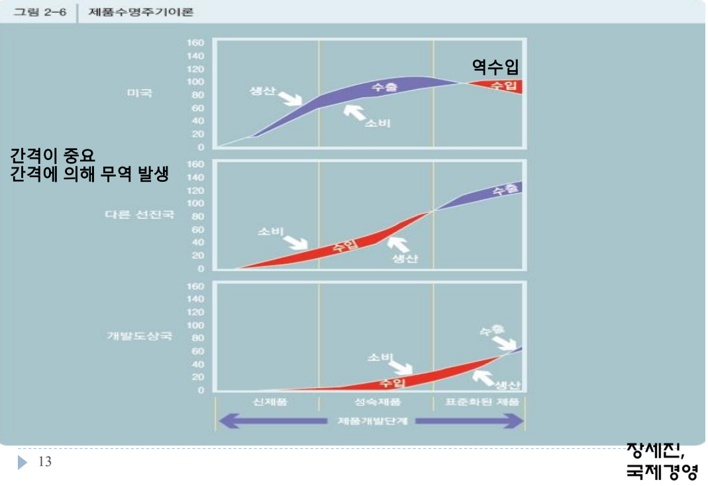
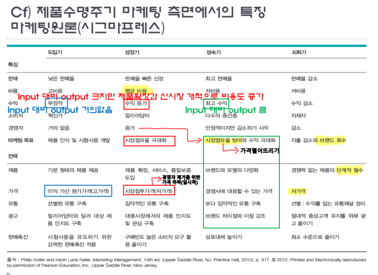
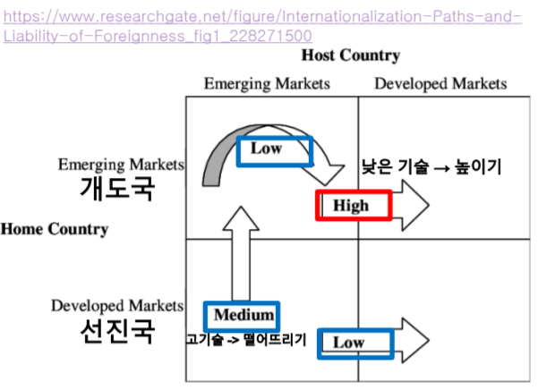
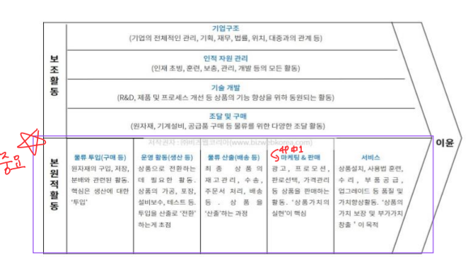
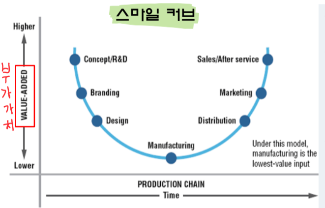
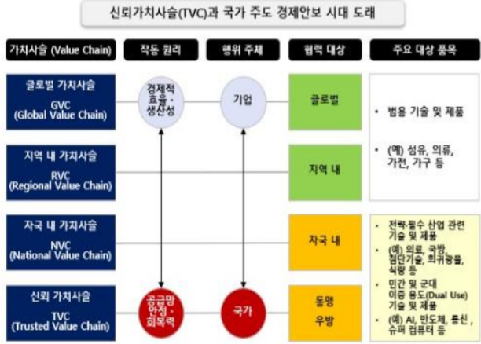

# **글로벌 시장 지향성**
: 적절한 시장 정보 생성, 정보를 기능 간 전달 & 통합 → 시장 기회에 어필하는 조직의 전략적인 실행 기획 & 조정하는 제반 활동<br>
- e.g. 2023년 뉴질랜드 음료 산업 환경 분석(feat. PEST)<br>
**PEST: 정치, 경제, 사회, 기술적 환경 분석**

## **글로벌 마인드**
편견을 제거하고 넓게 세계를 바라보는 것<br>
- 다른 문화에 열린 자세
- 창조적 문제 해결 능력
- 자신만의 비전

## **글로벌 시장 기회 구분**
수요, 환경의 동태적인 변화과정에서 주로 발생<br>
**경제발전단계 차이(경쟁적 지위)**, **제품 수명주기 상 위치**에 따른 차이로 인한 수요의 변화

### 1. **경쟁적 지위(Competitive Position)**
경쟁상황의 입장에서 살펴본 동종산업 내에서의 기업의 **서열적 위치**로 정의<br>
경쟁지위에 의한 시장기회는 고정적 X<br>
    
1-1 **자사 우위 시장(home market)**<br>
    - 경쟁사에 비해 어느정도의 우위를 누리는 시장<br>
    - **FDI**가 유리<br>
    - e.g. Samsung 중남미 시장의 스마트폰 점유율<br>

1-2 **중립 지대**<br>
    - 생존을 위해 **포기할 수 없는 시장**<br>
    - 1등 존재 x → 머니 게임<br>
    - e.g. 동남아 스마트폰 시장<br>

1-3 **경쟁자 우위 시장**<br>
    - **니치 시장** 포착 필요<br>
    - e.g. 현대 자동차의 일본 시장에서의 전기 자동차로의 전환<br>

### 2. **제품수명주기이론(PLC)**


- 경영자가 해외시장을 위한 후보제품을 선택하는데 있어서도 도움을 줄 수 있음<br>
- <U>제품 유형, 국가시장마다 다름</U><br>
- **Vernon**: 선진국에서 신제품 개발 → 제품 성장기에서부터 개도국으로의 수출 → 해외투자 및 개도국으로의 **역수입** 과정 => 국제무역 발생
- **모방시차**: A국이 연구개발 투자를 통해 신제품을 출시할 경우 A의 신제품이 B국에서 생산할 때까지 걸리는 시간
- B국이 스스로 생산 가능해지는 순간까지는 수입에 의존 → 기술격차 기간만큼 **A국에게는 글로벌 시장 기회**가 됨
- 현대에는 **제품의 모방시차가 짧아지거나 무의미**

|          PLC          |          제품 수명주기 별 특징         |   
|:---------------------:|:------------------------------------:|
|  |  |

# **국제 기업가 정신과 GVC**

## **기업가 정신**
1. **혁신성**: 시장지향적, 창의적 아이디어
2. **진취성**: 경쟁의지를 갖고 기업 성과 향상
3. **위험감수성**: 리스크가 존재하더라도 기회를 잡고자 새로운 프로젝트를 선호
4. **민첩성**: 미래시장의 변동 방향을 정확하게 인식 & 파악
**기업가 정신이 강한 기업은** 글로벌 시장에서의 소비자의 니즈에 민감하게 반응 가능 But **LOF 문제에 직면**

### **LOF(Liability of Foreignness)** 
글로벌 기업이 현지국에서 기업활동을 함으로써 발생되는 추가 비용



## **가치 사슬**
여러 장소에 위치하는 상이한 기업을 포함하며 국경의 한계를 넘어 전 세계적으로 네트워크를 형성하며 확산됨



### **GVCs(Global Value Chain)**
: 기업이 제품 또는 서비스를 생산하기 위해 원재료, 노동력 자본 등의 자원을 결합하는 과정에서 **부가가치가 창출**되는 것
- 제조업이 고부가가치 → R&D or 부품생산 or 서비스에서 고부가가치로 전환



- 예시: **미중무역분쟁의 시작**이 된 **중국 제조 2025**
    ```
    볼펜 심에서 비롯된 GVC에서 저부가가치 비중이 높은 중국을 핵심 소재, 부품 70%를 국산으로 채우겠다는 발표
    ```

### **GVC 과거와 현재**
- 금융위기 이후 디레버리징(부채줄이기), 소비여력 축소, 국가간 소득 불균형 야기<br> (+ 신흥군의 기술 발전 가속화)
- **GVC의 공급망 교란 발생** → 공급의 안정성이 재조명



#### **RVC(Regional Value Chain)** - 중국 중심의 동아시아 지역 가치 사슬
- 일본의 보복조치로 한중일 중심의 가치사슬 훼손
- 다른 예시: 미국 중심의 캐나다, 멕시코 지역 가치사슬

#### **DVC/NVC(Domestic/National Value Chain)**
- EU, 미국, 중국, 일본 등 주요 권역 국가는 정책적으로 국가 가치사슬 형성해 **독자적인 산업생태계를 구축**하고자 하는 추세

#### **TVC(Trusted Value Chain)**
- 우방공급망 또는 신뢰가치 사슬 → 미국의 공급망 재편 전략
- 기존의 GVC에서 중국만 제외 & 기술 우위의 우방국과 새롭게 TVC 구축 모색 중
- **가치 공유, 신뢰 강조**

### **공급망 패러다임 변화**
- Just In Time(효율성) → **Just In Case(안정성)**
- 돌발 상황(코로나 등)으로 인해 **만약의 사태에 대비**하는 것에 초점을 둔 **Just In Case**로의 전환 추세
- 즉, **비용의 관점** → **위험의 관점**

JIT → 코로나 등 위기 발생 → JIC → 비용 증가 → 인플레이션<br>
즉, 공급망 교란은 JIC, 관세, 기타 여러 변화를 야기 → 결국 **인플레이션을 유발**하게 됨