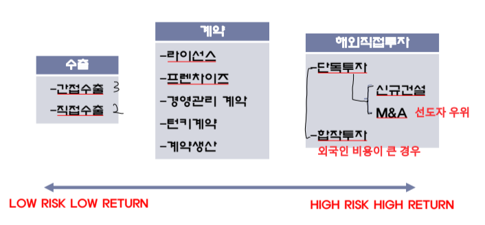
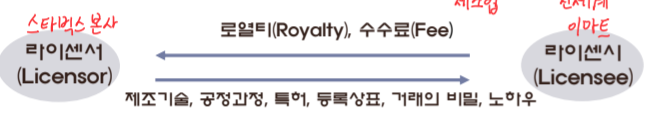
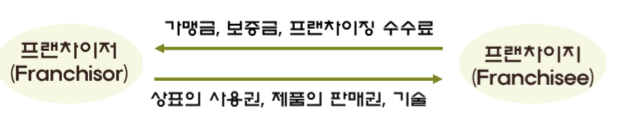
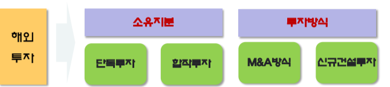
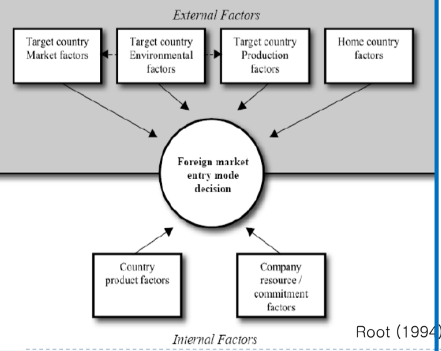
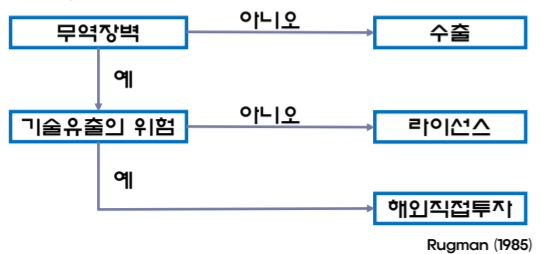
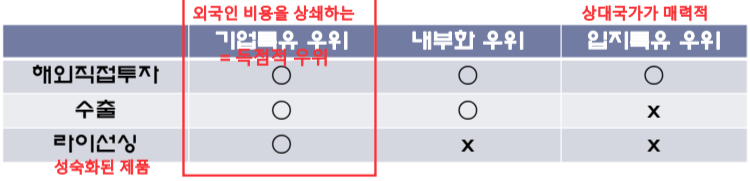
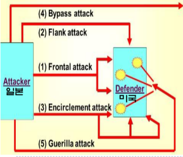

# **해외 시장 진입 방식 유형**

## **수출** - Low Risk Low Return
- 국내에서 제품 생산 → 해외시장으로 이전
- **학습 경험을 쌓아 높은 단계로 진입할 수 있는 발판**
- **간접 수출**과 **직접 수출**로 구분

| 구분 |                간접 수출                 |           직접 수출          |
|:---:|:-----------------------------------------:|:--------------------------:|
| 특징 | 관계자가 3명                              |  회사 내 수출 부서, 해외 지사| 
| 장점 | 수출업무 안정적, 자금 부담 적음            | 판매량 큼, 마케팅 노하우 축적 |
| 단점 | 해외시장 통제력 약화, 시장 기회 포착 어려움 | 수출 경비 많이 든다          |

## **계약방식**
- **기술, 노하우 판매** But **직접 투자 수반 X** 
- 수출과 FDI의 중간적 성격 
- **라이센싱**과 **프랜차이징**으로 구분

### **라이센싱(Licensing)**
- 특정 기업이 외국의 기업과 계약을 체결 → 생산기술, 등록 상표, 특허권 등 사용 권리 부여하고 대가로 수수료를 받는 거래 방식
- **경제적동기**: 자체 개발보다 저렴(라이센시 입장)
- **정치적동기**: 진입장벽 우회, 정치적 리스크가 클 경우 자산 보호
    + e.g. 폭스바겐의 중국 합작 투자 
- **전략적 동기**: 시장 확장을 위한 기술이전

### **프랜차이징(Franchising)**
- 소유나 경영면에서 이전은 없고 단지 **마케팅 및 관리 노하우**가 대상
- 소유나 경영면에서 이전을 하면 FDI

## **해외 투자(직접 투자 or 간접 투자)** - High Risk High Return
- **경영권 지배를 목적**에 따라 **해외간접투자**, **FDI**로 구분
- **유사점**: 국제 간의 자본 이동
- **차이점**
    + **FDI**: 기업 경영상의 운영권(= 기업 지배) 목적
    + **FII**: 직접적인 경영권 참여 X, 주식 투자와 채권 투자 성격

### **소유 지분에 따른 FDI 구분**

- **단독 투자**와 **합작 투자**

| 구분 |             단독 투자         |                 합작 투자                |
|:----:|:----------------------------:|:---------------------------------------:|
| 장점 | 기술 보호                     | 현지 파트너의 기술 및 자본 이용           | 
| 단점 | 높은 수준 비용, 위험, 시간 소요 | 기술에 대한 통제력 상실, 전략적 조정 불가능|

#### **단독 투자 분류**
- **M&A 방식**과 **신규 건설 투자** 

| 구분 |                 M&A                  |             신규 건설 투자          |
|:----:|:------------------------------------:|:----------------------------------:|
| 장점 | 신속한 진입(선도자 우위를 누려야할 경우)| 다국적 기업 수준에 맞는 시설 확보 가능 | 
| 단점 | 인수대상 기업의 선정 평가의 어려움      | 긴 시간 소요                         |

# **글로벌 시장 진입 방식의 선택 모형**
- 계획적이고 점진적인 과정을 거침
- **수출**과 같은 상대적 위험 부담이 낮은 방법으로 진입 → 경험 증대 및 경영 능력 축적 → **FDI**형태로 전환
- 전개 과정이 **일률적으로 거치는 것은 아님**
- e.g. 노스페이스는 계약 방식으로 운영 → 산업, 제품에 따라 다르다.

## **루트의 모형**
- **진화론적 관점**에서 기업의 글로벌 시장 진입방법 선택 문제를 다룸
- 시간의 흐름에 따라(경험 증대, 통제력 강화) 통제 강화 및 진입방식을 점진적 변화
- **진입 방법 고려 요인**
    + 외부적 요인 
        1. 현지국 시장
        2. 현지국 환경
        3. 현지국 제품
        4. 본국 요소
    + 내부적 요인
        1. 제품요소
        2. 자원의 투입과 몰입 요소

## **러그만의 단순 모델**
- 해외시장진입 대안을 선택하는데 시간 비용 절약 But 다양한 비용과 위험을 지나치게 단순화했다는 단점 존재

## **더닝의 모형**
- 기업 특유 우위, 내부화 우위, 입지 특유 우위에 관한 **절충 이론** 주장
- 3가지 우위 요인의 상호작용에 착안
- **OLI이론**: OI(Push), L(Pull)
- **LOF를 상쇄하는 기업 특유 우위(독점적 우위)**가 있어야 해외 진출 가능

# **글로벌 시장 진입 방식 결정 규칙**
- Root: 글로벌 시장 지입 방식의 결정 규칙을 3가지로 나누어 구분
- 단순, 실용적, 전략적 결정 규칙

## **Root의 시장 진입 방식 결정 규칙**
### **1. 단순 결정규칙**
- 모든 현지국에 대해 동일한 진입방식 사용
- 한가지 유형(수출, 라이선스 등)을 고집하는 태도
- 두 가지 실수를 범하게됨
    + 고수하고자 하는 한 가지 진입 방식으로 침투하기 어려운 시장일 경우 **그 시장을 포기해야함**
    + 기업이 고수하고자 하는 방식이 이미 진출하고 있거나 현지국 시장에 **부적합할 수 있음**

### **2. 실용적 결정규칙**
- 각 현지국 시장에 대해 **실행 가능한** 진입 방식을 사용
- **시장에 진입하기 위해 해당 방법 밖에 없는 경우**
- **장점**: 부적합한 진입방식의 사용으로 인한 사업실패의 위험 회피 가능
- **단점**: **이윤극대화 측면에서는 최적의 진입방식이 아닐수도 있음**
- e.g. 폭스바겐의 중국 합작투자 

### **3. 전략적 결정규칙**
- 현지국 시장에 가장 **적합한** 진입방식 사용
- 기대 수익과 비용을 기준으로 진입방식의 장단점을 고려해 선택(**이윤 극대화**)

## **Kotler의 글로벌 시장 진입 전략**
- 일본 기업들(도전자 입장)이 미국 시장 진입 or 미국 기업이 지배한 3국에 진입하고자 할 때 사용했던 전략

### **1. 정면 공격(하이트 진로 VS 오비 맥주)**
- 경쟁기업의 강점을 정면에서 공격
- 순수 정면 공격: **모든 부문에서 정면 대결**
- 제한된 정면 공격: 특정 부문에 한정
- **성공하기 위한 조건**: 충분한 자원, 진입기업이 기존기업보다 경쟁우위가 높거나 비슷, 소비자의 관심을 끌 수 있어야 함

### **2. 측면 공격(하이트 진로, 오비맥주 시장에서 롯데 크러시)**
- 약점을 공략(**상대 취약점에 대한 자사의 강점에 집중**)
- 지리적, 시장 세분화 측면 진입 전략: 지역 시장과 타켓층
- **성공하기 위한 조건**: 명확한 시장구분, 시장과 산업의 잠재력이 커야함

### **3. 포위 공격(애플과 삼성)**
- 다양한 세분시장, 제품, 마케팅 수단을 함께 사용해 전격적으로 기존 경쟁기업 공략
- 제품/시장 포위 공격 전략: 제품, 모든 인접 시장을 공략
- **성공하기 위한 조건**" 명확한 우위요소 확보, 많은 자원, 전략 실행/성공에 강한 의지 

### **4. 우회 공격(교원, 대교에서 웅진의 가전제품)**
- 차지하기 쉬운 시장부터 공격
- **비관련 제품으로의 다각화**: 교육 시장에서 정수기를 더한 웅진
- **혁신적 신제품**

### **5. 게릴라전**
- 간헐적, 소규모 공격(자원이 적은 기업이 사용)
