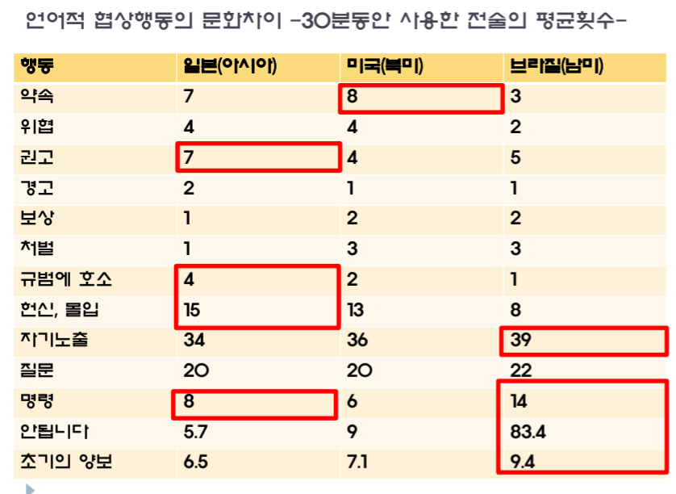
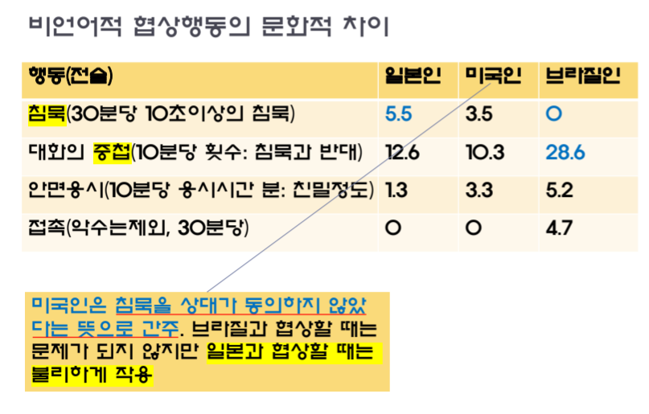
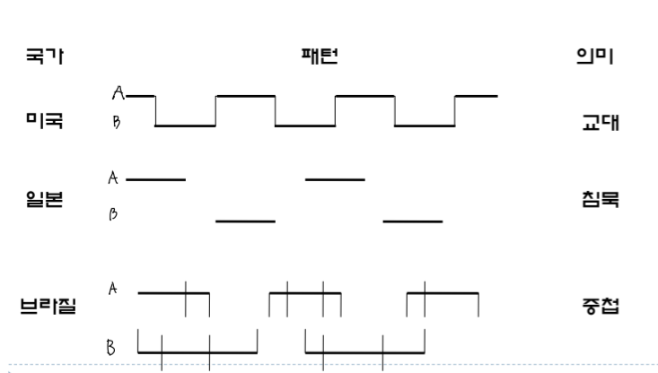

# **해외시장에서의 글로벌 협상**
- 협상: **갈등을 관리**하기 위한 수단
- 국제적 협상은 **문화적 다양성까지 포함**

## 설득의 국가별 유형

|      구분     | 북아메리카(저배경)|  아랍(고배경)  |    러시아    |
|:-------------|:---------------:|:------------:|:-----------:|
|스타일         |사실적            |감정적         |이상 추구     |
|갈등대처       |객관적 사실        |주관적 감정     |주장하는 이상 |
|양보          |초기에 양보        |전 과정 양보    |양보 X       |
|양보에 대한 반응|대체적으로 보답    |항상 보답       |보답 X       |
|관계          |단기적            |장기적          |지속 X       |
|권한          |넓음              |넓음           |제한적       |
|최초입장       |중간              |극단적         |극단적       |
|마감 시한      |매우 중시         |자유로움(서두름X)|무시(재량권 X)|

## 글로벌 협상 이론

### 휘셔-유리 협상
- Hard, Soft, Principled(강성, 연성, 원칙 입장)
- 강성, 연성 → 협상 전 목표를 보유 → **포지션 협상**
- 원칙 → 포지션 관계 X, 이성적으로 협상 진행 → **비포지션 협상**

|     구분      |      강성 입장      |     연성 입장    |      원칙     | 
|:------------:|:------------------:|:---------------:|:------------:|
|상대에 대한 인식|적대                 |친구(상대 신뢰)    |문제 해결자    |
|협상 목적      |승리                 |합의(이끌려감)     |현명한 합의    |
|합의에 대한 인식|일방적 양보 요구       |일방적 양보       |상호 이익 추구  |
|관계          |관계를 담보로 양보 요구 |관계를 위한 양보   |관계, 협상 분리 |
|포지션 변화    |초기 입장 고수        |입장을 자주 바꿈    |협상 이익에 초점|
|협상자 태도    |강경한 태도           |부드러운 태도      |현실적 협상     |
|협상 전략      |위협, 압력           |위협에 굴복        |이성에 따름     |
|평가          |자신의 가치가 중요     |상대의 가치가 중요 |공통의 가치      |

- 연성 입장에서 포지션 변화: 협상 결과가 아닌 "**내**"가 입장을 왔다갔다함.

### 레위키 협상
- **투쟁적(강성)**: Win-Lose 게임, Zero-Sum 게임
- **호혜적(원칙)**: Win-Win 게임, Positive-Sum 게임

|    구분     |    투쟁적 협상    |           호혜적 협상           | 
|:----------:|:----------------:|:-----------------------------:|
|협상 형태    |Win-Lose          |Win-Win                        |
|협상 이익 배분|정해진 이익 배분    |협상 이익 키우기                 |
|정보 흐름    |정보 공개 X         |정보 공개                      |
|상대 이익    |자기 주장만 함      |상대 요구사항과 입장 고려         |
|협상 전략    |비도덕적, 기만적 술책|시너지 효과를 통한 새로운 가치 창출|

## 협상 유형

|     일본인(고배경)    |    북아메리카인   |       남아메리카인     |
|:--------------------|:---------------:|---------------------:|
|정서적 민감성 중시(관계)|정서적 민감성 중요 X|정서적 민감성에 가치를 둠|
|감정을 숨김           |단도직입적/몰인격적  |이상에 몰입            |
|회유(침묵의 힘)        |법적 절차         |권력 행사(약점 이용)     |
|고용주에 대한 충성 강함 |충성 부족          |충성 X                |
|합의: 집단적 의사 결정 |팀웍               |상사로부터 결정         |
|체면을 중시           |비용,이익 근거 결정 |명예, 위신 중시         |
|논쟁적 X             |논쟁적, 몰인격적    |격력하게 시비를 따짐     |
|내용은 정확, 타당     |증거물 문서화       |서류를 싫어함           |
|의사결정의 단계적 접근 |조직된 의사결정     |충동적, 즉흥적 의사 결정 |
|집단의 이익 추구    |개인의 이윤이 목표    |집단 좋음 → 개인 좋음    |

## 협상가의 중요한 개인적 특성
1. 미국
    + **준비와 계획**
    + 위기 대처
    + 판단과 지적 능력
2. 일본
    + **직무에 대한 헌신** → 집단 주의
    + 권력 파악 및 활용
    + 존경과 확신 획득
3. 대만(중국)
    + 인내와 결단성
    + 존경과 확신 획득
    + ... **재미** → 관계를 중시
4. 브라질(남미)
    + **준비와 계획 기술**
    + 위기 대처
    + 판단과 지적 능력

# Self-Buyer간의 관계
- 일본은 **구매자와 판매자 간의 관계가** **수직적**
- **아마에** 관계를 형성
    + 정에 의한 문화가 아님
    + 정: **부모**가 아이를 보는 마음
    + 아마에: **아이**가 부모에게 사랑받고 싶은 마음
    + 즉, 주체가 다름
- 미국은 **판매자, 구매자의 관계가** **동등**

## 상황적 특성
1. 장소
    - 중립적 장소 선호
    - 휴양지 선택

2. 시간 제약
    - 미국: 협상 기간을 가능한 줄이려 함
    - 베트남: 길게 협상
    - So, 미국인이 느긋한 상대를 만나면 불리해짐
    - e.g. 크리스마스 기한

3. 지위의 차이
    - 미국: 평등주의, 격식을 따지지 않는 생활방식에 자부심
    - 일본: 상대방의 직위를 궁금해함 → 명함 교환
    - So, 미국의 젊고 유능한 전문가가 아시아 협상 자리 등장 → 상대를 모욕하는 결과가 될 수 있음

## 협상 전술
- 언어적, 비언어적 전술이 있음
- 미국인은 언어적 전술을 선호

1. 언어적 전술
    - 질문을 많이 하기
    - 가급적 확약을 적게 하기
    - 초기에 큰 요구를 하기

2. 비언어적 전술
    - 어조, 표정, 제스처, **침묵** 등
    - 언어적 메시지보다 비언어적 행동에 더 감정적이고 강하게 반응

| 비언어적 협상의 문화적 차이              |            대화의 중첩             |
|:-------------------------------------:|:--------------------------------:|
|||

## 문화 충격의 현장
- **중동에서의 해프닝**
    + 손으로 엉덩이와 등을 툭툭 침 → 무기 확인, 적인지 확인을 위함
    + 커피 권유 → 술을 안 먹는 문화 → 커피 권유 = 접대
    + 왼손으로 과일 먹기 → 왼손 = 볼일 볼 때 쓰는 손
- **일본에서의 해프닝**
    + "하이 하이"라고 대답 → 상대방의 말을 알아들었다는 뜻(동의한다는 말은 X)
    + 자기들끼리 쑥덕거림 → 여러 부서의 협의가 필요
    + 명함에 글씨를 썼다 → 일본에서 명함 = 자신의 얼굴