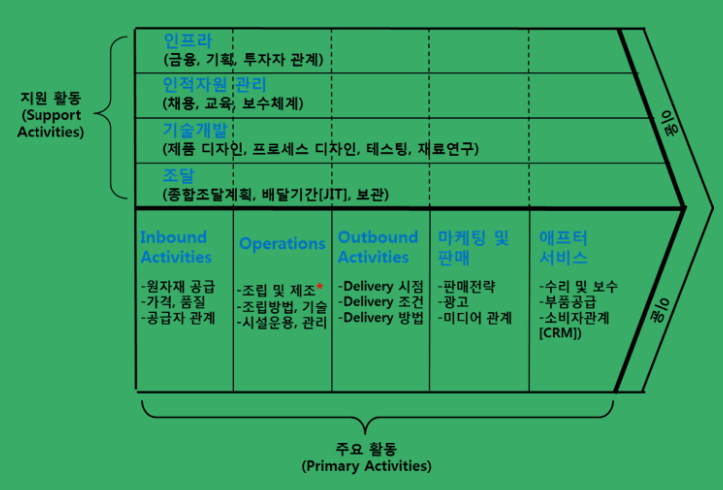
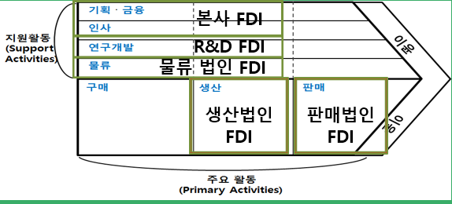
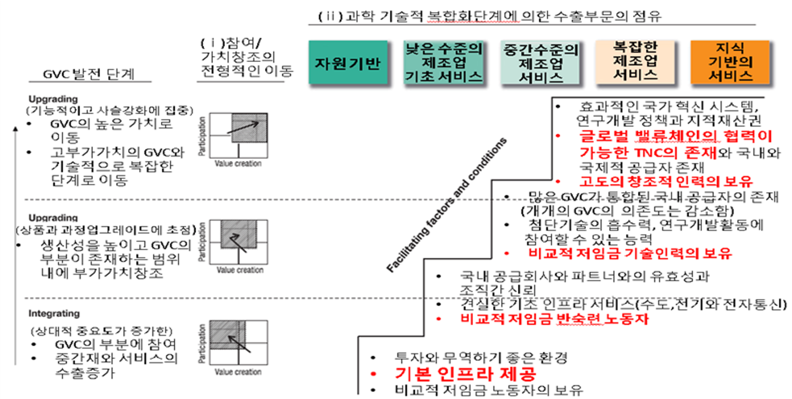
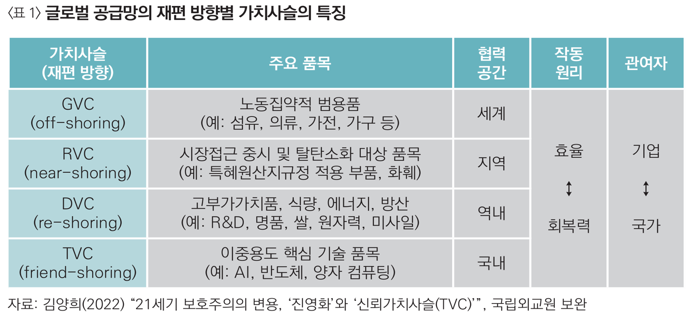
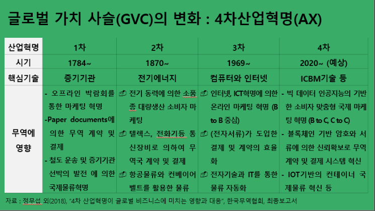
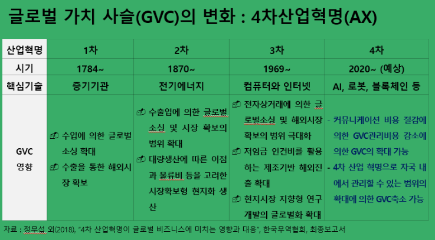
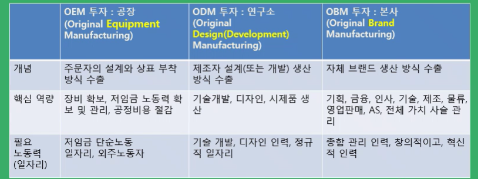
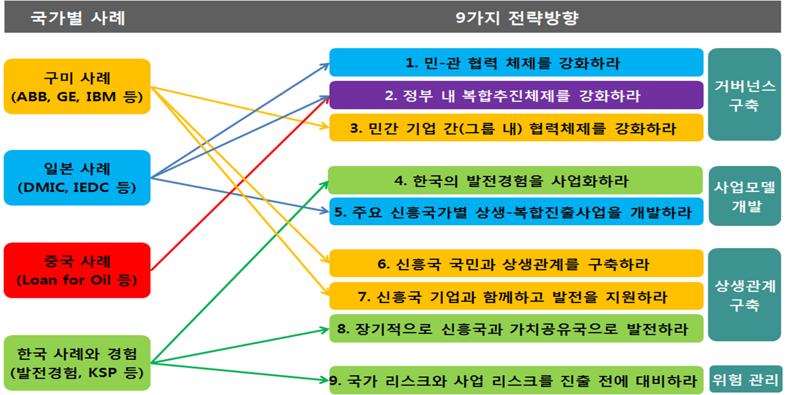

# 트럼피즘(MAGA)의 기회: 다양한 산업에서 막대한 기회
- 기회: 미국 제조업 공급망 자국 중심 확대 요구에 따른 기회
- 조선업, 방산, 원전, 반도체, 인공지능/로봇
- 트럼프 주요정책 키워드: _______ UP
    + _________,
    + ___________,
    + __________,
    + ______________,
    + __________,
    + _______________,
- 유럽: _____( ________, _______)
- 동남아: Make in ASEAN(_______) → ______________(현지기업과 파트너십 강화) 파트너십으로 확장
    + 현지 기업, 기술 인력 육성

# 벨류체인 교역 전략으로 기회 활용 필요
- 벨류체인 교역 전략: 미국 ___________ 벨류 체인 ←→ 한국 _________ 벨류체인
- 미국내 제조업 공급망 확대 요구 → 한국 제조업의 미국 진출 기회로 활용 + 미국 선진 기술 확보
- 기업체 연구소, 대학 등 대 미국 교류 확대
- 미국 내 첨단 AI와 로봇 중심 제조공장 건설에 적극 대응
- 국내 제조기반의 고도화에도 활용하는 역혁신(Reverse Innovation) 기회 활용

# 주요 산업별 밸류체인 교역 전략 수립 후 산-관-학 협력으로
1. 조선: 제조 설비 중심의 K조선업의 기술력과 연구개발 역량 확대
2. 철강 및 방산: 미국의 방산 기술 기반의 국내 이전 구축 기회로 활용
3. 반도체: 기술력 확보 기회로 활용
- 한국의 정확하고 빠른 역량(Agility) 최대한 발휘 필요

# 한국의 제조업 성공을 이끈 DNA: ABCD
- 대응 사례와 방안
1. ______________: 속도, 정확성
2. ______________: 모방, 글로벌 스탠다드
3. __________________: 혼합, 시너지 창출
4. _________________: 성실함, 목적 지향성

# 정구현 미중패권경쟁과 GVC 재편
1. 미중패권경쟁 전망: 미국의 창과 중국 방패
    - 책임 여부는 중요 X: 미국 패권주의 VS 중국 경제제도
    - 중국 부상은 기정 사실 But 일본 경제(1980)에 한 것 같은 정책으로 압박은 어려울 것

2. 향후 시나리오
    - ________________________,
    - ____________________,
    - ___________________ : ____________________

3. 제한된 공급망 분리(디리스킹)은 가능한가? X
    - 미국의 반도체 기업도 중국 시장을 잃으면 타격이 큼
    - 기술이나 장비 공급 차단은 가능한가?

# 글로벌 가치사슬(GVC)의 개념과 변화
- Global Value Chain(GVC): __________________________________________________
- 기업은 각국의 비용, 기술력, 시장 접근성을 고려해 생산, 조달, 유통을 최적화
- 최근 GVC는 디지털 기술, 자동화, 인공지능 등을 활용해 점점 더 효율적으로 발전
- 4차산업 혁명과 미-중 패권경쟁으로 GVC의 조정과 변화가 본격화될 가능성

# 국내 VS 국제 가치 사슬 비교
- ________ (GVC 확산) → ________ → ___________

|    항목     |    국내 가치 사슬    |          국제 가치 사슬         |
|:-----------|:------------------:|:-----------------------------:|
|생산범위     | 한 국가 내           | 여러 국가에서 생산 및 조달       |
|비용절감     | 제한적               |낮은 비용 지역 활용 가능         | 
|기술활용     | 특정 국가 내 기술 의존 |다양한 국가의 기술 활용 가능      |
|무역투자     | 국내 시장 중심        |글로벌 시장 무역 및 투자 유치     |
|공급망 리스크 | 국내 경제와 관련      |국제 정세, 정책 변화 등 요인 영향 |

# GVC와 다국적기업 무역
- 전세계 무역 총액의 약 80%가 다국적 기업의 GVC에 의해 설명
- 기업 내 무역이 6.3조 달러(33%), 계약 생산 등 NEM 무역이 2.4조 달러(12%), 다국적 기업과 거래 관계에 있는 관련 기업 간 무역이 6.3조 달러(33%)
- 2000년대(80, 90년대는 _____의 시대) 전 __________ 중심의 _______확대를 통한 GVC ____ 확산
- 2000년대 후 ___________ 중심의 ______ 확대를 통한 GVC ____ 확산(제조업 중심의 상품 수출과 서비스 분야 FDI의 ________ 심화)

# GVC 정의
- 기업 관점에서 바라보는 국제경영 차원에서의 정의와 국가 전체의 무역 측면에서 바라보는 경제적 차원의 정의로 나눌 수 있음
- 기업 관점에서 GVC(Tasks & Actives): 여러 ___ 에서 이루어지는 업무, 활동들이 하나의 주도적 _____에 의해서 ____되고 있는 ____된 공급망
- 경제적 차원의 GVC: 어떻게 ______의 ____이 다른 나라로부터 _____된 ______를 활용하고 있는지를 설명, 국제 투입산출표(IO Table)를 활용해 계산
    + 한 나라의 수출이 외국과 국내에서 생산된 부가가치를 어떻게 포함하고 있는지를 설명
    + 경제적 차원의 GVC 개념은 주로 부가가치 무역의 계산과정에서 활용

# GVC 정의(가치사슬 모형 활용: 마이클 포터)
- 2000년대 이후 FDI가 급속도로 확대되고, 중국 개방으로 제조 부분의 해외 이전이 전체 산업에서 급속도로 이루어지면서 이러한 가치사슬의 관점을 통한 글로벌화의 분석이 필요

# GVC 고도화형 지자체 투자유치 전략
- 기업의 7가지 밸류체인 활동 중 고도화 영역 FDI
- ________, ________, ______, ______, ______, _____, _____의 7가지로 설정
- **지역 발전전략**을 글로벌 밸류체인 관리활동으로의 참여를 의미하는 통합과 **지역 내 가치창출**을 의미하는 고도화 방안으로서의 FDI 유치 전략 구체화 필요

# GVC 참여와 고도화
- **GVC 참여(Participation)**: 제조나 판매 등 __________에서 다국적 기업이나 특정 산업의 _____를 한 기업이나 국가가 _____하여 ____, _____되는 현상 
- **GVC 고도화(Upgrading)**: 한 기업이나 국가가 담당하는 GVC에서의 한 ____가 ________에서 ______이나 ______ 등으로 점점 더 ______ 영역으로 ____, _____해 더 많은 _______를 만들어 나가는 현상(Value Creation)

# GVC 참여와 고도화(단계별 고도화 과정)
- __________ 서비스와 ________ 서비스가 필요

# GVC 확대: 해외투자, 수출
- 한국의 OFDI
    + 2000년대 이후 ____ 투자 러쉬
    + 2000년대 중반 이후 ______ 투자 러쉬
    + 2010년대 이후 _____, _____ 투자 러쉬
- 2015년대 이후 베트남과 중국 중심 아시아와 유럽에 대한 투자 확대 지속
- 2020년대 이후 ______ 투자가 압도적으로 많음

# GVC 확산과 변화 유형
- On-Shoring: NS + RS + FS
- NS(RVC), RS(DVC), FS(TVC) 중 트럼프 2기 정부의 전략? **RS(DVC) + 일부 NS(RVC)**
- 한국 대응? NS 포함 + FS

# GVC의 변화: 4차 산업현명(AX)
- ICBM: ______, _______, _________, _____________
- GVC 확산: 커뮤니케이션 비용 절감 → GVC 관리 비용 감소 → GVC 확대
- GVC 축소: 자국 내 관리할 수 있는 범위 확대 → GVC 축소 가능

# GVC의 변화 요인
- ____화(니어 쇼어링) 및 ___화(리쇼어링): 필수/전략 산업의 생산 공급망을 자국내 구축하는 방향으로 전환(트럼프 2기 관세 전쟁)
- **서비스화 및 고도화(AX 전환)**: 고부가가치 창출이 가능한 서비스 분야로 전환, 첨단+기존전통산업 융합되는 미래산업(AI 로봇 공장화)GVC로 재편
- **위기대응력 제고**: 외부충격에 탄력적으로 대응하기 위해 대체생산망과 효율적 재고관리 시스템 구축으로 안정 수급이 가능한 GVC 형성(**복수 국가에서의 분산 생산 구조**)

# GVC 변화로 인한 기회의 창
- 기회 창: 산업 리더십 변화에서 중요한 역할을 하는 요소로, 특정 시점에서 후발 기업, 국가가 기존 강자를 뛰어넘을 수 있는 기회
- 산업 시스템의 변화 속에서 나타나는 세가지 기회의 창
1. _______ 기회의 창: 산업 내 _______가 기존 강자에게 불리하게 작용할 때 후발 주자가 새로운 기술을 활용해 경쟁력을 확보 가능
    - ex) 디지털 기술 발전으로 한국 전자기업들이 일본 아날로그 기술 강자 추월

2. _______ 기회의 창: 시장에서 _________가 변화 or 새로운 수요가 등장할 때 시장 선점 가능(**인공지능 로봇 제조 수요, 미국 내 투자 기업에 대한 시장 수요 확대 가능**)
    - ex) 저가 자동차 시장이 인도에서 급성장 → 현지 기업들이 글로벌 자동차 강자들과 경쟁할 수 있는 기회

3. _____ 및 ______ 기회의 창: 정부 **산업 정책 변화**나 규제 완화(**관세부담 회피와 감세 등 혜택에 따른 기회의 창**) 
    - ex) 중국의 통신 산업에서 정부의 적극적인 지원 → 글로벌 경쟁력 확보

# GVC의 변화에 대응하는 한국 FDI 전략
1. 고부가 **혁신 서비스 밸류체인 참여** 확대형 투자 촉진: 리쇼어링 기회로 작용
2. **혁신 클러스터** 기반 투자 유치 확대: **집적외부효과와 혁신을 통한 FDI 유치 확대**
3. **GVC 변화 요인별 OLI 우위 변화**에 기반한 투자기회 활용
4. **산업별 밸류체인 무역 관점의 투자유치 전략** 실행
5. **지역별 특화산업의 글로벌 경쟁력 강화**를 위한 GVC 기반 투자 확대

# GO RIS 개념과 기초: 부산 트라이 포트(Tri-Port)
- **트라이포트**: 현재 물류 관점의 모달 인프라로 이해되고 있으나, 향후 물류와 기업, 산업을 연계하여 트라이포트 개념 확장이 필요
1. GDC(Global Distribution Center) 관점: 트라이포트형 복합 물류(___ 중심 ____ 모델)
2. SCM(Supply Chain Management)관점: 물류와 산업 통합(___ 중심 _____ 모델)
3. GVC관점: 글로벌 허브도시(산업 중심 글로벌 허브 모델)

# EDP(Enterpreneur Discovery Process: ____________)
- 안달루시아 EDP 거버넌스 운영의 주체
    + 공동의사결정위원회: 운영위원회와 **미러 그룹**
    + 전문가 워킹그룹: 총 70명 중 40명이 기업가
    + 기업가들이 전문가 그룹과 미러그룹에 동시에 참여해 EDP에서 **핵심적인 역할**을 수행
    - 관리팀: 테크노파크 등 지자체 산하기관 담당

- 1단계: 기업가들의 _____적 ______을 통한 아이디어 제시
- 2단계: 제시된 아이디어들을 _____팀에서 정리 및 문서화
- 3단계: 문서화된 아이디어를 ________________에서 회의를 통해 정책 입안 결정

# GVC 고도화형 지자체 투자유치 전략
1. OEM 투자(Original Equipment Manufacturing: 공장): _____ 설계와 상표 부착 방식의 수출
2. ODM 투자(Original Design Manufacturing: 연구소): _____ 설계 생산 방식 수출
3. OBM 투자(ORiginal Brand Manufacturing: 본사): _________ 생산 방식 수출(___, ____ 인프라 확보)

- 4차 산업혁명 기술의 GVC 영향은 대부분 ______ 분야에서 GVC 확대에 기여
- 서비스 분야 GVC 확대 분야 9개: **전자상거래, 문서 처리 자동화, IOT, 블록체인, Cloud, 3D 프린팅, 로보틱 프로세스 자동화, 스트리밍, 원격의료**

# 지역 대학과 기술인력 기반 GVC 고도화 FDI
1. EDP를 통한 타겟 산업의 기업 선정: GVC 특화 가능성을 고려한 지속적이고 유동적인 시행착오와 도전 프로세스로서의 특화산업
2. 투자유치 인센티브 지원 방식 변화: 기업이 해당 지역에 대한 투자를 통해 시장과 비용절감과 핵심 자원을 확보할 수 있도록 유도
3. 기업과 기술을 가진 대학, 연구소 중심의 투자유치 거버넌스 구축과 실행: **지역 대학 인재와 기술 중심 투자 유치에 집중**
4. 성과평가 변화: **투자유치를 통한 기업과 산업의 발전 성과 평가**

# 상생-복합형 신흥국 진출전략과 주요사례(9가지 전략방향)
- 거버넌스 구축
    1. 민-관 협력 체제 강화
    2. 정부 내 복합 추진체제를 강화
    3. 민간 기업 간 협력체제를 강화

- 사업모델 개발
    1. 한국 발전경험 사업화
    2. 주요 신흥국가별 상생-복합진출사업 개발

- 상생관계 구축
    1. 신흥국 국민과 상생관계 구축
    2. 신흥국 기업과 함께하고 발전 지원
    3. 장기적으로 신흥국과 가치공유국으로 발전

- 위험관리
    1. 국가 리스크와 사업 리스크를 진출 전 대비

# 상생형경험 로드맵 추진방안
- 정부: 정상외교 다수 부처간 ____형 _____(정상회담, 사업 발굴 등)
- 민간 developer: _________ 발굴(타당성 조사, 사업계획 수립 및 실행)
- 민간 금융기관: 융자/투자/보증(사업 수익성 및 리스크 평가)

- 민관 복합형 신흥국 경제협력을 위해서는 정부와 민간 개발사업자와 민간 금융기관의 3자간 협력이 반드시 필요
- 초기 사업 기획에서부터 신흥국 정부와의 협력을 통해 사업의 전 과정을 기획, 실행, 운영하는 대규모 복합형 경제협력 사업을 의미

# 복합형진출 사례: 인도 산업회랑 산업
1. 인도 5대 산업회랑과 ODA
- 5개 산업회랑 인근에 총 100곳의 스마트시티 건설
- 20여 곳에 스마트 시티를 건설할 예정
- 18년 초에는 군수품을 생산하는 핵심 상넙회랑 2곳을 지정함
- 산업회랑 건설은 2025년까지 인도 전체 GDP에서 제조업의 비중을 25%까지 높이는데 원동력이 될 것으로 기대
- 대부분 사업이 각 주체들의 ODA 사업으로 추진
- 한국도 일부 사업에 참여 또는 주도 필요