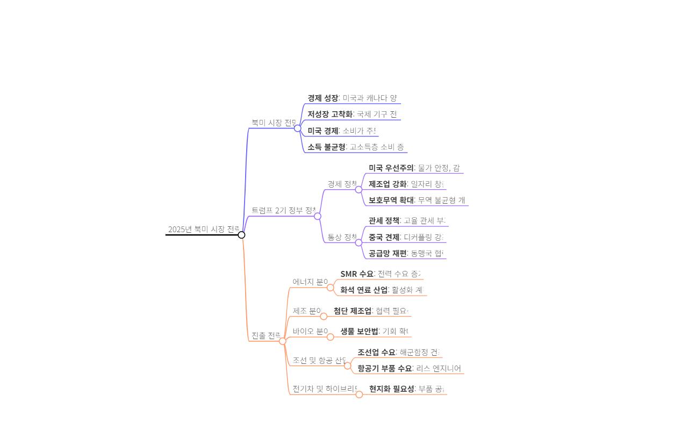

📌 트럼프 2.0 시대에 북미 시장 진출 전략은?
트럼프 2.0 시대에는 에너지, 제조, 바이오, 조선, 항공, 전기차/하이브리드차, 소비재 등 다양한 분야에서 기회가 있으며, 각 분야의 특성에 맞는 현지화 및 협력 전략이 필요합니다.

💡 트럼프 2.0 시대의 주요 정책 방향은?
보호무역 강화 및 보편 관세 도입

첨단 기술 산업 보호 및 미국 중심 생태계 구축

화석 연료 등 전통 에너지 산업 활성화

미국 제조업 강국 부활

대중국 통제 강화 및 공급망 재편

안보 우선주의 강화

kotra 북미 지역 본부장이 2025년 북미 시장 진출 전략을 제시하며, 트럼프 2기 정부 출범으로 인한 보호무역 강화와 미국 우선주의 정책 속에서도 에너지, 제조, 바이오, 조선, 항공, 전기차, 소비재 등 다양한 분야에서 새로운 기회를 찾을 수 있음을 강조합니다. 특히 첨단 기술 협력과 현지화 전략의 중요성을 역설하며, kotra가 우리 기업의 성공적인 북미 시장 진출을 적극 지원할 것임을 밝힙니다.

1. 발표자 소개 및 주제 소개
발표자는 코트라 북미 지역 본부장 박성호이며, 3년째 참석하고 있다.

오늘 발표의 주제는 2025년 북미 시장 진출 전략이다.

2. 북미 시장 전망
미국 대통령 선거가 있었고, 트럼프가 재선되었다.

현재 경제 상태는 양호하며, 내년 경제 전망은 저성장이 고착화될 것이라고 예측된다.

그러나 북미 지역은 예외적으로 성장할 것으로 보인다.

IMF의 2025년 경제 전망에 따르면, 미국의 성장률이 2.2%로 상향 조정되었다.

3. 트럼프 정부의 주요 정책 방향
트럼프 정부는 보호무역과 제조업 강국으로의 회귀를 목표로 한다.

주요 정책 키워드는 'thumbs up'으로 요약된다.

경제 정책: 물가 안정, 감세, 규제 완화, 제조업 강화.

통상 정책: 보호무역 확대, 무역 불균형 개선.

4. 북미 시장 진출 전략
전력 수요가 급증하고 있으며, 인프라 개선이 필요하다.

제조업 부문에서 한국 기업의 역할이 중요하다.

바이오 분야는 현지화가 필요하며, 인증과 인허가가 중요하다.

조선업과 항공 산업에서도 기회가 있다.

5. 소비 시장의 변화
초개인화와 바이퍼케이션 현상이 나타나고 있다.

고소득층과 저소득층의 소비 패턴이 다르며, 가성비 소비가 증가하고 있다.

프리미엄 제품과 듀프 제품 시장이 유망하다.