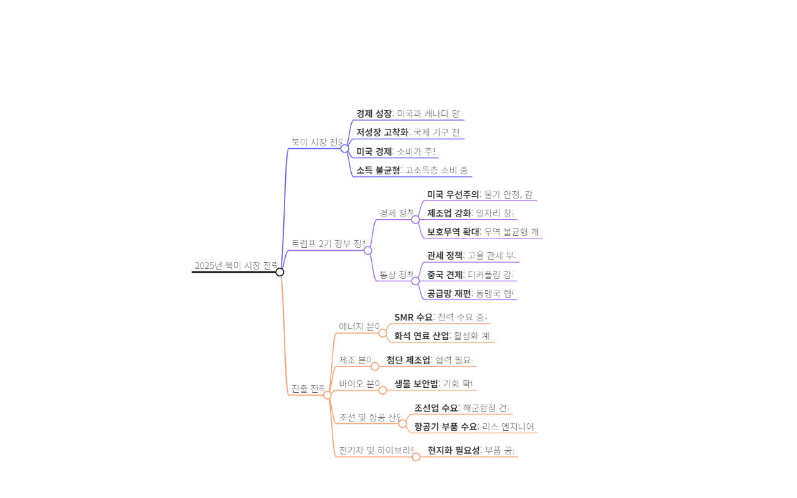

# 📌 트럼프 2.0 시대에 북미 시장 진출 전략은?
- 트럼프 2.0 시대에는 에너지, 제조, 바이오, 조선, 항공, 전기차/하이브리드, 소비재 등 다양한 분야에서 기회가 존재
- 각 분야의 특성에 맞는 현지화 및 협력 전략이 필요

# 💡 트럼프 2.0 시대의 주요 정책 방향은?
- 보호무역 강화
- 첨단 기술 산업 핵심 보호
- 전통 에너지 산업 회귀 및 확대
- 미국 제조업 강국 재건
- 중국 통제 강화 및 미국 중심 생태계 구축
- 안보 우선주의 강화

## 1. 🎯 북미 시장의 전망 및 트럼프 2.0 시대의 기회
- 많은 사람들이 트럼프 2.0 시대에 대해 위기감을 느끼고 있지만, 오히려 새로운 기회를 찾을 수 있다.
- 이전 정부에서의 경험을 바탕으로 익숙한 문제들이 존재

## 2. 📈 북미 시장 전망 및 전략
- 북미 시장은 **2025년까지 저성장이 고착화될 것**으로 예상 But 이 지역은 **예외적으로 상대적으로 높은 경제 성장**을 보일 것으로 전망
- IMF: 미국의 2025년 경제 성장률을 2.2%로 상향 조정
- FED: 통화 긴축 종료 후 **금리를 추가로 인하할 가능성**
- 일부 전문가들은 금리 인하가 0.25%로 결정될 것으로 전망

## 3. 📈 미국 경제 및 트럼프 정부의 정책 방향
- 팬데믹 이후 미국 경제의 산업 생산성이 크게 향상 But **소비는 주로 고소득층에 의해 주도**되고 있어서 전체 소비 규모의 증가가 모든 계층에 고르게 퍼지지 않는 상황
- 설문 조사에 따르면, 많은 미국인들이 현재의 경기가 좋지 않다고 느끼며, 이는 **객관적 소비 지표와 상반되는 양상**이다.
- 트럼프 정부: **보호무역과 전통 에너지 강화의 방향으로 정책을 추진**하며, **제조업을 부흥**시켜 미국 경제를 더 끌어올리겠다는 목표
- 트럼프의 통상 정책은 **고율 관세 부과**를 통해 무역 불균형을 해소하고 중국에 대한 견제를 강화

### 3.1. 팬데믹 이후 미국 소비의 양상
- 팬데믹을 거치면서 **미국 경제의 산업 생산성이 엄청 올라갔다**
- **미국 경제의 70%를 차지하는 소비가 경제를 이끌고 있지만**, 주로 고소득층의 소비 증가가 큰 역할
- 고소득층은 소비를 아끼지 않고 과감하게 지출하는 경향이 있으며, 반면 저소득층은 소비를 극도로 줄이고 있다.
- 통계적으로는 **전체 소비 규모가 증가**하고 있지만, 일반 미국인들은 현재 경기가 좋지 않다고 응답하고 있다는 사실이 확인
- 트럼프 대통령 취임 이후, **미국 경제에 대한 낙관 지수가 상승하는 경향**

### 3.2. 한국과 북미 간의 교역 및 투자 현황
- **한국과 북미 간의 교역은 꾸준히 호조**를 보이고 있으며, 특히 미국과 캐나다에 대한 수출이 증가하고 있다.
- 그러나 **한국 기업들의 북미 지역 투자는 전반적으로 주춤**한 상황이다.
- 북미의 전략적 가치는 매우 높아, **세계 최대 시장과 경제 규모를 가진 지역**
- **미국으로의 수출 비중은 증가**하고 있으며, 이는 한국 전체 수출에서 중요한 위치를 차지하고 있다.
- 북미 지역은 혁신의 중심지로, 글로벌 기술 자본과 인재가 밀집해 있는 곳이다.

### 3.3. 트럼프 2기 정부의 경제 및 통상 정책(THUMBS)
- Trade Protectionism, Hi-Tech, Upstream, Manufacturing, Blocking, Security
- 트럼프 2기 정부는 **보호무역을 강화**, 첨단 기술 산업을 보호하며, **화석 연료 산업을 재확대**하여 미국을 제조업 강국으로 만들겠다고 주장
- 경제 정책의 핵심은 **물가 안정, 감세 및 규제 완화, 그리고 제조업 독립 강화를 통한 경제 활성화**
- 통상 정책에서는 보호 무역 확대를 통해 무역 불균형과 불공정 무역 관행을 개선할 의도
- 트럼프 정부는 전통 에너지로 회귀하겠다고 강조하며, 원자력 발전도 확대할 계획
- 캘리포니아와 같은 주정부는 지속적으로 친환경 정책을 추진할 것으로 보이며, 미국 전역의 정책 방향과는 어긋날 것으로 추정

### 3.4. ️ 보호무역주의와 대중 재편 정책
- **무역적자와 재정적자를 개선**하고 제조업을 보호하기 위해 관세를 중요시하는 정책을 추진
- 모든 수입품에 대해 **최소 10%의 보편 관세를 부과**, 중국산 수입품에는 최소 60%의 고율 관세를 예고
- 미국은 **최혜국 대우 관세 혜택을 철회**하고 중국에 동일한 관세 기준을 적용하겠다고 하며, 중국으로의 수출 통제도 계획
- 공급망 재편을 위해 생물 보안법이 통과되었고, 중국 기업을 배제하며 협력국가들과의 관계를 강화할 것이며 기회가 발생할 것이라고 예상된다.
- **멕시코가 미국의 수입 시장 점유율 1위로 부각**되고 있으며, 캐나다는 중국과의 관계에서 거리를 두며 새로운 협상 목소리를 내고 있다.

### 3.5. 트럼프의 정책 이행 가능성에 대한 논의
- 특히 관세 정책과 IRA, 반도체 인센티브 축소와 폐기에 대한 논의가 활발
- **관세 인상이 인플레이션을 초래할 것이라는 전망**

## 4. ⚡ 북미 시장의 전력 및 제조 산업 기회
- 미국의 **전력 수요는 증가**하고 있으며, 특히 **제조업 육성과 데이터 센터 확장에 따라 전기 공급이 시급히 필요**
- 대중 견제를 고려할 때, **한국 제품의 품질과 가격은 바이어들에게 매력적으로 인식**
- 제조 분야에서는 미국의 첨단 분야 제조업에 대한 의지가 강함
- 바이오 산업에서는 **중국 의존도를 줄이는 방안**이 마련되고 있으며, CDMo 시장에서 우리 기업들에게 기회가 열릴 것으로 보인다
- 항공 산업에서는 부품 부족 문제로 수리 및 리스 엔지니어링을 통한 수요가 존재하며, **드론 산업**의 기회를 활용해야 한다

### 4.1. 북미 시장 진출을 위한 기회와 전략
- 미국의 전력 수요가 급증하고 있으며, 이는 제조 육성과 AI 확산에 따른 데이터센터 증가 때문으로 보인다.
- 현재 **미국의 전력 인프라는 많이 노후화**되어 있어, 개선과 확충이 시급한 상황이다.
- **중국산 대체 수요를 공략하는 것이 중요**하며, 한국 제품이 품질과 가격에서 경쟁력을 가진다고 생각된다.
- 미국과 캐나다에서 **소형 모듈 원전(SMR)에 대한 관심이 증가**하고 있으며, 이와 관련한 협력 방안도 제안된다.
- 빅테크 기업들이 대규모 전력을 필요로 하면서 **데이터 센터 증설에 서두르고 있는 상황**이다.

### 4.2. 제조 분야의 중요성 및 한국의 역할
- 미국은 제조 강국 복원을 지속적으로 추진
- 특히 **첨단 제조업에 대한 집중이 더욱 확대될 것으로 예측**
- 미국의 제조업 부활은 한국의 기여 없이는 어려운 상황이며, 한국 기업들이 중요한 역할
- 한국 기업들은 미국 시장에서 없어서는 안 될 파트너로 자리매김하고 있으며, 그 관계를 더욱 강화해야함

### 4.3. 북미 바이오 시장 현황 및 기회
- 미국은 **바이오 산업을 국가의 중요한 이슈로 인식**
- **생물 보안법 재정이 추진 중**
- 바이오 분야의 성공적인 진출을 위해서는 **현지화가 필수적**이며, 인증 및 인허가 받는 것이 중요

### 4.4. 북미 조선업과 MRO 사업의 기회
- 북미 조선업은 화석연료 산업의 회복으로 인해 **유조선과 LNG 운반선 수요가 증가할 것으로 예상**
- 미국은 해군함정 55척을 건조할 계획이 있지만, 조선업은 중국 및 한국에 비해 뒤처짐
- 미국 정부는 중국을 견제하기 위해 한국과의 협력을 적극적으로 추진 중으로 보인다.
- 함정의 유지 보수 정비(MRO) 사업 규모는 연간 1조원으로 추정되며, 추가 수주 가능성이 높아 보인다.

### ✈️ 항공산업의 최신 동향
- 달라스 무역관은 오클라호마주에서 수십 개의 항공 분야 기업과 미팅을 진행하였으며, 항공기가 노후화되고 부품 부족 문제가 있다고 보고했다.
- 이들 항공기는 역설계를 통해 부품을 공급하거나 정비가 가능하여 수요가 많아 보인다.
- **미국 드론 시장**은 중국 배제 움직임을 반영

### ⚡ 전기차와 하이브리드 차량의 변화
- 디트로이트 무역관은 전기차 판매 감소 및 하이브리드 차량 생산 확대 소식을 전하며, 부품 업체에 대한 지원 요청이 잇따른다고 밝혔다.
- 완성차 업체들은 **현지에서의 신속한 대응과 현지화의 중요성을 강조**하고 있으며, 소프트웨어 기술 개발 또한 필수적이라고 언급

### 4.5. ️ 소비 시장의 변화와 전략
- **초개인화 현상**으로 MG 세대가 자기 자신을 중요시하며 **‘미코노미’ 소비관이 확산**
- 타르트라진의 가상 메이크업 도구는 사용자 얼굴에 맞는 컬러를 제시하여 소비자 매출을 200% 증가시켰다.
- 맥도날드는 소비자가 원하는 음료를 직접 조합할 수 있는 플랫폼을 만들어 마케팅을 혁신하고 있다.
- **바이퍼케이션 현상이 나타나면서 팬데믹 이후 소득 계층의 양극화가 심화**되었고, **중산층 비중이 감소**
- 고소득층을 겨냥한 **프리미엄 유통망**과 **가성비**를 찾는 소비층을 효과적으로 공략해야 한다는 전략이 필요

# Summary

## 📌 트럼프 2.0 시대에 북미 시장 진출 전략
- 트럼프 2.0 시대에는 에너지, 제조, 바이오, 조선, 항공, 전기차/하이브리드차, 소비재 등 다양한 분야에서 기회가 있으며, **각 분야의 특성에 맞는 현지화 및 협력 전략이 필요**

## 💡 트럼프 2.0 시대의 주요 정책 방향(Thumbs UP)
- **Trade Protectionism**: 보호무역 강화 및 보편 관세 도입
- **Hi-Tech**: 첨단 기술 산업 보호 및 미국 중심 생태계 구축
- **Upstream**: 화석 연료 등 전통 에너지 산업 활성화
- **Manufacturing**: 미국 제조업 강국 부활
- **Blocking**: 대중국 통제 강화 및 공급망 재편
- **Security**: 안보 우선주의 강화

## 북미 시장 전망
- 현재 경제 상태는 양호
- 내년 경제 전망은 **저성장이 고착화될 것이라고 예측**
- 그러나 북미 지역은 **예외적으로 성장할 것으로 전망**
- IMF's 2025년 경제 전망: 미국의 성장률이 2.2%로 상향 조정

## 트럼프 정부의 주요 정책 방향
- 트럼프 정부는 보호무역과 제조업 강국으로의 회귀를 목표
- 주요 정책 키워드: **'thumbs up'**
- 경제 정책: 물가 안정, 감세, 규제 완화, 제조업 강화
- 통상 정책: 보호무역 확대, 무역 불균형 개선

## 북미 시장 진출 전략
- 전력 수요 급증 → 인프라 개선이 필요
- 제조업 부문에서 한국 기업의 역할이 중요
- 바이오 분야는 현지화가 필요하며, 인증과 인허가가 중요
- 조선업과 항공 산업에서도 기회

## 소비 시장의 변화
- **초개인화와 바이퍼케이션 현상**
- 고소득층과 저소득층의 소비 패턴이 다르며, 가성비 소비가 증가
- **프리미엄 제품과 듀프 제품 시장이 유망**
- Dupe: 명품과 품질이 비슷하지만 가격이 훨씬 저렴한 제품