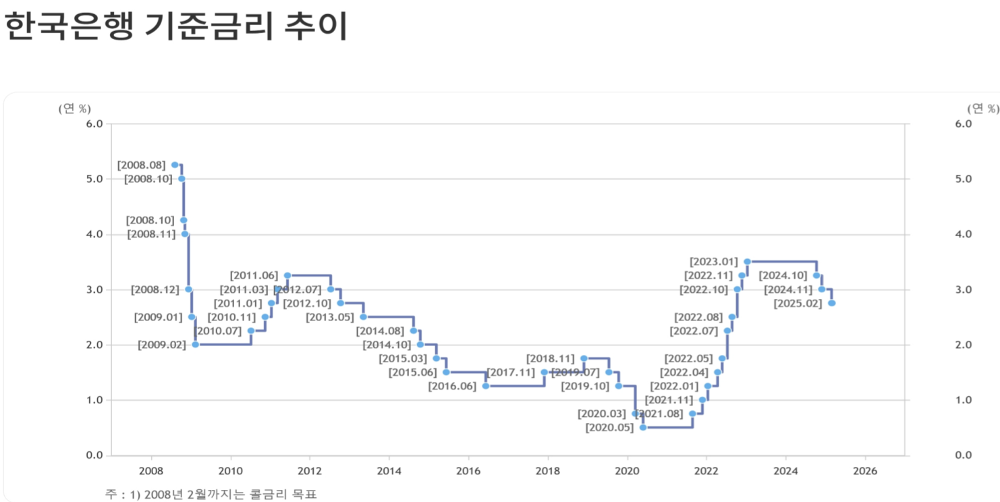
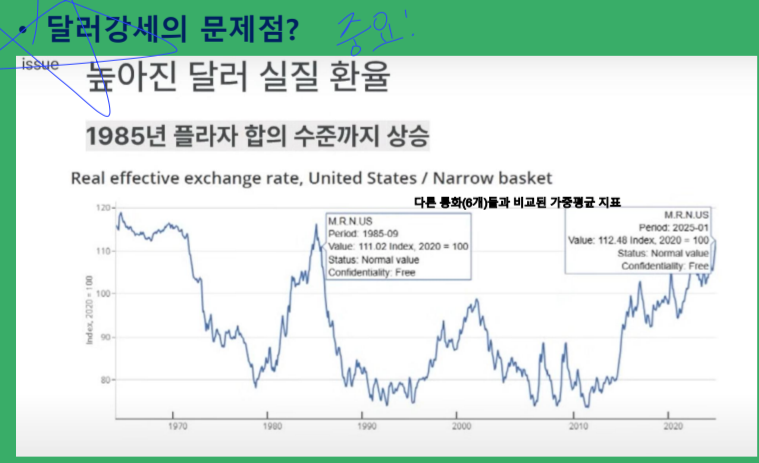

# **한은 경제 전망과 금리/관세 효과**
- **기준 금리를 현재 3.00% → 2.75%로 인하**
- Y = C + I + G + X - M
    + Y: GDP
    + C: 민간소비
    + I: 투자(건설 투자, 설비투자, 지식 재산 생산물 투자)
    + G: 정부 지출
    + X: 수출
    + M: 수입
    + X - M: 경상 수지(상품수지, 서비스수지, 본원/이전 소득 수지)
- **If 금리 ↓ → C & I ↑ → Y ↑**
- **IF 금리 ↑ → C & I ↓ → Y ↓**

# **중요**
- GDP 요소
    + C: 민간 소비
    + I: 건설 투자, 설비 투자, 지식재산 생산물 투자
    + X, M
- **본원 소득 수지**: 노동 소득 수지,자본 소득 수지, 이전 소득 수지(규모 작음)

    

## ** 한은 경제 전망(2025년 2월)**
- 2025년 GDP 성장률 1.5%(예상: 1.9%)
- 2024년 GDP 성장률 2.0%(예상: 2.2%)
- **GDP 성장률**은 실업률(완전 고용 = 3%, 마찰적 실업률)과 관계가 있음
- **물가 안정(목표 = 2%)**
- **금리 ↓ → 통화량&환율 ↑ → 성장률 & 물가 ↑**
- **근원 물가 상승률** : 물가 상승률 중 식료품, 에너지 등 변동성이 심한 항목을 뺀 상승률

## ** 한은 기준 금리 인하와 2025년 경제전망 평가**
- 세계경제는 미국의 관세 정책 영향으로 성장의 하방 위험 확대 → 물가경로의 불확실성 증대
- 국내 경제: 소비 부진 & 수출 증가세 약화 → 성장 둔화 흐름 지속
- **미국의 관세부과는 미국내로의 제조업 공급망 재편 수단이자 세수확보 수단**
1. **부정**
    - 미국의 관세부과가 철회되지 X → 2025년 한국 성장률은 전망치(1.5%)도 달성하기 어렵고 1% 내외가 될 가능성 존재 
    - 미국의 대중국 고립화 전략(디커플링 전략) 본격화 → 중국경제 침체에 따른 부정적 영향(대중국 수출 감소) 가능성 
2. **긍정**
    - 미국경제의 제조업 공급망 구축 수요에 따른 대미 수출 증가로 한국 성장률 상향 가능성
    - 국내 기준 금리 추가 인하에 따른 소비와 투자 회복 가능성

## **기준 금리 인하 효과**
1. **금리를 통한 통화 정책 목표**
- GDP 성장률 상승 = 실업류 하락(완전 고용이 목표)
- 물가상승률 상승(물가 안정이 목표)
- 환율 상승(환율 안정 목표)
- 금리 인하 시 C& I 증가, 환율 상승(수출증가, 수입 감소), 국내 물가 상승

2. **자산시장 상승 효과**
- **부동산 가격 상승(70%)**
    + 시차 존재(6 ~ 12 개월)
- **채권 가격 상승(100%, 금리의 역수)**
    + 즉시 효과(단기채)
- **주식시장 상승 영향(50%)**
    + 유동성 증가 효과

## ** 미국 수입 관세 인상 효과**
- **미국 수입 물가 상승** → 소비 감소에 따른 성장률 하락: 즉시 발생
- **전세계 수출입 감소** → 전 세계 성장률 하락: 단기(2025년 발생 가능)
- **전세계 불확실성 확대** → 성장률 급감 가능성: 단기 또는 중기(2026년 이후)발생 가능성
- **미국의로의 투자 확대** → 미국 경제 상승률 상승: 중기(2026년 이후) 발생 가능성

### **기타**
- KOTRA에서 권역 구분
    + 북미
    + 유럽
    + 중국
    + 동남아 대양주
    + 일본
    + 인도서남아
    + 중동
    + 중남미
    + 중앙아시아
    + 아프리카
- **Agile and Flexible 대응, Buffers 확보**
    + Agile: 소규모 팀을 꾸려 구체적 계획 없이 실행에 옮겨 외부 피드백을 계속적으로 반영해 최종 결과를 만드는 형태

# **2025년 세계 경제는 동상이몽의 시대**

## 미국과 중국은 경제/정치적 패권을 두고 경쟁하며 서로 다른 목표 추구
- 미국: 자국 산업 보호, 동맹 강화 집중
- 중국: 기술 자립 및 글로벌 공급망 장악 목표
- 이러한 갈등 → **글로벌 경제 전반에 큰 영향** & 각국은 저마다의 이해 관계 속에서 다른 꿈을 추구

## **한국의 동분서주와 대응 과제**
- 한국 기업들: 미중 패권 다툼과 탈세계화로 인한 공급망 분절화에 대응
- 미중 갈등 속 규제 환경 변화 및 탄소 배출 규제 강화
- 한국 정부: 기업의 이해관계와 애로사항을 반영한 적극적 지원과 규제 대응 필요

## **2025년 이후 세계 경제 변화 키워드**
1. 금리 → **관세**
2. 자유무역 → **보호무역**
3. 시장적 거래 관계 → **전략적 동반자 관계**
4. 동반성장 → **나홀로 성장**
5. 국제법 → **힘**

# **세계 경제전망과 트럼피즘**
- **상호관세**: 특정 국가가 미국 제품에 부과하는 관세율과 동일한 수준의 관세를
해당 국가의 수입품에 부과하는 방식
- **일반관세**: 모든 국가를 대상으로 모든 수입 품목에 동일한 관세율을 일괄적으로 부과
    + 특정 국가나 품목에 대한 예외없이 전반적인 수입품에 적용
    + 미국이 모든 수입 철강과 알루미늄에 25% 관세 = 보편관세

- **달러 강세 문제점**
    + 미국의 무역적자와 경제적 불균형의 근본원인 = 글로벌 준비자산으로서 달러에 대한 비탄력적인 수요 → 이로 인한 **달러의 지속적인 고평가**
    + 달러라는 안전자산과 안보 우산을 제공하기 위한 비용 증가 → **수출 경쟁력 약화, 무역 적자, 미국 제조업 침식**
    + **무역과 안보를 연계해 동맹국들에 더 많은 부담을 지우는 방향**

## **세계 경제 전망과 트럼피즘의 위협**
- 미국 경제에 대한 부정적 영향?(긍정적 요소)
    1. **성장률 하락, 물가 상승**: 스테그플레이션 장기화(단기적 소규모 영향)
    2. **강달러에 의한 무역 적자 확대 지속**(달러 패권 유지)
    3. **금융 시장 위축**: 자본 유출, 주가 하락(양적 긴축 중단, 완화로 확장)
- 세계 경제에 대한 부정적 영향
    1. 관세 인상 → 수출 감소
    2. **성장률 하락, 물가 상승**
    3. 제조업 공급망 유출에 따른 공동화
- 기회
    1. 조선업: 해군 함정, 수리 및 건조, 상선 부분 등 전방위 확대
    2. 방산: 기술협력, 제조 기반 구축 및 연결 확대
    3. 원전: 공동 수출, 핵무장 등
    4. 반도체: 제조기반, 원천 기술 협력
    5. AI, Robot: 한국의 필요성

## **2025년 세계 경제 리스크 요인**
1. **미국 신정부 출범과 자국우선주의 및 보호무역주의 심화**
2. **대내외 악재에 따른 중국 경제 성장 충격**
    - 4D
        + Deflation: 물가 하락 → 부동산/제조품 등
        + Debt(부채)
        + Demographic: 인구고령화(2015 ~)
        + Deep Seek: 기술, 민간 기업
3. **통화정책 전환기 금융시장 변동성 확대와 실질 부채 부담 증가**
- 달러의 위기: 무역 적자, 재정 적자
    + 보여주는 지표 → 미국 국채시장에서의 리스크(수요 감소)
- 트럼프의 해결책? 관세(재정 수입 증가)